hw6
================
Matthew Spotnitz
11/23/2021

``` r
library(tidyverse)
```

    ## ── Attaching packages ─────────────────────────────────────── tidyverse 1.3.1 ──

    ## ✓ ggplot2 3.3.5     ✓ purrr   0.3.4
    ## ✓ tibble  3.1.5     ✓ dplyr   1.0.7
    ## ✓ tidyr   1.1.3     ✓ stringr 1.4.0
    ## ✓ readr   2.0.1     ✓ forcats 0.5.1

    ## ── Conflicts ────────────────────────────────────────── tidyverse_conflicts() ──
    ## x dplyr::filter() masks stats::filter()
    ## x dplyr::lag()    masks stats::lag()

``` r
library(ggplot2)
```

\#\#Problem 1 I will import and view the birthweight dataset.

``` r
birthweight_df = read.csv("birthweight.csv")
birthweight_df = janitor::clean_names(birthweight_df)
head(birthweight_df)
```

    ##   babysex bhead blength  bwt delwt fincome frace gaweeks malform menarche
    ## 1       2    34      51 3629   177      35     1    39.9       0       13
    ## 2       1    34      48 3062   156      65     2    25.9       0       14
    ## 3       2    36      50 3345   148      85     1    39.9       0       12
    ## 4       1    34      52 3062   157      55     1    40.0       0       14
    ## 5       2    34      52 3374   156       5     1    41.6       0       13
    ## 6       1    33      52 3374   129      55     1    40.7       0       12
    ##   mheight momage mrace parity pnumlbw pnumsga    ppbmi ppwt smoken wtgain
    ## 1      63     36     1      3       0       0 26.27184  148      0     29
    ## 2      65     25     2      0       0       0 21.34485  128      0     28
    ## 3      64     29     1      0       0       0 23.56517  137      1     11
    ## 4      64     18     1      0       0       0 21.84508  127     10     30
    ## 5      66     20     1      0       0       0 21.02642  130      1     26
    ## 6      66     23     1      0       0       0 18.60030  115      0     14

``` r
tail(birthweight_df)
```

    ##      babysex bhead blength  bwt delwt fincome frace gaweeks malform menarche
    ## 4337       2    35      52 3657   142      55     2    40.0       0       13
    ## 4338       1    34      50 3147   129      25     2    39.0       0       12
    ## 4339       1    34      51 3430   158      25     2    39.4       0       12
    ## 4340       1    35      52 3090   128      15     2    38.1       0       14
    ## 4341       2    32      46 2268   120       5     2    39.0       0       13
    ## 4342       2    34      52 3232   149      25     2    40.6       0       11
    ##      mheight momage mrace parity pnumlbw pnumsga    ppbmi ppwt smoken wtgain
    ## 4337      63     16     2      0       0       0 21.30149  120      0     22
    ## 4338      64     20     2      0       0       0 18.06089  105      0     24
    ## 4339      66     18     2      0       0       0 19.73249  122      0     36
    ## 4340      56     18     2      0       0       0 21.56776   96      3     32
    ## 4341      62     17     2      0       0       0 19.24491  105      0     15
    ## 4342      63     16     2      0       0       0 23.43164  132      0     17

``` r
str(birthweight_df)
```

    ## 'data.frame':    4342 obs. of  20 variables:
    ##  $ babysex : int  2 1 2 1 2 1 2 2 1 1 ...
    ##  $ bhead   : int  34 34 36 34 34 33 33 33 36 33 ...
    ##  $ blength : int  51 48 50 52 52 52 46 49 52 50 ...
    ##  $ bwt     : int  3629 3062 3345 3062 3374 3374 2523 2778 3515 3459 ...
    ##  $ delwt   : int  177 156 148 157 156 129 126 140 146 169 ...
    ##  $ fincome : int  35 65 85 55 5 55 96 5 85 75 ...
    ##  $ frace   : int  1 2 1 1 1 1 2 1 1 2 ...
    ##  $ gaweeks : num  39.9 25.9 39.9 40 41.6 ...
    ##  $ malform : int  0 0 0 0 0 0 0 0 0 0 ...
    ##  $ menarche: int  13 14 12 14 13 12 14 12 11 12 ...
    ##  $ mheight : int  63 65 64 64 66 66 72 62 61 64 ...
    ##  $ momage  : int  36 25 29 18 20 23 29 19 13 19 ...
    ##  $ mrace   : int  1 2 1 1 1 1 2 1 1 2 ...
    ##  $ parity  : int  3 0 0 0 0 0 0 0 0 0 ...
    ##  $ pnumlbw : int  0 0 0 0 0 0 0 0 0 0 ...
    ##  $ pnumsga : int  0 0 0 0 0 0 0 0 0 0 ...
    ##  $ ppbmi   : num  26.3 21.3 23.6 21.8 21 ...
    ##  $ ppwt    : int  148 128 137 127 130 115 105 119 105 145 ...
    ##  $ smoken  : num  0 0 1 10 1 0 0 0 0 4 ...
    ##  $ wtgain  : int  29 28 11 30 26 14 21 21 41 24 ...

``` r
view(birthweight_df)
```

There are 4342 observations and 20 variables. Those variables are
combinations of integer and numerical formats. I will dnow drop missing
values.

``` r
birthweight_na_df = drop_na(birthweight_df)
str(birthweight_na_df)
```

    ## 'data.frame':    4342 obs. of  20 variables:
    ##  $ babysex : int  2 1 2 1 2 1 2 2 1 1 ...
    ##  $ bhead   : int  34 34 36 34 34 33 33 33 36 33 ...
    ##  $ blength : int  51 48 50 52 52 52 46 49 52 50 ...
    ##  $ bwt     : int  3629 3062 3345 3062 3374 3374 2523 2778 3515 3459 ...
    ##  $ delwt   : int  177 156 148 157 156 129 126 140 146 169 ...
    ##  $ fincome : int  35 65 85 55 5 55 96 5 85 75 ...
    ##  $ frace   : int  1 2 1 1 1 1 2 1 1 2 ...
    ##  $ gaweeks : num  39.9 25.9 39.9 40 41.6 ...
    ##  $ malform : int  0 0 0 0 0 0 0 0 0 0 ...
    ##  $ menarche: int  13 14 12 14 13 12 14 12 11 12 ...
    ##  $ mheight : int  63 65 64 64 66 66 72 62 61 64 ...
    ##  $ momage  : int  36 25 29 18 20 23 29 19 13 19 ...
    ##  $ mrace   : int  1 2 1 1 1 1 2 1 1 2 ...
    ##  $ parity  : int  3 0 0 0 0 0 0 0 0 0 ...
    ##  $ pnumlbw : int  0 0 0 0 0 0 0 0 0 0 ...
    ##  $ pnumsga : int  0 0 0 0 0 0 0 0 0 0 ...
    ##  $ ppbmi   : num  26.3 21.3 23.6 21.8 21 ...
    ##  $ ppwt    : int  148 128 137 127 130 115 105 119 105 145 ...
    ##  $ smoken  : num  0 0 1 10 1 0 0 0 0 4 ...
    ##  $ wtgain  : int  29 28 11 30 26 14 21 21 41 24 ...

There were no missing values. Therefore, it is appropriate to use the
original dataframe. I will make a facetwrap that shows a histogram of
each variable

``` r
ggplot(gather(birthweight_df), aes(value)) + geom_histogram(bins = 10) + facet_wrap(~key, scales = 'free_x')
```

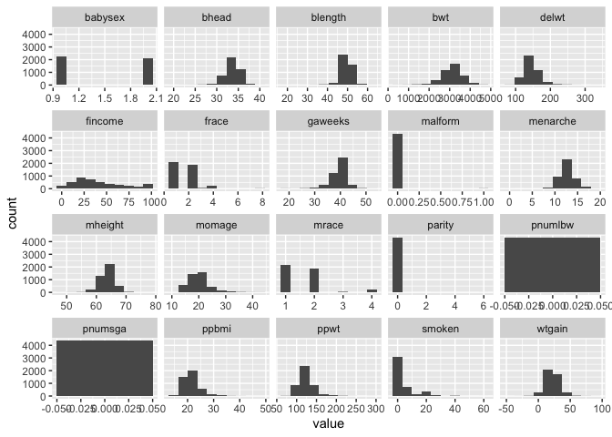<!-- --> After looking at
these plots, I intend to convert babysex, frace, mrace, malform, and
mrace into factor variables.

``` r
birthweight_factor_df = birthweight_df %>% mutate (babysex = as.factor(babysex), frace = as.factor(frace), mrace = as.factor(mrace), malform = as.factor(malform), mrace = as.factor(mrace))
str(birthweight_factor_df)
```

    ## 'data.frame':    4342 obs. of  20 variables:
    ##  $ babysex : Factor w/ 2 levels "1","2": 2 1 2 1 2 1 2 2 1 1 ...
    ##  $ bhead   : int  34 34 36 34 34 33 33 33 36 33 ...
    ##  $ blength : int  51 48 50 52 52 52 46 49 52 50 ...
    ##  $ bwt     : int  3629 3062 3345 3062 3374 3374 2523 2778 3515 3459 ...
    ##  $ delwt   : int  177 156 148 157 156 129 126 140 146 169 ...
    ##  $ fincome : int  35 65 85 55 5 55 96 5 85 75 ...
    ##  $ frace   : Factor w/ 5 levels "1","2","3","4",..: 1 2 1 1 1 1 2 1 1 2 ...
    ##  $ gaweeks : num  39.9 25.9 39.9 40 41.6 ...
    ##  $ malform : Factor w/ 2 levels "0","1": 1 1 1 1 1 1 1 1 1 1 ...
    ##  $ menarche: int  13 14 12 14 13 12 14 12 11 12 ...
    ##  $ mheight : int  63 65 64 64 66 66 72 62 61 64 ...
    ##  $ momage  : int  36 25 29 18 20 23 29 19 13 19 ...
    ##  $ mrace   : Factor w/ 4 levels "1","2","3","4": 1 2 1 1 1 1 2 1 1 2 ...
    ##  $ parity  : int  3 0 0 0 0 0 0 0 0 0 ...
    ##  $ pnumlbw : int  0 0 0 0 0 0 0 0 0 0 ...
    ##  $ pnumsga : int  0 0 0 0 0 0 0 0 0 0 ...
    ##  $ ppbmi   : num  26.3 21.3 23.6 21.8 21 ...
    ##  $ ppwt    : int  148 128 137 127 130 115 105 119 105 145 ...
    ##  $ smoken  : num  0 0 1 10 1 0 0 0 0 4 ...
    ##  $ wtgain  : int  29 28 11 30 26 14 21 21 41 24 ...

I will make scatter plots for continuous variables that may be assocaite
with birthweight.

``` r
birthweight_factor_df %>% ggplot(aes(x = bhead, y= bwt)) + geom_point()  ##On inspection, there is a corrleation
```

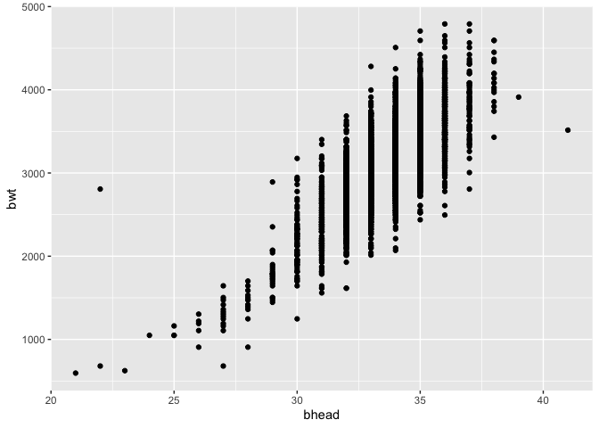<!-- -->

``` r
birthweight_factor_df %>% ggplot(aes(x = blength, y= bwt)) + geom_point() ##On inspection, there is a corrrelation
```

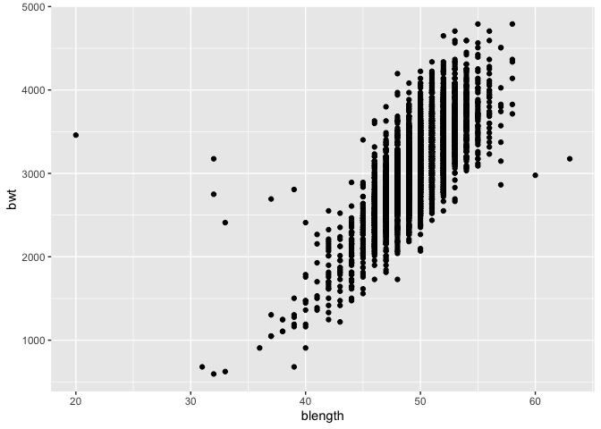<!-- -->

``` r
birthweight_factor_df %>% ggplot(aes(x = delwt, y= bwt)) + geom_point() #There is not a strong correlation
```

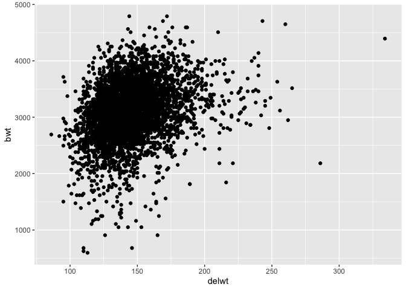<!-- -->

``` r
birthweight_factor_df %>% ggplot(aes(x = gaweeks, y= bwt)) + geom_point() ##There is not a strong correlation
```

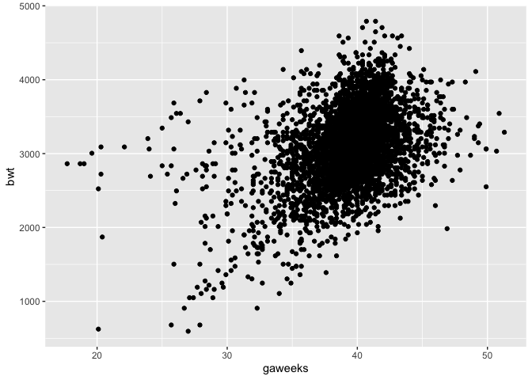<!-- -->

``` r
birthweight_factor_df %>% ggplot(aes(x = menarche, y= bwt)) + geom_point()#There is not a strong correlation
```

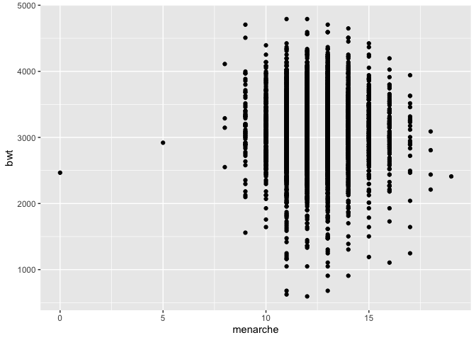<!-- -->

``` r
birthweight_factor_df %>% ggplot(aes(x = fincome, y= bwt)) + geom_point() #There is not a strong correlation
```

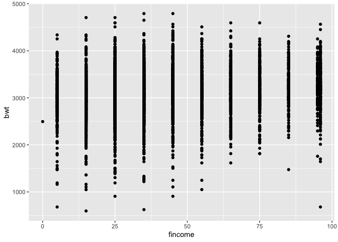<!-- -->

``` r
birthweight_factor_df %>% ggplot(aes(x = mheight, y= bwt)) + geom_point() #There is not a strong correlation
```

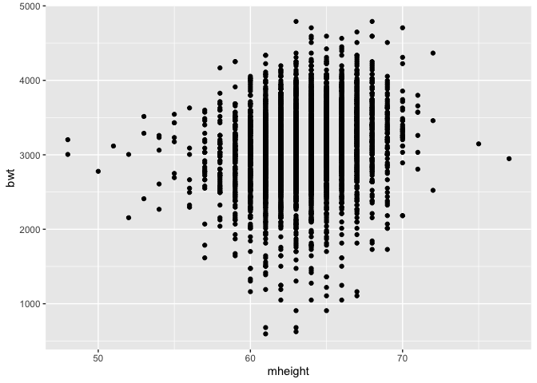<!-- -->

``` r
birthweight_factor_df %>% ggplot(aes(x = momage, y= bwt)) + geom_point() #There is not a strong correlation
```

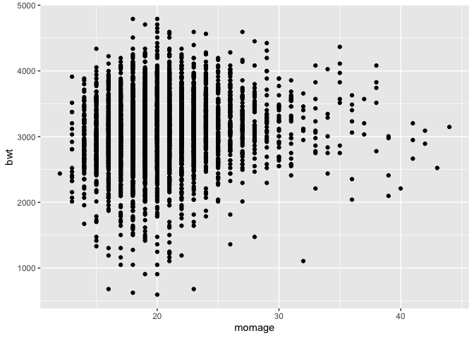<!-- -->

``` r
birthweight_factor_df %>% ggplot(aes(x = ppbmi, y= bwt)) + geom_point() #There is not a strong correlation
```

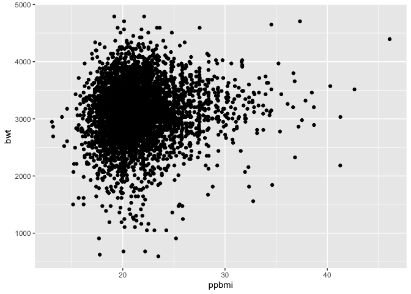<!-- -->

``` r
birthweight_factor_df %>% ggplot(aes(x = ppwt, y= bwt)) + geom_point()#There is not a strong correlation
```

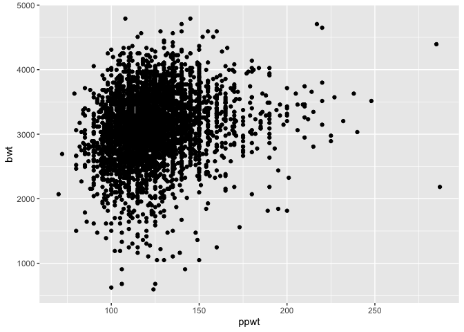<!-- -->

``` r
birthweight_factor_df %>% ggplot(aes(x = smoken, y= bwt)) + geom_point() #There is not a strong correlation
```

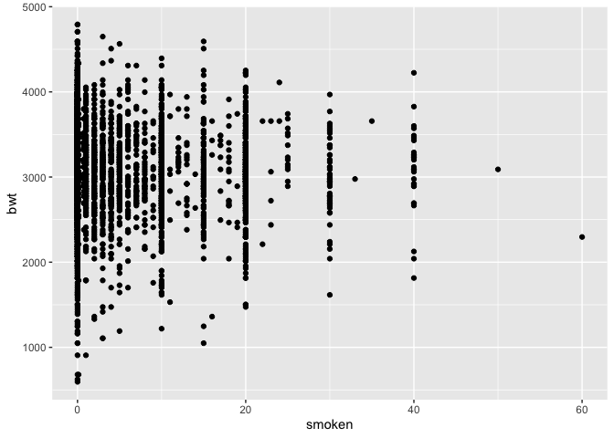<!-- -->

``` r
birthweight_factor_df %>% ggplot(aes(x = wtgain, y= bwt)) + geom_point() #There is not a strong correlation
```

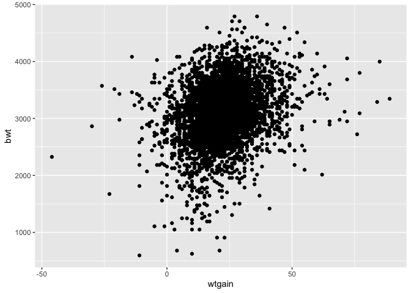<!-- -->

``` r
birthweight_factor_df %>% ggplot(aes(x = parity, y= bwt)) + geom_point() #There is not a strong correlation
```

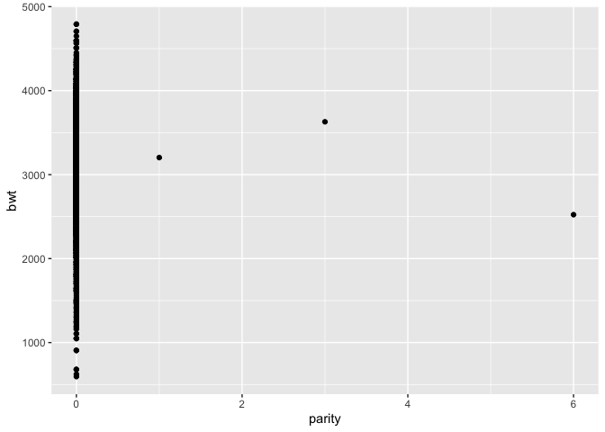<!-- --> Now I will plot
brithweight by non-continuous variables

``` r
birthweight_factor_df %>% ggplot(aes(x = babysex, y= bwt)) + geom_boxplot()   #There is not a strong correlation
```

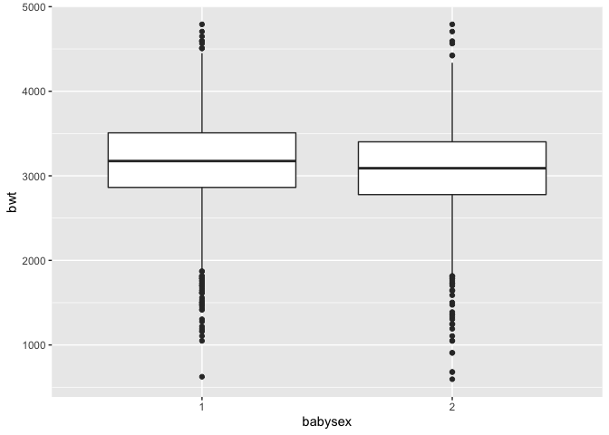<!-- -->

``` r
birthweight_factor_df %>% ggplot(aes(x = frace, y= bwt)) + geom_boxplot()   #There is not a strong correlation
```

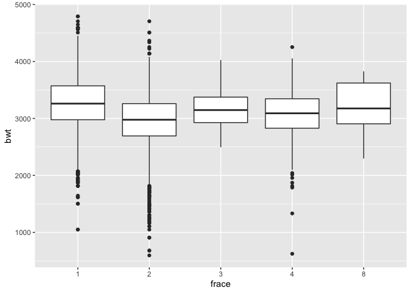<!-- -->

``` r
birthweight_factor_df %>% ggplot(aes(x = mrace, y= bwt)) + geom_boxplot() #There is not a strong correlation 
```

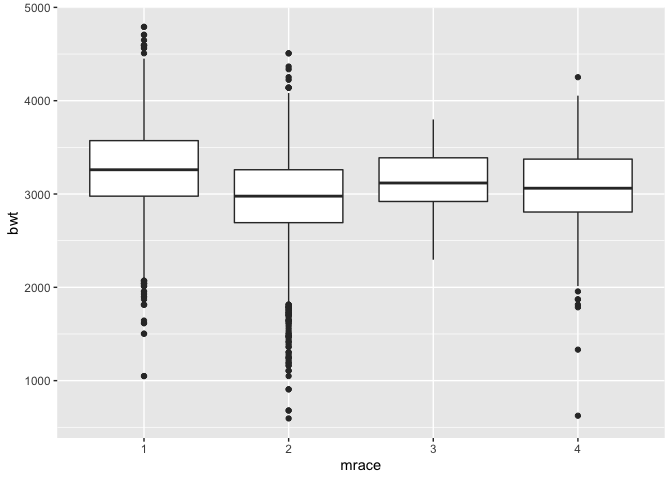<!-- -->

``` r
birthweight_factor_df %>% ggplot(aes(x = malform, y= bwt)) + geom_boxplot() # There is not a strong correlation
```

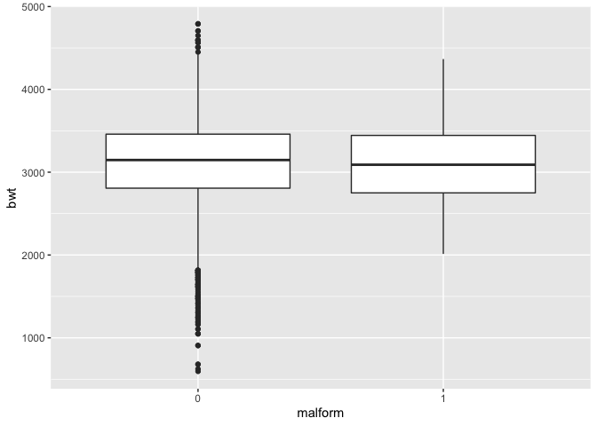<!-- -->

``` r
#pnumlbw and pnumsga are exlusively zero values.
```

On the basis of this exploratory data analysis, a baby’s head
circumference and length at birth have the strongest correlation with
birthweight. I will map the residuals and fitted values of these models.

``` r
fit = lm(bwt ~ bhead + blength, data = birthweight_factor_df)
birthweight_factor_df %>% modelr::add_residuals(fit) %>% ggplot(aes(x=bhead, y = resid)) + geom_point() ##Overall, there is a uniform distribution of residuals
```

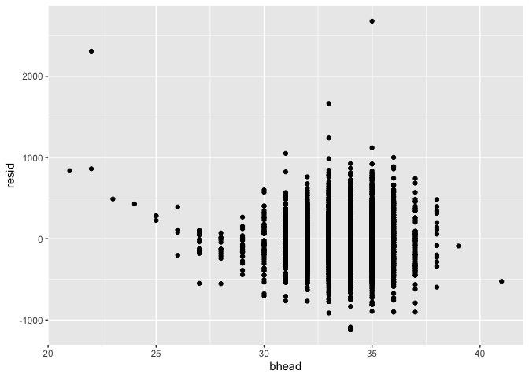<!-- -->

``` r
birthweight_factor_df %>% modelr::add_residuals(fit) %>% ggplot(aes(x=blength, y = resid)) + geom_point() ##Overall, there is a uniform distribution of residuals
```

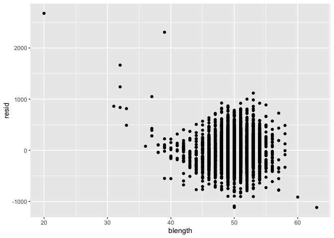<!-- --> Now I will plot
the fitted values

``` r
fit = lm(bwt ~ bhead + blength, data = birthweight_factor_df)
birthweight_factor_df %>% modelr::add_predictions(fit) %>% ggplot(aes(x=bhead, y = pred)) + geom_point() ##Overall, there is a direct correlation between baby's head circumference at birth and fitted values
```

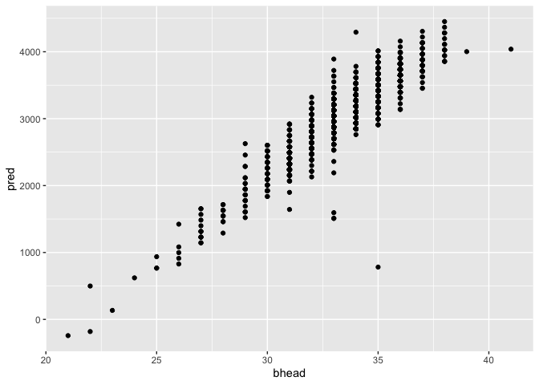<!-- -->

``` r
birthweight_factor_df %>% modelr::add_predictions(fit) %>% ggplot(aes(x=blength, y = pred)) + geom_point() ##Overall, there is a direct correlation betwen baby's length at birth and fitted values.
```

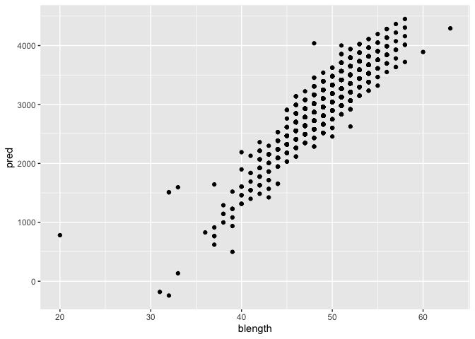<!-- --> Now I will
correlate the fitted values with residuals

``` r
fit = lm(bwt ~ bhead + blength, data = birthweight_factor_df)
birthweight_factor_df  %>% modelr::add_residuals(fit)%>% modelr::add_predictions(fit) %>% ggplot(aes(x=pred, y = resid)) + geom_point() +    labs(
    title = "Residuals vs. Fitted Values",
    x = "Fitted Values",
    y = "Residuals",
    caption = "Birthweight Data"
  )  + theme_minimal() #Overall, there is not a strong correlation between fitted values and residuals
```

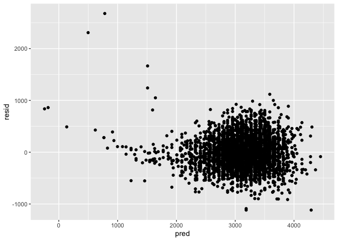<!-- --> Now I will fit
more models.

``` r
fit_length_age = lm(bwt ~ blength + gaweeks, data = birthweight_factor_df)
fit_three = lm (bwt ~ bhead + blength + babysex + bhead*blength*babysex, data = birthweight_factor_df)
```
