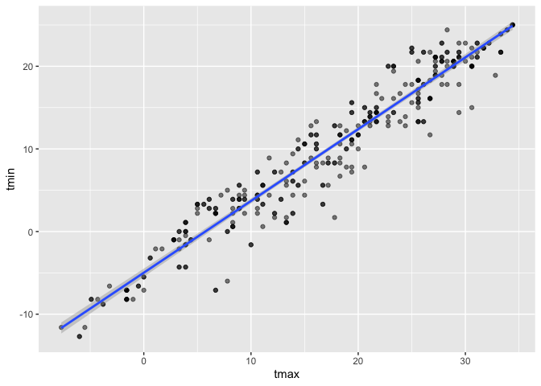

hw6
================
Matthew Spotnitz
11/23/2021

``` r
library(tidyverse)
```

    ## ── Attaching packages ─────────────────────────────────────── tidyverse 1.3.1 ──

    ## ✓ ggplot2 3.3.5     ✓ purrr   0.3.4
    ## ✓ tibble  3.1.5     ✓ dplyr   1.0.7
    ## ✓ tidyr   1.1.3     ✓ stringr 1.4.0
    ## ✓ readr   2.0.1     ✓ forcats 0.5.1

    ## ── Conflicts ────────────────────────────────────────── tidyverse_conflicts() ──
    ## x dplyr::filter() masks stats::filter()
    ## x dplyr::lag()    masks stats::lag()

``` r
library(ggplot2)
library(modelr)
library(mgcv)
```

    ## Loading required package: nlme

    ## 
    ## Attaching package: 'nlme'

    ## The following object is masked from 'package:dplyr':
    ## 
    ##     collapse

    ## This is mgcv 1.8-36. For overview type 'help("mgcv-package")'.

\#\#Problem 1 I will import and view the birthweight dataset.

``` r
birthweight_df = read.csv("birthweight.csv")
birthweight_df = janitor::clean_names(birthweight_df)
head(birthweight_df)
```

    ##   babysex bhead blength  bwt delwt fincome frace gaweeks malform menarche
    ## 1       2    34      51 3629   177      35     1    39.9       0       13
    ## 2       1    34      48 3062   156      65     2    25.9       0       14
    ## 3       2    36      50 3345   148      85     1    39.9       0       12
    ## 4       1    34      52 3062   157      55     1    40.0       0       14
    ## 5       2    34      52 3374   156       5     1    41.6       0       13
    ## 6       1    33      52 3374   129      55     1    40.7       0       12
    ##   mheight momage mrace parity pnumlbw pnumsga    ppbmi ppwt smoken wtgain
    ## 1      63     36     1      3       0       0 26.27184  148      0     29
    ## 2      65     25     2      0       0       0 21.34485  128      0     28
    ## 3      64     29     1      0       0       0 23.56517  137      1     11
    ## 4      64     18     1      0       0       0 21.84508  127     10     30
    ## 5      66     20     1      0       0       0 21.02642  130      1     26
    ## 6      66     23     1      0       0       0 18.60030  115      0     14

``` r
tail(birthweight_df)
```

    ##      babysex bhead blength  bwt delwt fincome frace gaweeks malform menarche
    ## 4337       2    35      52 3657   142      55     2    40.0       0       13
    ## 4338       1    34      50 3147   129      25     2    39.0       0       12
    ## 4339       1    34      51 3430   158      25     2    39.4       0       12
    ## 4340       1    35      52 3090   128      15     2    38.1       0       14
    ## 4341       2    32      46 2268   120       5     2    39.0       0       13
    ## 4342       2    34      52 3232   149      25     2    40.6       0       11
    ##      mheight momage mrace parity pnumlbw pnumsga    ppbmi ppwt smoken wtgain
    ## 4337      63     16     2      0       0       0 21.30149  120      0     22
    ## 4338      64     20     2      0       0       0 18.06089  105      0     24
    ## 4339      66     18     2      0       0       0 19.73249  122      0     36
    ## 4340      56     18     2      0       0       0 21.56776   96      3     32
    ## 4341      62     17     2      0       0       0 19.24491  105      0     15
    ## 4342      63     16     2      0       0       0 23.43164  132      0     17

``` r
str(birthweight_df)
```

    ## 'data.frame':    4342 obs. of  20 variables:
    ##  $ babysex : int  2 1 2 1 2 1 2 2 1 1 ...
    ##  $ bhead   : int  34 34 36 34 34 33 33 33 36 33 ...
    ##  $ blength : int  51 48 50 52 52 52 46 49 52 50 ...
    ##  $ bwt     : int  3629 3062 3345 3062 3374 3374 2523 2778 3515 3459 ...
    ##  $ delwt   : int  177 156 148 157 156 129 126 140 146 169 ...
    ##  $ fincome : int  35 65 85 55 5 55 96 5 85 75 ...
    ##  $ frace   : int  1 2 1 1 1 1 2 1 1 2 ...
    ##  $ gaweeks : num  39.9 25.9 39.9 40 41.6 ...
    ##  $ malform : int  0 0 0 0 0 0 0 0 0 0 ...
    ##  $ menarche: int  13 14 12 14 13 12 14 12 11 12 ...
    ##  $ mheight : int  63 65 64 64 66 66 72 62 61 64 ...
    ##  $ momage  : int  36 25 29 18 20 23 29 19 13 19 ...
    ##  $ mrace   : int  1 2 1 1 1 1 2 1 1 2 ...
    ##  $ parity  : int  3 0 0 0 0 0 0 0 0 0 ...
    ##  $ pnumlbw : int  0 0 0 0 0 0 0 0 0 0 ...
    ##  $ pnumsga : int  0 0 0 0 0 0 0 0 0 0 ...
    ##  $ ppbmi   : num  26.3 21.3 23.6 21.8 21 ...
    ##  $ ppwt    : int  148 128 137 127 130 115 105 119 105 145 ...
    ##  $ smoken  : num  0 0 1 10 1 0 0 0 0 4 ...
    ##  $ wtgain  : int  29 28 11 30 26 14 21 21 41 24 ...

``` r
view(birthweight_df)
```

There are 4342 observations and 20 variables. Those variables are
combinations of integer and numerical formats. I will dnow drop missing
values.

``` r
birthweight_na_df = drop_na(birthweight_df)
str(birthweight_na_df)
```

    ## 'data.frame':    4342 obs. of  20 variables:
    ##  $ babysex : int  2 1 2 1 2 1 2 2 1 1 ...
    ##  $ bhead   : int  34 34 36 34 34 33 33 33 36 33 ...
    ##  $ blength : int  51 48 50 52 52 52 46 49 52 50 ...
    ##  $ bwt     : int  3629 3062 3345 3062 3374 3374 2523 2778 3515 3459 ...
    ##  $ delwt   : int  177 156 148 157 156 129 126 140 146 169 ...
    ##  $ fincome : int  35 65 85 55 5 55 96 5 85 75 ...
    ##  $ frace   : int  1 2 1 1 1 1 2 1 1 2 ...
    ##  $ gaweeks : num  39.9 25.9 39.9 40 41.6 ...
    ##  $ malform : int  0 0 0 0 0 0 0 0 0 0 ...
    ##  $ menarche: int  13 14 12 14 13 12 14 12 11 12 ...
    ##  $ mheight : int  63 65 64 64 66 66 72 62 61 64 ...
    ##  $ momage  : int  36 25 29 18 20 23 29 19 13 19 ...
    ##  $ mrace   : int  1 2 1 1 1 1 2 1 1 2 ...
    ##  $ parity  : int  3 0 0 0 0 0 0 0 0 0 ...
    ##  $ pnumlbw : int  0 0 0 0 0 0 0 0 0 0 ...
    ##  $ pnumsga : int  0 0 0 0 0 0 0 0 0 0 ...
    ##  $ ppbmi   : num  26.3 21.3 23.6 21.8 21 ...
    ##  $ ppwt    : int  148 128 137 127 130 115 105 119 105 145 ...
    ##  $ smoken  : num  0 0 1 10 1 0 0 0 0 4 ...
    ##  $ wtgain  : int  29 28 11 30 26 14 21 21 41 24 ...

There were no missing values. Therefore, it is appropriate to use the
original dataframe. I will make a facetwrap that shows a histogram of
each variable

``` r
ggplot(gather(birthweight_df), aes(value)) + geom_histogram(bins = 10) + facet_wrap(~key, scales = 'free_x')
```

<!-- --> After looking at
these plots, I intend to convert babysex, frace, mrace, malform, and
mrace into factor variables.

``` r
birthweight_factor_df = birthweight_df %>% mutate (babysex = as.factor(babysex), frace = as.factor(frace), mrace = as.factor(mrace), malform = as.factor(malform), mrace = as.factor(mrace))
str(birthweight_factor_df)
```

    ## 'data.frame':    4342 obs. of  20 variables:
    ##  $ babysex : Factor w/ 2 levels "1","2": 2 1 2 1 2 1 2 2 1 1 ...
    ##  $ bhead   : int  34 34 36 34 34 33 33 33 36 33 ...
    ##  $ blength : int  51 48 50 52 52 52 46 49 52 50 ...
    ##  $ bwt     : int  3629 3062 3345 3062 3374 3374 2523 2778 3515 3459 ...
    ##  $ delwt   : int  177 156 148 157 156 129 126 140 146 169 ...
    ##  $ fincome : int  35 65 85 55 5 55 96 5 85 75 ...
    ##  $ frace   : Factor w/ 5 levels "1","2","3","4",..: 1 2 1 1 1 1 2 1 1 2 ...
    ##  $ gaweeks : num  39.9 25.9 39.9 40 41.6 ...
    ##  $ malform : Factor w/ 2 levels "0","1": 1 1 1 1 1 1 1 1 1 1 ...
    ##  $ menarche: int  13 14 12 14 13 12 14 12 11 12 ...
    ##  $ mheight : int  63 65 64 64 66 66 72 62 61 64 ...
    ##  $ momage  : int  36 25 29 18 20 23 29 19 13 19 ...
    ##  $ mrace   : Factor w/ 4 levels "1","2","3","4": 1 2 1 1 1 1 2 1 1 2 ...
    ##  $ parity  : int  3 0 0 0 0 0 0 0 0 0 ...
    ##  $ pnumlbw : int  0 0 0 0 0 0 0 0 0 0 ...
    ##  $ pnumsga : int  0 0 0 0 0 0 0 0 0 0 ...
    ##  $ ppbmi   : num  26.3 21.3 23.6 21.8 21 ...
    ##  $ ppwt    : int  148 128 137 127 130 115 105 119 105 145 ...
    ##  $ smoken  : num  0 0 1 10 1 0 0 0 0 4 ...
    ##  $ wtgain  : int  29 28 11 30 26 14 21 21 41 24 ...

I will make scatter plots for numerical variables that may be associated
with birthweight.

``` r
birthweight_factor_df %>% ggplot(aes(x = bhead, y= bwt)) + geom_point()  ##On inspection, there is a corrleation
```

<!-- -->

``` r
birthweight_factor_df %>% ggplot(aes(x = blength, y= bwt)) + geom_point() ##On inspection, there is a corrrelation
```

<!-- -->

``` r
birthweight_factor_df %>% ggplot(aes(x = delwt, y= bwt)) + geom_point() #There is not a strong correlation
```

<!-- -->

``` r
birthweight_factor_df %>% ggplot(aes(x = gaweeks, y= bwt)) + geom_point() ##There is not a strong correlation
```

<!-- -->

``` r
birthweight_factor_df %>% ggplot(aes(x = menarche, y= bwt)) + geom_point()#There is not a strong correlation
```

<!-- -->

``` r
birthweight_factor_df %>% ggplot(aes(x = fincome, y= bwt)) + geom_point() #There is not a strong correlation
```

<!-- -->

``` r
birthweight_factor_df %>% ggplot(aes(x = mheight, y= bwt)) + geom_point() #There is not a strong correlation
```

<!-- -->

``` r
birthweight_factor_df %>% ggplot(aes(x = momage, y= bwt)) + geom_point() #There is not a strong correlation
```

<!-- -->

``` r
birthweight_factor_df %>% ggplot(aes(x = ppbmi, y= bwt)) + geom_point() #There is not a strong correlation
```

<!-- -->

``` r
birthweight_factor_df %>% ggplot(aes(x = ppwt, y= bwt)) + geom_point()#There is not a strong correlation
```

<!-- -->

``` r
birthweight_factor_df %>% ggplot(aes(x = smoken, y= bwt)) + geom_point() #There is not a strong correlation
```

<!-- -->

``` r
birthweight_factor_df %>% ggplot(aes(x = wtgain, y= bwt)) + geom_point() #There is not a strong correlation
```

<!-- -->

``` r
birthweight_factor_df %>% ggplot(aes(x = parity, y= bwt)) + geom_point() #There is not a strong correlation
```

<!-- --> Now I will plot
brithweight by non-continuous variables

``` r
birthweight_factor_df %>% ggplot(aes(x = babysex, y= bwt)) + geom_boxplot()   #There is not a strong correlation
```

<!-- -->

``` r
birthweight_factor_df %>% ggplot(aes(x = frace, y= bwt)) + geom_boxplot()   #There is not a strong correlation
```

<!-- -->

``` r
birthweight_factor_df %>% ggplot(aes(x = mrace, y= bwt)) + geom_boxplot() #There is not a strong correlation 
```

<!-- -->

``` r
birthweight_factor_df %>% ggplot(aes(x = malform, y= bwt)) + geom_boxplot() # There is not a strong correlation
```

<!-- -->

``` r
#pnumlbw and pnumsga are exlusively zero values.
```

On the basis of this exploratory data analysis, a baby’s head
circumference and length at birth have the strongest correlation with
birthweight. I will map the residuals and fitted values of these models.

``` r
fit = lm(bwt ~ bhead + blength, data = birthweight_factor_df)
birthweight_factor_df %>% modelr::add_residuals(fit) %>% ggplot(aes(x=bhead, y = resid)) + geom_point() ##Overall, there is a uniform distribution of residuals
```

<!-- -->

``` r
birthweight_factor_df %>% modelr::add_residuals(fit) %>% ggplot(aes(x=blength, y = resid)) + geom_point() ##Overall, there is a uniform distribution of residuals
```

<!-- --> Now I will plot
the fitted values

``` r
fit = lm(bwt ~ bhead + blength, data = birthweight_factor_df)
birthweight_factor_df %>% modelr::add_predictions(fit) %>% ggplot(aes(x=bhead, y = pred)) + geom_point() ##Overall, there is a direct correlation between baby's head circumference at birth and fitted values
```

<!-- -->

``` r
birthweight_factor_df %>% modelr::add_predictions(fit) %>% ggplot(aes(x=blength, y = pred)) + geom_point() ##Overall, there is a direct correlation betwen baby's length at birth and fitted values.
```

<!-- --> Now I will
correlate the fitted values with residuals

``` r
fit = lm(bwt ~ bhead + blength, data = birthweight_factor_df)
birthweight_factor_df  %>% modelr::add_residuals(fit)%>% modelr::add_predictions(fit) %>% ggplot(aes(x=pred, y = resid)) + geom_point() +    labs(
    title = "Residuals vs. Fitted Values",
    x = "Fitted Values",
    y = "Residuals",
    caption = "Birthweight Data"
  )  + theme_minimal() #Overall, there is not a strong correlation between fitted values and residuals
```

<!-- --> Now I will fit
more models. In order to make the model with baby sex run, the input
needs to be numeric and not a factor. Also, I will need to split the
data frame into training and testing data.

``` r
birthweight_df = mutate(birthweight_df, id = row_number())
view(birthweight_df)
train_df = sample_n(birthweight_df, 80)
test_df = anti_join(birthweight_df, train_df, by = 'id')
```

Fit the linear models with the training data

``` r
fit = lm(bwt ~ bhead + blength, data = birthweight_df)
fit_length_age = lm(bwt ~ blength + gaweeks, data = birthweight_df)
fit_three = lm (bwt ~ bhead + blength + babysex + bhead*blength*babysex, data = birthweight_df)
```

Now I will add model performance

``` r
train_df %>% 
  gather_predictions(fit, fit_length_age, fit_three) %>% 
  mutate(model = fct_inorder(model))
```

    ##              model babysex bhead blength  bwt delwt fincome frace gaweeks
    ## 1              fit       2    33      51 2778   161      15     2    38.7
    ## 2              fit       1    36      51 3856   153      35     1    41.3
    ## 3              fit       1    34      50 3033   158      25     1    42.1
    ## 4              fit       2    32      48 2807   113      25     1    40.4
    ## 5              fit       2    33      50 3203   136      25     2    38.6
    ## 6              fit       1    33      54 3374   150      45     1    39.0
    ## 7              fit       2    36      49 2495   141      45     4    36.9
    ## 8              fit       1    33      50 3005   140      96     2    39.6
    ## 9              fit       1    34      51 3969   140      85     1    41.9
    ## 10             fit       2    33      49 2948   135      15     2    36.1
    ## 11             fit       1    31      49 3175   135      15     2    39.6
    ## 12             fit       2    36      52 3600   153      96     1    40.0
    ## 13             fit       2    33      52 3062   120      25     2    39.3
    ## 14             fit       1    35      48 3175   147      45     4    41.4
    ## 15             fit       1    33      48 3487   179      85     1    39.6
    ## 16             fit       1    31      43 2353   140      85     2    37.0
    ## 17             fit       1    36      54 3260   150      55     2    42.3
    ## 18             fit       1    34      54 3799   146      85     1    41.0
    ## 19             fit       2    33      50 3118   175      25     2    38.1
    ## 20             fit       2    26      39 1191   121       5     2    27.7
    ## 21             fit       2    33      47 2750   133      35     2    35.3
    ## 22             fit       1    32      50 2750   121      95     2    36.1
    ## 23             fit       1    34      51 3430   166      25     1    39.1
    ## 24             fit       1    32      47 2778   166      25     2    37.1
    ## 25             fit       2    34      54 3629   254      96     1    40.3
    ## 26             fit       1    33      51 3515   147      55     1    38.6
    ## 27             fit       2    35      57 3374   147      45     1    39.6
    ## 28             fit       2    34      53 2693   117      25     2    40.0
    ## 29             fit       2    33      45 2211   129      65     1    40.3
    ## 30             fit       2    33      50 2948   158      96     1    41.1
    ## 31             fit       2    34      54 3629   217       5     2    41.6
    ## 32             fit       1    33      48 2523   194      35     2    34.9
    ## 33             fit       1    32      46 2693   134      75     1    37.9
    ## 34             fit       1    35      52 3487   138      55     1    40.0
    ## 35             fit       1    33      49 2892   130      96     1    39.3
    ## 36             fit       1    35      53 3572   174       5     2    35.9
    ## 37             fit       2    34      48 3118   115      96     1    41.4
    ## 38             fit       2    34      51 3005   148      35     2    46.7
    ## 39             fit       2    35      51 3600   153      35     2    35.6
    ## 40             fit       1    32      49 2523   132      75     1    38.3
    ## 41             fit       2    35      52 3487   165      45     2    41.6
    ## 42             fit       1    35      53 3685   147      65     1    40.3
    ## 43             fit       2    35      52 3941   168       5     2    39.1
    ## 44             fit       1    32      48 2665   134      65     1    40.9
    ## 45             fit       1    32      50 2977   166      25     2    31.9
    ## 46             fit       1    31      48 2892   163      35     2    34.1
    ## 47             fit       1    32      51 3118   117      45     2    36.9
    ## 48             fit       1    36      52 3912   148      75     1    42.0
    ## 49             fit       2    36      48 3289   142       5     2    36.4
    ## 50             fit       1    35      52 3317   140      15     2    39.3
    ## 51             fit       2    34      51 3289   152      45     2    38.1
    ## 52             fit       2    33      51 3544   139      65     1    40.7
    ## 53             fit       1    36      52 3232   143      45     1    41.0
    ## 54             fit       2    34      51 3997   177      35     1    39.0
    ## 55             fit       1    35      50 3260   135      25     2    41.4
    ## 56             fit       1    33      49 2835   174      25     2    40.7
    ## 57             fit       2    33      50 2665   133      45     2    39.7
    ## 58             fit       2    32      49 2778   122      45     1    40.1
    ## 59             fit       1    33      47 2722   172       5     2    38.3
    ## 60             fit       1    33      53 3515   157      45     1    40.0
    ## 61             fit       1    34      52 3005   141      85     1    39.4
    ## 62             fit       2    30      43 1814   132      35     2    33.1
    ## 63             fit       1    34      48 2722   144      25     2    36.9
    ## 64             fit       1    33      49 2523   111      35     2    39.0
    ## 65             fit       1    34      49 3544   156      45     1    44.0
    ## 66             fit       1    32      45 2268   140      65     1    35.0
    ## 67             fit       2    33      51 3203   158      35     4    38.9
    ## 68             fit       1    32      52 3062   120      15     2    24.0
    ## 69             fit       1    34      52 3062   124      45     1    40.1
    ## 70             fit       1    37      52 3856   122      25     2    40.4
    ## 71             fit       1    32      48 2381   113      96     1    37.3
    ## 72             fit       1    32      48 2183   221      65     2    33.6
    ## 73             fit       2    32      47 2155   124      35     2    36.9
    ## 74             fit       1    35      54 3033   158      75     2    36.7
    ## 75             fit       2    33      51 3289   133      35     2    39.4
    ## 76             fit       2    35      51 3487   157      25     1    42.9
    ## 77             fit       1    35      54 3742   132      75     1    43.3
    ## 78             fit       2    34      52 3402   164      65     1    41.7
    ## 79             fit       1    33      49 2948   149      35     2    39.1
    ## 80             fit       1    36      52 4026   138      35     2    38.4
    ## 81  fit_length_age       2    33      51 2778   161      15     2    38.7
    ## 82  fit_length_age       1    36      51 3856   153      35     1    41.3
    ## 83  fit_length_age       1    34      50 3033   158      25     1    42.1
    ## 84  fit_length_age       2    32      48 2807   113      25     1    40.4
    ## 85  fit_length_age       2    33      50 3203   136      25     2    38.6
    ## 86  fit_length_age       1    33      54 3374   150      45     1    39.0
    ## 87  fit_length_age       2    36      49 2495   141      45     4    36.9
    ## 88  fit_length_age       1    33      50 3005   140      96     2    39.6
    ## 89  fit_length_age       1    34      51 3969   140      85     1    41.9
    ## 90  fit_length_age       2    33      49 2948   135      15     2    36.1
    ## 91  fit_length_age       1    31      49 3175   135      15     2    39.6
    ## 92  fit_length_age       2    36      52 3600   153      96     1    40.0
    ## 93  fit_length_age       2    33      52 3062   120      25     2    39.3
    ## 94  fit_length_age       1    35      48 3175   147      45     4    41.4
    ## 95  fit_length_age       1    33      48 3487   179      85     1    39.6
    ## 96  fit_length_age       1    31      43 2353   140      85     2    37.0
    ## 97  fit_length_age       1    36      54 3260   150      55     2    42.3
    ## 98  fit_length_age       1    34      54 3799   146      85     1    41.0
    ## 99  fit_length_age       2    33      50 3118   175      25     2    38.1
    ## 100 fit_length_age       2    26      39 1191   121       5     2    27.7
    ## 101 fit_length_age       2    33      47 2750   133      35     2    35.3
    ## 102 fit_length_age       1    32      50 2750   121      95     2    36.1
    ## 103 fit_length_age       1    34      51 3430   166      25     1    39.1
    ## 104 fit_length_age       1    32      47 2778   166      25     2    37.1
    ## 105 fit_length_age       2    34      54 3629   254      96     1    40.3
    ## 106 fit_length_age       1    33      51 3515   147      55     1    38.6
    ## 107 fit_length_age       2    35      57 3374   147      45     1    39.6
    ## 108 fit_length_age       2    34      53 2693   117      25     2    40.0
    ## 109 fit_length_age       2    33      45 2211   129      65     1    40.3
    ## 110 fit_length_age       2    33      50 2948   158      96     1    41.1
    ## 111 fit_length_age       2    34      54 3629   217       5     2    41.6
    ## 112 fit_length_age       1    33      48 2523   194      35     2    34.9
    ## 113 fit_length_age       1    32      46 2693   134      75     1    37.9
    ## 114 fit_length_age       1    35      52 3487   138      55     1    40.0
    ## 115 fit_length_age       1    33      49 2892   130      96     1    39.3
    ## 116 fit_length_age       1    35      53 3572   174       5     2    35.9
    ## 117 fit_length_age       2    34      48 3118   115      96     1    41.4
    ## 118 fit_length_age       2    34      51 3005   148      35     2    46.7
    ## 119 fit_length_age       2    35      51 3600   153      35     2    35.6
    ## 120 fit_length_age       1    32      49 2523   132      75     1    38.3
    ## 121 fit_length_age       2    35      52 3487   165      45     2    41.6
    ## 122 fit_length_age       1    35      53 3685   147      65     1    40.3
    ## 123 fit_length_age       2    35      52 3941   168       5     2    39.1
    ## 124 fit_length_age       1    32      48 2665   134      65     1    40.9
    ## 125 fit_length_age       1    32      50 2977   166      25     2    31.9
    ## 126 fit_length_age       1    31      48 2892   163      35     2    34.1
    ## 127 fit_length_age       1    32      51 3118   117      45     2    36.9
    ## 128 fit_length_age       1    36      52 3912   148      75     1    42.0
    ## 129 fit_length_age       2    36      48 3289   142       5     2    36.4
    ## 130 fit_length_age       1    35      52 3317   140      15     2    39.3
    ## 131 fit_length_age       2    34      51 3289   152      45     2    38.1
    ## 132 fit_length_age       2    33      51 3544   139      65     1    40.7
    ## 133 fit_length_age       1    36      52 3232   143      45     1    41.0
    ## 134 fit_length_age       2    34      51 3997   177      35     1    39.0
    ## 135 fit_length_age       1    35      50 3260   135      25     2    41.4
    ## 136 fit_length_age       1    33      49 2835   174      25     2    40.7
    ## 137 fit_length_age       2    33      50 2665   133      45     2    39.7
    ## 138 fit_length_age       2    32      49 2778   122      45     1    40.1
    ## 139 fit_length_age       1    33      47 2722   172       5     2    38.3
    ## 140 fit_length_age       1    33      53 3515   157      45     1    40.0
    ## 141 fit_length_age       1    34      52 3005   141      85     1    39.4
    ## 142 fit_length_age       2    30      43 1814   132      35     2    33.1
    ## 143 fit_length_age       1    34      48 2722   144      25     2    36.9
    ## 144 fit_length_age       1    33      49 2523   111      35     2    39.0
    ## 145 fit_length_age       1    34      49 3544   156      45     1    44.0
    ## 146 fit_length_age       1    32      45 2268   140      65     1    35.0
    ## 147 fit_length_age       2    33      51 3203   158      35     4    38.9
    ## 148 fit_length_age       1    32      52 3062   120      15     2    24.0
    ## 149 fit_length_age       1    34      52 3062   124      45     1    40.1
    ## 150 fit_length_age       1    37      52 3856   122      25     2    40.4
    ## 151 fit_length_age       1    32      48 2381   113      96     1    37.3
    ## 152 fit_length_age       1    32      48 2183   221      65     2    33.6
    ## 153 fit_length_age       2    32      47 2155   124      35     2    36.9
    ## 154 fit_length_age       1    35      54 3033   158      75     2    36.7
    ## 155 fit_length_age       2    33      51 3289   133      35     2    39.4
    ## 156 fit_length_age       2    35      51 3487   157      25     1    42.9
    ## 157 fit_length_age       1    35      54 3742   132      75     1    43.3
    ## 158 fit_length_age       2    34      52 3402   164      65     1    41.7
    ## 159 fit_length_age       1    33      49 2948   149      35     2    39.1
    ## 160 fit_length_age       1    36      52 4026   138      35     2    38.4
    ## 161      fit_three       2    33      51 2778   161      15     2    38.7
    ## 162      fit_three       1    36      51 3856   153      35     1    41.3
    ## 163      fit_three       1    34      50 3033   158      25     1    42.1
    ## 164      fit_three       2    32      48 2807   113      25     1    40.4
    ## 165      fit_three       2    33      50 3203   136      25     2    38.6
    ## 166      fit_three       1    33      54 3374   150      45     1    39.0
    ## 167      fit_three       2    36      49 2495   141      45     4    36.9
    ## 168      fit_three       1    33      50 3005   140      96     2    39.6
    ## 169      fit_three       1    34      51 3969   140      85     1    41.9
    ## 170      fit_three       2    33      49 2948   135      15     2    36.1
    ## 171      fit_three       1    31      49 3175   135      15     2    39.6
    ## 172      fit_three       2    36      52 3600   153      96     1    40.0
    ## 173      fit_three       2    33      52 3062   120      25     2    39.3
    ## 174      fit_three       1    35      48 3175   147      45     4    41.4
    ## 175      fit_three       1    33      48 3487   179      85     1    39.6
    ## 176      fit_three       1    31      43 2353   140      85     2    37.0
    ## 177      fit_three       1    36      54 3260   150      55     2    42.3
    ## 178      fit_three       1    34      54 3799   146      85     1    41.0
    ## 179      fit_three       2    33      50 3118   175      25     2    38.1
    ## 180      fit_three       2    26      39 1191   121       5     2    27.7
    ## 181      fit_three       2    33      47 2750   133      35     2    35.3
    ## 182      fit_three       1    32      50 2750   121      95     2    36.1
    ## 183      fit_three       1    34      51 3430   166      25     1    39.1
    ## 184      fit_three       1    32      47 2778   166      25     2    37.1
    ## 185      fit_three       2    34      54 3629   254      96     1    40.3
    ## 186      fit_three       1    33      51 3515   147      55     1    38.6
    ## 187      fit_three       2    35      57 3374   147      45     1    39.6
    ## 188      fit_three       2    34      53 2693   117      25     2    40.0
    ## 189      fit_three       2    33      45 2211   129      65     1    40.3
    ## 190      fit_three       2    33      50 2948   158      96     1    41.1
    ## 191      fit_three       2    34      54 3629   217       5     2    41.6
    ## 192      fit_three       1    33      48 2523   194      35     2    34.9
    ## 193      fit_three       1    32      46 2693   134      75     1    37.9
    ## 194      fit_three       1    35      52 3487   138      55     1    40.0
    ## 195      fit_three       1    33      49 2892   130      96     1    39.3
    ## 196      fit_three       1    35      53 3572   174       5     2    35.9
    ## 197      fit_three       2    34      48 3118   115      96     1    41.4
    ## 198      fit_three       2    34      51 3005   148      35     2    46.7
    ## 199      fit_three       2    35      51 3600   153      35     2    35.6
    ## 200      fit_three       1    32      49 2523   132      75     1    38.3
    ## 201      fit_three       2    35      52 3487   165      45     2    41.6
    ## 202      fit_three       1    35      53 3685   147      65     1    40.3
    ## 203      fit_three       2    35      52 3941   168       5     2    39.1
    ## 204      fit_three       1    32      48 2665   134      65     1    40.9
    ## 205      fit_three       1    32      50 2977   166      25     2    31.9
    ## 206      fit_three       1    31      48 2892   163      35     2    34.1
    ## 207      fit_three       1    32      51 3118   117      45     2    36.9
    ## 208      fit_three       1    36      52 3912   148      75     1    42.0
    ## 209      fit_three       2    36      48 3289   142       5     2    36.4
    ## 210      fit_three       1    35      52 3317   140      15     2    39.3
    ## 211      fit_three       2    34      51 3289   152      45     2    38.1
    ## 212      fit_three       2    33      51 3544   139      65     1    40.7
    ## 213      fit_three       1    36      52 3232   143      45     1    41.0
    ## 214      fit_three       2    34      51 3997   177      35     1    39.0
    ## 215      fit_three       1    35      50 3260   135      25     2    41.4
    ## 216      fit_three       1    33      49 2835   174      25     2    40.7
    ## 217      fit_three       2    33      50 2665   133      45     2    39.7
    ## 218      fit_three       2    32      49 2778   122      45     1    40.1
    ## 219      fit_three       1    33      47 2722   172       5     2    38.3
    ## 220      fit_three       1    33      53 3515   157      45     1    40.0
    ## 221      fit_three       1    34      52 3005   141      85     1    39.4
    ## 222      fit_three       2    30      43 1814   132      35     2    33.1
    ## 223      fit_three       1    34      48 2722   144      25     2    36.9
    ## 224      fit_three       1    33      49 2523   111      35     2    39.0
    ## 225      fit_three       1    34      49 3544   156      45     1    44.0
    ## 226      fit_three       1    32      45 2268   140      65     1    35.0
    ## 227      fit_three       2    33      51 3203   158      35     4    38.9
    ## 228      fit_three       1    32      52 3062   120      15     2    24.0
    ## 229      fit_three       1    34      52 3062   124      45     1    40.1
    ## 230      fit_three       1    37      52 3856   122      25     2    40.4
    ## 231      fit_three       1    32      48 2381   113      96     1    37.3
    ## 232      fit_three       1    32      48 2183   221      65     2    33.6
    ## 233      fit_three       2    32      47 2155   124      35     2    36.9
    ## 234      fit_three       1    35      54 3033   158      75     2    36.7
    ## 235      fit_three       2    33      51 3289   133      35     2    39.4
    ## 236      fit_three       2    35      51 3487   157      25     1    42.9
    ## 237      fit_three       1    35      54 3742   132      75     1    43.3
    ## 238      fit_three       2    34      52 3402   164      65     1    41.7
    ## 239      fit_three       1    33      49 2948   149      35     2    39.1
    ## 240      fit_three       1    36      52 4026   138      35     2    38.4
    ##     malform menarche mheight momage mrace parity pnumlbw pnumsga    ppbmi ppwt
    ## 1         0       12      62     18     2      0       0       0 26.39301  144
    ## 2         0       15      66     24     1      0       0       0 21.02642  130
    ## 3         0       14      62     20     4      0       0       0 20.16133  110
    ## 4         0       13      61     20     1      0       0       0 18.93434  100
    ## 5         0       11      61     13     2      0       0       0 20.82778  110
    ## 6         0       14      65     20     1      0       0       0 21.67837  130
    ## 7         0       11      59     21     4      0       0       0 21.25177  105
    ## 8         0       12      52     24     2      0       0       0 32.04855  123
    ## 9         0       12      66     23     1      0       0       0 19.08552  118
    ## 10        0       14      65     20     2      0       0       0 18.34323  110
    ## 11        0       12      59     16     2      0       0       0 22.26376  110
    ## 12        0       11      62     20     1      0       0       0 23.27717  127
    ## 13        0       14      62     17     2      0       0       0 17.59534   96
    ## 14        0       12      61     16     4      0       0       0 21.96384  116
    ## 15        0       13      66     24     1      0       0       0 26.68738  165
    ## 16        0       12      66     17     2      0       0       0 20.05597  124
    ## 17        0       11      63     18     2      0       0       0 21.30149  120
    ## 18        0       12      68     28     1      0       0       0 19.50303  128
    ## 19        0       10      68     22     2      0       0       0 24.37878  160
    ## 20        0       15      61     16     2      0       0       0 19.88106  105
    ## 21        0       14      62     18     2      0       0       0 22.72732  124
    ## 22        0       14      57     17     2      0       0       0 21.03449   97
    ## 23        0       13      66     18     1      0       0       0 20.37946  126
    ## 24        0       13      62     18     2      0       0       0 24.74345  135
    ## 25        0       13      70     22     1      0       0       0 34.22085  238
    ## 26        0       12      63     21     1      0       0       0 22.72159  128
    ## 27        0       12      69     24     1      0       0       0 19.23779  130
    ## 28        0       10      65     19     2      0       0       0 18.34323  110
    ## 29        0       13      66     20     1      0       0       0 16.65940  103
    ## 30        0       12      65     19     1      0       0       0 20.84458  125
    ## 31        0       13      69     23     2      0       0       0 30.33651  205
    ## 32        0       11      63     18     2      0       0       0 24.85174  140
    ## 33        0       12      63     23     1      0       0       0 19.88139  112
    ## 34        0       13      68     28     1      0       0       0 18.89356  124
    ## 35        0       12      64     18     1      0       0       0 18.92094  110
    ## 36        0       14      67     18     1      0       0       0 23.54244  150
    ## 37        0       11      60     24     1      0       0       0 20.94070  107
    ## 38        0       12      63     24     2      0       0       0 21.83403  123
    ## 39        0       10      68     17     2      0       0       0 21.33144  140
    ## 40        0       16      62     23     1      0       0       0 22.17746  121
    ## 41        0       12      69     20     2      0       0       0 19.97770  135
    ## 42        0       12      66     20     1      0       0       0 21.51165  133
    ## 43        0       13      66     15     2      0       0       0 21.02642  130
    ## 44        0       16      62     23     1      0       0       0 19.97805  109
    ## 45        0       12      66     17     2      0       0       0 23.45255  145
    ## 46        0       12      65     20     2      0       0       0 22.51215  135
    ## 47        0       14      63     17     2      0       0       0 20.05890  113
    ## 48        0       14      65     18     1      0       0       0 20.67783  124
    ## 49        0       12      60     16     2      0       0       0 20.35358  104
    ## 50        0       12      66     18     2      0       0       0 19.57075  121
    ## 51        0       12      67     19     2      0       0       0 18.83396  120
    ## 52        0       13      63     31     1      0       0       0 21.65652  122
    ## 53        0       11      62     19     3      0       0       0 22.91060  125
    ## 54        0       12      67     16     1      0       0       0 22.44380  143
    ## 55        0       13      58     24     2      0       0       0 25.13247  120
    ## 56        0       11      66     15     2      0       0       0 27.17261  168
    ## 57        0       12      60     14     2      0       0       0 22.70207  116
    ## 58        0       13      62     17     1      0       0       0 18.69505  102
    ## 59        0       12      64     18     2      0       0       0 27.34935  159
    ## 60        0       13      59     18     1      0       0       0 25.29973  125
    ## 61        0       13      64     23     1      0       0       0 20.64102  120
    ## 62        0       12      61     17     2      0       0       0 20.82778  110
    ## 63        0       13      62     18     2      0       0       0 21.62761  118
    ## 64        0       10      60     13     2      0       0       0 16.63513   85
    ## 65        0       12      65     16     1      0       0       0 22.34539  134
    ## 66        0       13      64     25     1      0       0       0 21.50106  125
    ## 67        0       13      62     17     4      0       0       0 25.65988  140
    ## 68        0       12      61     14     2      0       0       0 21.96384  116
    ## 69        0        9      65     19     1      0       0       0 19.17702  115
    ## 70        0       12      63     14     2      0       0       0 18.28378  103
    ## 71        0       13      59     21     1      0       0       0 21.85897  108
    ## 72        0       12      64     17     2      0       0       0 29.24145  170
    ## 73        0       12      64     21     2      0       0       0 17.20085  100
    ## 74        0       11      62     15     2      0       0       0 21.99418  120
    ## 75        0       12      62     17     2      0       0       0 20.71119  113
    ## 76        0       13      63     18     1      0       0       0 21.30149  120
    ## 77        0       12      62     26     1      0       0       0 18.87834  103
    ## 78        0       12      66     22     1      0       0       0 25.06996  155
    ## 79        0       11      63     17     2      0       0       0 24.14169  136
    ## 80        0       13      60     26     2      0       0       0 21.13641  108
    ## 81        0       12      62     18     2      0       0       0 26.39301  144
    ## 82        0       15      66     24     1      0       0       0 21.02642  130
    ## 83        0       14      62     20     4      0       0       0 20.16133  110
    ## 84        0       13      61     20     1      0       0       0 18.93434  100
    ## 85        0       11      61     13     2      0       0       0 20.82778  110
    ## 86        0       14      65     20     1      0       0       0 21.67837  130
    ## 87        0       11      59     21     4      0       0       0 21.25177  105
    ## 88        0       12      52     24     2      0       0       0 32.04855  123
    ## 89        0       12      66     23     1      0       0       0 19.08552  118
    ## 90        0       14      65     20     2      0       0       0 18.34323  110
    ## 91        0       12      59     16     2      0       0       0 22.26376  110
    ## 92        0       11      62     20     1      0       0       0 23.27717  127
    ## 93        0       14      62     17     2      0       0       0 17.59534   96
    ## 94        0       12      61     16     4      0       0       0 21.96384  116
    ## 95        0       13      66     24     1      0       0       0 26.68738  165
    ## 96        0       12      66     17     2      0       0       0 20.05597  124
    ## 97        0       11      63     18     2      0       0       0 21.30149  120
    ## 98        0       12      68     28     1      0       0       0 19.50303  128
    ## 99        0       10      68     22     2      0       0       0 24.37878  160
    ## 100       0       15      61     16     2      0       0       0 19.88106  105
    ## 101       0       14      62     18     2      0       0       0 22.72732  124
    ## 102       0       14      57     17     2      0       0       0 21.03449   97
    ## 103       0       13      66     18     1      0       0       0 20.37946  126
    ## 104       0       13      62     18     2      0       0       0 24.74345  135
    ## 105       0       13      70     22     1      0       0       0 34.22085  238
    ## 106       0       12      63     21     1      0       0       0 22.72159  128
    ## 107       0       12      69     24     1      0       0       0 19.23779  130
    ## 108       0       10      65     19     2      0       0       0 18.34323  110
    ## 109       0       13      66     20     1      0       0       0 16.65940  103
    ## 110       0       12      65     19     1      0       0       0 20.84458  125
    ## 111       0       13      69     23     2      0       0       0 30.33651  205
    ## 112       0       11      63     18     2      0       0       0 24.85174  140
    ## 113       0       12      63     23     1      0       0       0 19.88139  112
    ## 114       0       13      68     28     1      0       0       0 18.89356  124
    ## 115       0       12      64     18     1      0       0       0 18.92094  110
    ## 116       0       14      67     18     1      0       0       0 23.54244  150
    ## 117       0       11      60     24     1      0       0       0 20.94070  107
    ## 118       0       12      63     24     2      0       0       0 21.83403  123
    ## 119       0       10      68     17     2      0       0       0 21.33144  140
    ## 120       0       16      62     23     1      0       0       0 22.17746  121
    ## 121       0       12      69     20     2      0       0       0 19.97770  135
    ## 122       0       12      66     20     1      0       0       0 21.51165  133
    ## 123       0       13      66     15     2      0       0       0 21.02642  130
    ## 124       0       16      62     23     1      0       0       0 19.97805  109
    ## 125       0       12      66     17     2      0       0       0 23.45255  145
    ## 126       0       12      65     20     2      0       0       0 22.51215  135
    ## 127       0       14      63     17     2      0       0       0 20.05890  113
    ## 128       0       14      65     18     1      0       0       0 20.67783  124
    ## 129       0       12      60     16     2      0       0       0 20.35358  104
    ## 130       0       12      66     18     2      0       0       0 19.57075  121
    ## 131       0       12      67     19     2      0       0       0 18.83396  120
    ## 132       0       13      63     31     1      0       0       0 21.65652  122
    ## 133       0       11      62     19     3      0       0       0 22.91060  125
    ## 134       0       12      67     16     1      0       0       0 22.44380  143
    ## 135       0       13      58     24     2      0       0       0 25.13247  120
    ## 136       0       11      66     15     2      0       0       0 27.17261  168
    ## 137       0       12      60     14     2      0       0       0 22.70207  116
    ## 138       0       13      62     17     1      0       0       0 18.69505  102
    ## 139       0       12      64     18     2      0       0       0 27.34935  159
    ## 140       0       13      59     18     1      0       0       0 25.29973  125
    ## 141       0       13      64     23     1      0       0       0 20.64102  120
    ## 142       0       12      61     17     2      0       0       0 20.82778  110
    ## 143       0       13      62     18     2      0       0       0 21.62761  118
    ## 144       0       10      60     13     2      0       0       0 16.63513   85
    ## 145       0       12      65     16     1      0       0       0 22.34539  134
    ## 146       0       13      64     25     1      0       0       0 21.50106  125
    ## 147       0       13      62     17     4      0       0       0 25.65988  140
    ## 148       0       12      61     14     2      0       0       0 21.96384  116
    ## 149       0        9      65     19     1      0       0       0 19.17702  115
    ## 150       0       12      63     14     2      0       0       0 18.28378  103
    ## 151       0       13      59     21     1      0       0       0 21.85897  108
    ## 152       0       12      64     17     2      0       0       0 29.24145  170
    ## 153       0       12      64     21     2      0       0       0 17.20085  100
    ## 154       0       11      62     15     2      0       0       0 21.99418  120
    ## 155       0       12      62     17     2      0       0       0 20.71119  113
    ## 156       0       13      63     18     1      0       0       0 21.30149  120
    ## 157       0       12      62     26     1      0       0       0 18.87834  103
    ## 158       0       12      66     22     1      0       0       0 25.06996  155
    ## 159       0       11      63     17     2      0       0       0 24.14169  136
    ## 160       0       13      60     26     2      0       0       0 21.13641  108
    ## 161       0       12      62     18     2      0       0       0 26.39301  144
    ## 162       0       15      66     24     1      0       0       0 21.02642  130
    ## 163       0       14      62     20     4      0       0       0 20.16133  110
    ## 164       0       13      61     20     1      0       0       0 18.93434  100
    ## 165       0       11      61     13     2      0       0       0 20.82778  110
    ## 166       0       14      65     20     1      0       0       0 21.67837  130
    ## 167       0       11      59     21     4      0       0       0 21.25177  105
    ## 168       0       12      52     24     2      0       0       0 32.04855  123
    ## 169       0       12      66     23     1      0       0       0 19.08552  118
    ## 170       0       14      65     20     2      0       0       0 18.34323  110
    ## 171       0       12      59     16     2      0       0       0 22.26376  110
    ## 172       0       11      62     20     1      0       0       0 23.27717  127
    ## 173       0       14      62     17     2      0       0       0 17.59534   96
    ## 174       0       12      61     16     4      0       0       0 21.96384  116
    ## 175       0       13      66     24     1      0       0       0 26.68738  165
    ## 176       0       12      66     17     2      0       0       0 20.05597  124
    ## 177       0       11      63     18     2      0       0       0 21.30149  120
    ## 178       0       12      68     28     1      0       0       0 19.50303  128
    ## 179       0       10      68     22     2      0       0       0 24.37878  160
    ## 180       0       15      61     16     2      0       0       0 19.88106  105
    ## 181       0       14      62     18     2      0       0       0 22.72732  124
    ## 182       0       14      57     17     2      0       0       0 21.03449   97
    ## 183       0       13      66     18     1      0       0       0 20.37946  126
    ## 184       0       13      62     18     2      0       0       0 24.74345  135
    ## 185       0       13      70     22     1      0       0       0 34.22085  238
    ## 186       0       12      63     21     1      0       0       0 22.72159  128
    ## 187       0       12      69     24     1      0       0       0 19.23779  130
    ## 188       0       10      65     19     2      0       0       0 18.34323  110
    ## 189       0       13      66     20     1      0       0       0 16.65940  103
    ## 190       0       12      65     19     1      0       0       0 20.84458  125
    ## 191       0       13      69     23     2      0       0       0 30.33651  205
    ## 192       0       11      63     18     2      0       0       0 24.85174  140
    ## 193       0       12      63     23     1      0       0       0 19.88139  112
    ## 194       0       13      68     28     1      0       0       0 18.89356  124
    ## 195       0       12      64     18     1      0       0       0 18.92094  110
    ## 196       0       14      67     18     1      0       0       0 23.54244  150
    ## 197       0       11      60     24     1      0       0       0 20.94070  107
    ## 198       0       12      63     24     2      0       0       0 21.83403  123
    ## 199       0       10      68     17     2      0       0       0 21.33144  140
    ## 200       0       16      62     23     1      0       0       0 22.17746  121
    ## 201       0       12      69     20     2      0       0       0 19.97770  135
    ## 202       0       12      66     20     1      0       0       0 21.51165  133
    ## 203       0       13      66     15     2      0       0       0 21.02642  130
    ## 204       0       16      62     23     1      0       0       0 19.97805  109
    ## 205       0       12      66     17     2      0       0       0 23.45255  145
    ## 206       0       12      65     20     2      0       0       0 22.51215  135
    ## 207       0       14      63     17     2      0       0       0 20.05890  113
    ## 208       0       14      65     18     1      0       0       0 20.67783  124
    ## 209       0       12      60     16     2      0       0       0 20.35358  104
    ## 210       0       12      66     18     2      0       0       0 19.57075  121
    ## 211       0       12      67     19     2      0       0       0 18.83396  120
    ## 212       0       13      63     31     1      0       0       0 21.65652  122
    ## 213       0       11      62     19     3      0       0       0 22.91060  125
    ## 214       0       12      67     16     1      0       0       0 22.44380  143
    ## 215       0       13      58     24     2      0       0       0 25.13247  120
    ## 216       0       11      66     15     2      0       0       0 27.17261  168
    ## 217       0       12      60     14     2      0       0       0 22.70207  116
    ## 218       0       13      62     17     1      0       0       0 18.69505  102
    ## 219       0       12      64     18     2      0       0       0 27.34935  159
    ## 220       0       13      59     18     1      0       0       0 25.29973  125
    ## 221       0       13      64     23     1      0       0       0 20.64102  120
    ## 222       0       12      61     17     2      0       0       0 20.82778  110
    ## 223       0       13      62     18     2      0       0       0 21.62761  118
    ## 224       0       10      60     13     2      0       0       0 16.63513   85
    ## 225       0       12      65     16     1      0       0       0 22.34539  134
    ## 226       0       13      64     25     1      0       0       0 21.50106  125
    ## 227       0       13      62     17     4      0       0       0 25.65988  140
    ## 228       0       12      61     14     2      0       0       0 21.96384  116
    ## 229       0        9      65     19     1      0       0       0 19.17702  115
    ## 230       0       12      63     14     2      0       0       0 18.28378  103
    ## 231       0       13      59     21     1      0       0       0 21.85897  108
    ## 232       0       12      64     17     2      0       0       0 29.24145  170
    ## 233       0       12      64     21     2      0       0       0 17.20085  100
    ## 234       0       11      62     15     2      0       0       0 21.99418  120
    ## 235       0       12      62     17     2      0       0       0 20.71119  113
    ## 236       0       13      63     18     1      0       0       0 21.30149  120
    ## 237       0       12      62     26     1      0       0       0 18.87834  103
    ## 238       0       12      66     22     1      0       0       0 25.06996  155
    ## 239       0       11      63     17     2      0       0       0 24.14169  136
    ## 240       0       13      60     26     2      0       0       0 21.13641  108
    ##     smoken wtgain   id     pred
    ## 1    0.000     17 3151 3125.605
    ## 2    0.000     23 1036 3563.667
    ## 3    0.000     48 2437 3186.595
    ## 4    5.000     13 3825 2724.494
    ## 5    0.125     26 1597 3040.575
    ## 6    1.000     20  677 3380.695
    ## 7   20.000     36 2751 3393.607
    ## 8    0.750     17  309 3040.575
    ## 9    0.000     22  378 3271.626
    ## 10   8.000     25 1966 2955.544
    ## 11   0.000     25 3055 2663.503
    ## 12  20.000     26 2315 3648.697
    ## 13   0.000     24 1313 3210.635
    ## 14   5.000     31 2711 3162.556
    ## 15   0.000     14 1005 2870.514
    ## 16   0.000     16 1719 2153.322
    ## 17   2.000     30 4139 3818.758
    ## 18   0.000     18  945 3526.716
    ## 19   0.000     15 4086 3040.575
    ## 20   0.000     16 1681 1083.097
    ## 21   0.000      9 1407 2785.484
    ## 22   0.000     24 3862 2894.554
    ## 23   8.000     40  184 3271.626
    ## 24  20.000     31 1412 2639.463
    ## 25   0.000     16 3876 3526.716
    ## 26   0.000     19 1018 3125.605
    ## 27  15.000     17   19 3927.828
    ## 28   0.000      7 4030 3441.686
    ## 29  20.000     26   95 2615.424
    ## 30   0.000     33  823 3040.575
    ## 31   0.000     12 3258 3526.716
    ## 32   0.000     54 1823 2870.514
    ## 33  12.000     22 1143 2554.433
    ## 34   0.000     14   97 3502.677
    ## 35  10.000     20  561 2955.544
    ## 36   1.000     24  648 3587.707
    ## 37   0.000      8 1029 3016.535
    ## 38   0.000     25 3647 3271.626
    ## 39   0.000     13 3616 3417.646
    ## 40   7.000     11  211 2809.524
    ## 41   0.000     30 3185 3502.677
    ## 42   0.000     14 2319 3587.707
    ## 43   0.000     38 1377 3502.677
    ## 44  10.000     25 2076 2724.494
    ## 45   5.000     21 3333 2894.554
    ## 46   0.000     28 2553 2578.473
    ## 47   0.000      4 2021 2979.584
    ## 48  10.000     24 2294 3648.697
    ## 49   0.000     38 3270 3308.576
    ## 50   0.000     19 2713 3502.677
    ## 51   2.000     32 2639 3271.626
    ## 52   0.000     17 2100 3125.605
    ## 53   0.000     18  495 3648.697
    ## 54  20.000     34 3681 3271.626
    ## 55   0.000     15 2459 3332.616
    ## 56   2.000      6 1620 2955.544
    ## 57   1.000     17 1531 3040.575
    ## 58  10.000     20 2924 2809.524
    ## 59   0.000     13 2604 2785.484
    ## 60   0.000     32 2120 3295.665
    ## 61   0.000     21  420 3356.656
    ## 62   0.000     22 2664 2007.301
    ## 63   0.000     26 4307 3016.535
    ## 64   0.000     26 1566 2955.544
    ## 65   0.000     22 1956 3101.565
    ## 66   0.000     15  751 2469.403
    ## 67   0.000     18 2508 3125.605
    ## 68   3.000      4 3414 3064.614
    ## 69  20.000      9  710 3356.656
    ## 70   0.000     19 4242 3794.718
    ## 71   0.000      5 1156 2724.494
    ## 72   4.000     51 1774 2724.494
    ## 73  20.000     24 3513 2639.463
    ## 74   0.000     38 4129 3672.737
    ## 75   0.000     20  724 3125.605
    ## 76   0.000     37 3849 3417.646
    ## 77   0.000     29 1043 3672.737
    ## 78  20.000      9  693 3356.656
    ## 79   2.000     13 2589 2955.544
    ## 80   0.000     30 2453 3648.697
    ## 81   0.000     17 3151 3255.382
    ## 82   0.000     23 1036 3325.703
    ## 83   0.000     48 2437 3218.785
    ## 84   5.000     13 3825 2915.694
    ## 85   0.125     26 1597 3124.121
    ## 86   1.000     20  677 3649.163
    ## 87  20.000     36 2751 2949.586
    ## 88   0.750     17  309 3151.168
    ## 89   0.000     22  378 3341.931
    ## 90   8.000     25 1966 2927.949
    ## 91   0.000     25 3055 3022.612
    ## 92  20.000     26 2315 3419.098
    ## 93   0.000     24 1313 3400.165
    ## 94   5.000     31 2711 2942.741
    ## 95   0.000     14 1005 2894.057
    ## 96   0.000     16 1719 2180.957
    ## 97   2.000     30 4139 3738.417
    ## 98   0.000     18  945 3703.256
    ## 99   0.000     15 4086 3110.598
    ## 100  0.000     16 1681 1415.199
    ## 101  0.000      9 1407 2649.200
    ## 102  0.000     24 3862 3056.504
    ## 103  8.000     40  184 3266.200
    ## 104 20.000     31 1412 2697.884
    ## 105  0.000     16 3876 3684.324
    ## 106  0.000     19 1018 3252.677
    ## 107 15.000     17   19 4051.058
    ## 108  0.000      7 4030 3547.654
    ## 109 20.000     26   95 2527.322
    ## 110  0.000     33  823 3191.738
    ## 111  0.000     12 3258 3719.484
    ## 112  0.000     54 1823 2766.937
    ## 113 12.000     22 1143 2590.966
    ## 114  0.000     14   97 3419.098
    ## 115 10.000     20  561 3014.498
    ## 116  1.000     24  648 3436.762
    ## 117  0.000      8 1029 2942.741
    ## 118  0.000     25 3647 3471.756
    ## 119  0.000     13 3616 3171.537
    ## 120  7.000     11  211 2987.452
    ## 121  0.000     30 3185 3462.373
    ## 122  0.000     14 2319 3555.768
    ## 123  0.000     38 1377 3394.756
    ## 124 10.000     25 2076 2929.218
    ## 125  5.000     21 3333 2942.908
    ## 126  0.000     28 2553 2745.300
    ## 127  0.000      4 2021 3206.698
    ## 128 10.000     24 2294 3473.192
    ## 129  0.000     38 3270 2807.507
    ## 130  0.000     19 2713 3400.165
    ## 131  2.000     32 2639 3239.154
    ## 132  0.000     17 2100 3309.475
    ## 133  0.000     18  495 3446.145
    ## 134 20.000     34 3681 3263.496
    ## 135  0.000     15 2459 3199.852
    ## 136  2.000      6 1620 3052.364
    ## 137  1.000     17 1531 3153.873
    ## 138 10.000     20 2924 3036.136
    ## 139  0.000     13 2604 2730.340
    ## 140  0.000     32 2120 3547.654
    ## 141  0.000     21  420 3402.870
    ## 142  0.000     22 2664 2075.474
    ## 143  0.000     26 4307 2821.031
    ## 144  0.000     26 1566 3006.384
    ## 145  0.000     22 1956 3141.618
    ## 146  0.000     15  751 2383.975
    ## 147  0.000     18 2508 3260.791
    ## 148  3.000      4 3414 2986.350
    ## 149 20.000      9  710 3421.803
    ## 150  0.000     19 4242 3429.917
    ## 151  0.000      5 1156 2831.849
    ## 152  4.000     51 1774 2731.776
    ## 153 20.000     24 3513 2692.475
    ## 154  0.000     38 4129 3586.955
    ## 155  0.000     20  724 3274.314
    ## 156  0.000     37 3849 3368.978
    ## 157  0.000     29 1043 3765.464
    ## 158 20.000      9  693 3465.078
    ## 159  2.000     13 2589 3009.089
    ## 160  0.000     30 2453 3375.823
    ## 161  0.000     17 3151 3141.427
    ## 162  0.000     23 1036 3559.872
    ## 163  0.000     48 2437 3169.444
    ## 164  5.000     13 3825 2734.269
    ## 165  0.125     26 1597 3053.366
    ## 166  1.000     20  677 3350.761
    ## 167 20.000     36 2751 3404.206
    ## 168  0.750     17  309 3015.329
    ## 169  0.000     22  378 3252.749
    ## 170  8.000     25 1966 2965.305
    ## 171  0.000     25 3055 2622.134
    ## 172 20.000     26 2315 3698.308
    ## 173  0.000     24 1313 3229.487
    ## 174  5.000     31 2711 3158.058
    ## 175  0.000     14 1005 2847.614
    ## 176  0.000     16 1719 2112.344
    ## 177  2.000     30 4139 3806.463
    ## 178  0.000     18  945 3502.661
    ## 179  0.000     15 4086 3053.366
    ## 180  0.000     16 1681 1293.308
    ## 181  0.000      9 1407 2789.184
    ## 182  0.000     24 3862 2861.214
    ## 183  8.000     40  184 3252.749
    ## 184 20.000     31 1412 2607.980
    ## 185  0.000     16 3876 3568.531
    ## 186  0.000     19 1018 3099.187
    ## 187 15.000     17   19 4015.582
    ## 188  0.000      7 4030 3477.146
    ## 189 20.000     26   95 2613.063
    ## 190  0.000     33  823 3053.366
    ## 191  0.000     12 3258 3568.531
    ## 192  0.000     54 1823 2847.614
    ## 193 12.000     22 1143 2523.568
    ## 194  0.000     14   97 3489.061
    ## 195 10.000     20  561 2931.471
    ## 196  1.000     24  648 3571.811
    ## 197  0.000      8 1029 3020.220
    ## 198  0.000     25 3647 3294.376
    ## 199  0.000     13 3616 3447.325
    ## 200  7.000     11  211 2776.803
    ## 201  0.000     30 3185 3542.034
    ## 202  0.000     14 2319 3571.811
    ## 203  0.000     38 1377 3542.034
    ## 204 10.000     25 2076 2692.391
    ## 205  5.000     21 3333 2861.214
    ## 206  0.000     28 2553 2537.169
    ## 207  0.000      4 2021 2945.626
    ## 208 10.000     24 2294 3642.069
    ## 209  0.000     38 3270 3306.172
    ## 210  0.000     19 2713 3489.061
    ## 211  2.000     32 2639 3294.376
    ## 212  0.000     17 2100 3141.427
    ## 213  0.000     18  495 3642.069
    ## 214 20.000     34 3681 3294.376
    ## 215  0.000     15 2459 3323.560
    ## 216  2.000      6 1620 2931.471
    ## 217  1.000     17 1531 3053.366
    ## 218 10.000     20 2924 2819.005
    ## 219  0.000     13 2604 2763.756
    ## 220  0.000     32 2120 3266.903
    ## 221  0.000     21  420 3336.053
    ## 222  0.000     22 2664 2057.881
    ## 223  0.000     26 4307 3002.836
    ## 224  0.000     26 1566 2931.471
    ## 225  0.000     22 1956 3086.140
    ## 226  0.000     15  751 2439.157
    ## 227  0.000     18 2508 3141.427
    ## 228  3.000      4 3414 3030.037
    ## 229 20.000      9  710 3336.053
    ## 230  0.000     19 4242 3795.077
    ## 231  0.000      5 1156 2692.391
    ## 232  4.000     51 1774 2692.391
    ## 233 20.000     24 3513 2649.533
    ## 234  0.000     38 4129 3654.562
    ## 235  0.000     20  724 3141.427
    ## 236  0.000     37 3849 3447.325
    ## 237  0.000     29 1043 3654.562
    ## 238 20.000      9  693 3385.761
    ## 239  2.000     13 2589 2931.471
    ## 240  0.000     30 2453 3642.069

Cross validation

``` r
cv_df = crossv_mc(birthweight_df, 100)
```

Creating testing and training datasets

``` r
cv_df =
  cv_df %>% 
  mutate(
    train = map(train, as_tibble),
    test = map(test, as_tibble))
```

Now we will do cross validation on different models

``` r
cv_df = 
  cv_df %>% 
  mutate(
    model_one  = map(train, ~lm(bwt ~ bhead + blength, data = .x)),
    model_two  = map(train, ~lm(bwt ~ blength + gaweeks, data =.x)),
    model_three  = map(train, ~lm (bwt ~ bhead + blength + babysex + bhead*blength*babysex, data = .x))) %>% 
   mutate(
    rmse_model_one = map2_dbl(model_one, test, ~rmse(model = .x, data = .y)),
    rmse_model_two = map2_dbl(model_two, test, ~rmse(model = .x, data = .y)),
    rmse_model_three = map2_dbl(model_three, test, ~rmse(model = .x, data = .y)))
```

Now I will make violin plots of each model

``` r
cv_df %>% 
  select(starts_with("rmse")) %>% 
  pivot_longer(
    everything(),
    names_to = "model", 
    values_to = "rmse",
    names_prefix = "rmse_") %>% 
  mutate(model = fct_inorder(model)) %>% 
  ggplot(aes(x = model, y = rmse)) + geom_violin()+    labs(
    title = "Violin Plot of Residuals vs. Candidate Models",
    x = "Candidate Models",
    y = "Residuals",
    caption = "Birthweight Data"
  )  + theme_minimal()
```

<!-- --> Overall, the
model that used child length at birth and gestational age, without
interaction terms, had the highest residual error (“model\_two). My
model, which used head circumference and child length at birth without
interactions(”model\_one“), had similar performance to a model that used
head cirumferece and length at birth, sex, and interactions terms of all
three variables (”model\_three").

\#Problem Two

``` r
weather_df = 
  rnoaa::meteo_pull_monitors(
    c("USW00094728"),
    var = c("PRCP", "TMIN", "TMAX"), 
    date_min = "2017-01-01",
    date_max = "2017-12-31") %>%
  mutate(
    name = recode(id, USW00094728 = "CentralPark_NY"),
    tmin = tmin / 10,
    tmax = tmax / 10) %>%
  select(name, id, everything())
```

    ## Registered S3 method overwritten by 'hoardr':
    ##   method           from
    ##   print.cache_info httr

    ## using cached file: ~/Library/Caches/R/noaa_ghcnd/USW00094728.dly

    ## date created (size, mb): 2021-10-05 20:10:57 (7.602)

    ## file min/max dates: 1869-01-01 / 2021-10-31

``` r
head_df = janitor::clean_names(weather_df)
head(weather_df)
```

    ## # A tibble: 6 × 6
    ##   name           id          date        prcp  tmax  tmin
    ##   <chr>          <chr>       <date>     <dbl> <dbl> <dbl>
    ## 1 CentralPark_NY USW00094728 2017-01-01     0   8.9   4.4
    ## 2 CentralPark_NY USW00094728 2017-01-02    53   5     2.8
    ## 3 CentralPark_NY USW00094728 2017-01-03   147   6.1   3.9
    ## 4 CentralPark_NY USW00094728 2017-01-04     0  11.1   1.1
    ## 5 CentralPark_NY USW00094728 2017-01-05     0   1.1  -2.7
    ## 6 CentralPark_NY USW00094728 2017-01-06    13   0.6  -3.8

``` r
tail(weather_df)
```

    ## # A tibble: 6 × 6
    ##   name           id          date        prcp  tmax  tmin
    ##   <chr>          <chr>       <date>     <dbl> <dbl> <dbl>
    ## 1 CentralPark_NY USW00094728 2017-12-26     0  -2.1  -4.9
    ## 2 CentralPark_NY USW00094728 2017-12-27     0  -4.3  -8.2
    ## 3 CentralPark_NY USW00094728 2017-12-28     0  -7.7 -11.6
    ## 4 CentralPark_NY USW00094728 2017-12-29     0  -5.5 -11.6
    ## 5 CentralPark_NY USW00094728 2017-12-30    13  -4.9  -8.2
    ## 6 CentralPark_NY USW00094728 2017-12-31     0  -6   -12.7

``` r
str(weather_df)
```

    ## tibble [365 × 6] (S3: tbl_df/tbl/data.frame)
    ##  $ name: chr [1:365] "CentralPark_NY" "CentralPark_NY" "CentralPark_NY" "CentralPark_NY" ...
    ##  $ id  : chr [1:365] "USW00094728" "USW00094728" "USW00094728" "USW00094728" ...
    ##  $ date: Date[1:365], format: "2017-01-01" "2017-01-02" ...
    ##  $ prcp: num [1:365] 0 53 147 0 0 13 81 0 0 0 ...
    ##  $ tmax: num [1:365] 8.9 5 6.1 11.1 1.1 0.6 -3.2 -3.8 -4.9 7.8 ...
    ##  $ tmin: num [1:365] 4.4 2.8 3.9 1.1 -2.7 -3.8 -6.6 -8.8 -9.9 -6 ...

``` r
view(weather_df)
```

We are going to fit a linear model with tmax as the response and tmin as
the predictor

``` r
lm (tmax~tmin, data=weather_df) %>% broom::glance()
```

    ## # A tibble: 1 × 12
    ##   r.squared adj.r.squared sigma statistic   p.value    df logLik   AIC   BIC
    ##       <dbl>         <dbl> <dbl>     <dbl>     <dbl> <dbl>  <dbl> <dbl> <dbl>
    ## 1     0.912         0.911  2.94     3741. 2.98e-193     1  -910. 1827. 1838.
    ## # … with 3 more variables: deviance <dbl>, df.residual <int>, nobs <int>

Now I am going to make a boot smaple funcion.

``` r
boot_sample = function(df) {
  sample_frac(df, replace = TRUE)
}
```

I will run the boot sample function to check that it works

``` r
boot_sample(weather_df) %>% 
  ggplot(aes(x = tmax, y = tmin)) + 
  geom_point(alpha = .5) +
  stat_smooth(method = "lm")
```

    ## `geom_smooth()` using formula 'y ~ x'

<!-- --> I wll now run
5000 boot straps

``` r
boot_straps = 
  tibble(
    strap_number = 1:5000,
    strap_sample = rerun(5000, boot_sample(weather_df))
  )

boot_straps
```

    ## # A tibble: 5,000 × 2
    ##    strap_number strap_sample      
    ##           <int> <list>            
    ##  1            1 <tibble [365 × 6]>
    ##  2            2 <tibble [365 × 6]>
    ##  3            3 <tibble [365 × 6]>
    ##  4            4 <tibble [365 × 6]>
    ##  5            5 <tibble [365 × 6]>
    ##  6            6 <tibble [365 × 6]>
    ##  7            7 <tibble [365 × 6]>
    ##  8            8 <tibble [365 × 6]>
    ##  9            9 <tibble [365 × 6]>
    ## 10           10 <tibble [365 × 6]>
    ## # … with 4,990 more rows

``` r
bootstrap_results = 
  boot_straps %>% 
  mutate(
    models = map(strap_sample, ~lm(tmax ~ tmin, data = .x) ),
    results = map(models, broom::glance)) %>% 
  select(-strap_sample, -models) %>% 
  unnest(results) 

bootstrap_results %>% 
  summarize(
    ci_lower = quantile(r.squared, 0.025), 
    ci_upper = quantile(r.squared, 0.975))  
```

    ## # A tibble: 1 × 2
    ##   ci_lower ci_upper
    ##      <dbl>    <dbl>
    ## 1    0.893    0.927

On the basis of this output the 95% confidence interval for r squared
ranges from 0.894 to 0.927.

``` r
bootstrap_results = 
  boot_straps %>% 
  mutate(
    models = map(strap_sample, ~lm(tmax ~ tmin, data = .x) ),
    results = map(models, broom::tidy)) %>% 
  select(-strap_sample, -models) %>% 
  unnest(results) 

bootstrap_results %>%   group_by(term) %>% 
  summarize(
    ci_lower = quantile(estimate, 0.025), 
    ci_upper = quantile(estimate, 0.975))  
```

    ## # A tibble: 2 × 3
    ##   term        ci_lower ci_upper
    ##   <chr>          <dbl>    <dbl>
    ## 1 (Intercept)     6.72     7.72
    ## 2 tmin            1.01     1.07

On the basis of this output the 95% confidence interval of log(B0 • B1)
ranges from the log (6.71 \* 1.01) to log (7.71 \* 1.07). Alternatively,
those values are 0.83 to 0.92.
