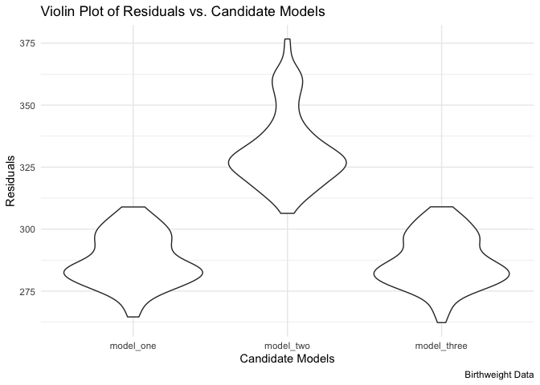

hw6
================
Matthew Spotnitz
11/23/2021

``` r
library(tidyverse)
```

    ## ── Attaching packages ─────────────────────────────────────── tidyverse 1.3.1 ──

    ## ✓ ggplot2 3.3.5     ✓ purrr   0.3.4
    ## ✓ tibble  3.1.5     ✓ dplyr   1.0.7
    ## ✓ tidyr   1.1.3     ✓ stringr 1.4.0
    ## ✓ readr   2.0.1     ✓ forcats 0.5.1

    ## ── Conflicts ────────────────────────────────────────── tidyverse_conflicts() ──
    ## x dplyr::filter() masks stats::filter()
    ## x dplyr::lag()    masks stats::lag()

``` r
library(ggplot2)
library(modelr)
library(mgcv)
```

    ## Loading required package: nlme

    ## 
    ## Attaching package: 'nlme'

    ## The following object is masked from 'package:dplyr':
    ## 
    ##     collapse

    ## This is mgcv 1.8-36. For overview type 'help("mgcv-package")'.

\#\#Problem 1 I will import and view the birthweight dataset.

``` r
birthweight_df = read.csv("birthweight.csv")
birthweight_df = janitor::clean_names(birthweight_df)
head(birthweight_df)
```

    ##   babysex bhead blength  bwt delwt fincome frace gaweeks malform menarche
    ## 1       2    34      51 3629   177      35     1    39.9       0       13
    ## 2       1    34      48 3062   156      65     2    25.9       0       14
    ## 3       2    36      50 3345   148      85     1    39.9       0       12
    ## 4       1    34      52 3062   157      55     1    40.0       0       14
    ## 5       2    34      52 3374   156       5     1    41.6       0       13
    ## 6       1    33      52 3374   129      55     1    40.7       0       12
    ##   mheight momage mrace parity pnumlbw pnumsga    ppbmi ppwt smoken wtgain
    ## 1      63     36     1      3       0       0 26.27184  148      0     29
    ## 2      65     25     2      0       0       0 21.34485  128      0     28
    ## 3      64     29     1      0       0       0 23.56517  137      1     11
    ## 4      64     18     1      0       0       0 21.84508  127     10     30
    ## 5      66     20     1      0       0       0 21.02642  130      1     26
    ## 6      66     23     1      0       0       0 18.60030  115      0     14

``` r
tail(birthweight_df)
```

    ##      babysex bhead blength  bwt delwt fincome frace gaweeks malform menarche
    ## 4337       2    35      52 3657   142      55     2    40.0       0       13
    ## 4338       1    34      50 3147   129      25     2    39.0       0       12
    ## 4339       1    34      51 3430   158      25     2    39.4       0       12
    ## 4340       1    35      52 3090   128      15     2    38.1       0       14
    ## 4341       2    32      46 2268   120       5     2    39.0       0       13
    ## 4342       2    34      52 3232   149      25     2    40.6       0       11
    ##      mheight momage mrace parity pnumlbw pnumsga    ppbmi ppwt smoken wtgain
    ## 4337      63     16     2      0       0       0 21.30149  120      0     22
    ## 4338      64     20     2      0       0       0 18.06089  105      0     24
    ## 4339      66     18     2      0       0       0 19.73249  122      0     36
    ## 4340      56     18     2      0       0       0 21.56776   96      3     32
    ## 4341      62     17     2      0       0       0 19.24491  105      0     15
    ## 4342      63     16     2      0       0       0 23.43164  132      0     17

``` r
str(birthweight_df)
```

    ## 'data.frame':    4342 obs. of  20 variables:
    ##  $ babysex : int  2 1 2 1 2 1 2 2 1 1 ...
    ##  $ bhead   : int  34 34 36 34 34 33 33 33 36 33 ...
    ##  $ blength : int  51 48 50 52 52 52 46 49 52 50 ...
    ##  $ bwt     : int  3629 3062 3345 3062 3374 3374 2523 2778 3515 3459 ...
    ##  $ delwt   : int  177 156 148 157 156 129 126 140 146 169 ...
    ##  $ fincome : int  35 65 85 55 5 55 96 5 85 75 ...
    ##  $ frace   : int  1 2 1 1 1 1 2 1 1 2 ...
    ##  $ gaweeks : num  39.9 25.9 39.9 40 41.6 ...
    ##  $ malform : int  0 0 0 0 0 0 0 0 0 0 ...
    ##  $ menarche: int  13 14 12 14 13 12 14 12 11 12 ...
    ##  $ mheight : int  63 65 64 64 66 66 72 62 61 64 ...
    ##  $ momage  : int  36 25 29 18 20 23 29 19 13 19 ...
    ##  $ mrace   : int  1 2 1 1 1 1 2 1 1 2 ...
    ##  $ parity  : int  3 0 0 0 0 0 0 0 0 0 ...
    ##  $ pnumlbw : int  0 0 0 0 0 0 0 0 0 0 ...
    ##  $ pnumsga : int  0 0 0 0 0 0 0 0 0 0 ...
    ##  $ ppbmi   : num  26.3 21.3 23.6 21.8 21 ...
    ##  $ ppwt    : int  148 128 137 127 130 115 105 119 105 145 ...
    ##  $ smoken  : num  0 0 1 10 1 0 0 0 0 4 ...
    ##  $ wtgain  : int  29 28 11 30 26 14 21 21 41 24 ...

``` r
view(birthweight_df)
```

There are 4342 observations and 20 variables. Those variables are
combinations of integer and numerical formats. I will dnow drop missing
values.

``` r
birthweight_na_df = drop_na(birthweight_df)
str(birthweight_na_df)
```

    ## 'data.frame':    4342 obs. of  20 variables:
    ##  $ babysex : int  2 1 2 1 2 1 2 2 1 1 ...
    ##  $ bhead   : int  34 34 36 34 34 33 33 33 36 33 ...
    ##  $ blength : int  51 48 50 52 52 52 46 49 52 50 ...
    ##  $ bwt     : int  3629 3062 3345 3062 3374 3374 2523 2778 3515 3459 ...
    ##  $ delwt   : int  177 156 148 157 156 129 126 140 146 169 ...
    ##  $ fincome : int  35 65 85 55 5 55 96 5 85 75 ...
    ##  $ frace   : int  1 2 1 1 1 1 2 1 1 2 ...
    ##  $ gaweeks : num  39.9 25.9 39.9 40 41.6 ...
    ##  $ malform : int  0 0 0 0 0 0 0 0 0 0 ...
    ##  $ menarche: int  13 14 12 14 13 12 14 12 11 12 ...
    ##  $ mheight : int  63 65 64 64 66 66 72 62 61 64 ...
    ##  $ momage  : int  36 25 29 18 20 23 29 19 13 19 ...
    ##  $ mrace   : int  1 2 1 1 1 1 2 1 1 2 ...
    ##  $ parity  : int  3 0 0 0 0 0 0 0 0 0 ...
    ##  $ pnumlbw : int  0 0 0 0 0 0 0 0 0 0 ...
    ##  $ pnumsga : int  0 0 0 0 0 0 0 0 0 0 ...
    ##  $ ppbmi   : num  26.3 21.3 23.6 21.8 21 ...
    ##  $ ppwt    : int  148 128 137 127 130 115 105 119 105 145 ...
    ##  $ smoken  : num  0 0 1 10 1 0 0 0 0 4 ...
    ##  $ wtgain  : int  29 28 11 30 26 14 21 21 41 24 ...

There were no missing values. Therefore, it is appropriate to use the
original dataframe. I will make a facetwrap that shows a histogram of
each variable

``` r
ggplot(gather(birthweight_df), aes(value)) + geom_histogram(bins = 10) + facet_wrap(~key, scales = 'free_x')
```

<!-- --> After looking at
these plots, I intend to convert babysex, frace, mrace, malform, and
mrace into factor variables.

``` r
birthweight_factor_df = birthweight_df %>% mutate (babysex = as.factor(babysex), frace = as.factor(frace), mrace = as.factor(mrace), malform = as.factor(malform), mrace = as.factor(mrace))
str(birthweight_factor_df)
```

    ## 'data.frame':    4342 obs. of  20 variables:
    ##  $ babysex : Factor w/ 2 levels "1","2": 2 1 2 1 2 1 2 2 1 1 ...
    ##  $ bhead   : int  34 34 36 34 34 33 33 33 36 33 ...
    ##  $ blength : int  51 48 50 52 52 52 46 49 52 50 ...
    ##  $ bwt     : int  3629 3062 3345 3062 3374 3374 2523 2778 3515 3459 ...
    ##  $ delwt   : int  177 156 148 157 156 129 126 140 146 169 ...
    ##  $ fincome : int  35 65 85 55 5 55 96 5 85 75 ...
    ##  $ frace   : Factor w/ 5 levels "1","2","3","4",..: 1 2 1 1 1 1 2 1 1 2 ...
    ##  $ gaweeks : num  39.9 25.9 39.9 40 41.6 ...
    ##  $ malform : Factor w/ 2 levels "0","1": 1 1 1 1 1 1 1 1 1 1 ...
    ##  $ menarche: int  13 14 12 14 13 12 14 12 11 12 ...
    ##  $ mheight : int  63 65 64 64 66 66 72 62 61 64 ...
    ##  $ momage  : int  36 25 29 18 20 23 29 19 13 19 ...
    ##  $ mrace   : Factor w/ 4 levels "1","2","3","4": 1 2 1 1 1 1 2 1 1 2 ...
    ##  $ parity  : int  3 0 0 0 0 0 0 0 0 0 ...
    ##  $ pnumlbw : int  0 0 0 0 0 0 0 0 0 0 ...
    ##  $ pnumsga : int  0 0 0 0 0 0 0 0 0 0 ...
    ##  $ ppbmi   : num  26.3 21.3 23.6 21.8 21 ...
    ##  $ ppwt    : int  148 128 137 127 130 115 105 119 105 145 ...
    ##  $ smoken  : num  0 0 1 10 1 0 0 0 0 4 ...
    ##  $ wtgain  : int  29 28 11 30 26 14 21 21 41 24 ...

I will make scatter plots for numerical variables that may be associated
with birthweight.

``` r
birthweight_factor_df %>% ggplot(aes(x = bhead, y= bwt)) + geom_point()  ##On inspection, there is a corrleation
```

<!-- -->

``` r
birthweight_factor_df %>% ggplot(aes(x = blength, y= bwt)) + geom_point() ##On inspection, there is a corrrelation
```

<!-- -->

``` r
birthweight_factor_df %>% ggplot(aes(x = delwt, y= bwt)) + geom_point() #There is not a strong correlation
```

<!-- -->

``` r
birthweight_factor_df %>% ggplot(aes(x = gaweeks, y= bwt)) + geom_point() ##There is not a strong correlation
```

<!-- -->

``` r
birthweight_factor_df %>% ggplot(aes(x = menarche, y= bwt)) + geom_point()#There is not a strong correlation
```

<!-- -->

``` r
birthweight_factor_df %>% ggplot(aes(x = fincome, y= bwt)) + geom_point() #There is not a strong correlation
```

<!-- -->

``` r
birthweight_factor_df %>% ggplot(aes(x = mheight, y= bwt)) + geom_point() #There is not a strong correlation
```

<!-- -->

``` r
birthweight_factor_df %>% ggplot(aes(x = momage, y= bwt)) + geom_point() #There is not a strong correlation
```

<!-- -->

``` r
birthweight_factor_df %>% ggplot(aes(x = ppbmi, y= bwt)) + geom_point() #There is not a strong correlation
```

<!-- -->

``` r
birthweight_factor_df %>% ggplot(aes(x = ppwt, y= bwt)) + geom_point()#There is not a strong correlation
```

<!-- -->

``` r
birthweight_factor_df %>% ggplot(aes(x = smoken, y= bwt)) + geom_point() #There is not a strong correlation
```

<!-- -->

``` r
birthweight_factor_df %>% ggplot(aes(x = wtgain, y= bwt)) + geom_point() #There is not a strong correlation
```

<!-- -->

``` r
birthweight_factor_df %>% ggplot(aes(x = parity, y= bwt)) + geom_point() #There is not a strong correlation
```

<!-- --> Now I will plot
brithweight by non-continuous variables

``` r
birthweight_factor_df %>% ggplot(aes(x = babysex, y= bwt)) + geom_boxplot()   #There is not a strong correlation
```

<!-- -->

``` r
birthweight_factor_df %>% ggplot(aes(x = frace, y= bwt)) + geom_boxplot()   #There is not a strong correlation
```

<!-- -->

``` r
birthweight_factor_df %>% ggplot(aes(x = mrace, y= bwt)) + geom_boxplot() #There is not a strong correlation 
```

<!-- -->

``` r
birthweight_factor_df %>% ggplot(aes(x = malform, y= bwt)) + geom_boxplot() # There is not a strong correlation
```

<!-- -->

``` r
#pnumlbw and pnumsga are exlusively zero values.
```

On the basis of this exploratory data analysis, a baby’s head
circumference and length at birth have the strongest correlation with
birthweight. I will map the residuals and fitted values of these models.

``` r
fit = lm(bwt ~ bhead + blength, data = birthweight_factor_df)
birthweight_factor_df %>% modelr::add_residuals(fit) %>% ggplot(aes(x=bhead, y = resid)) + geom_point() ##Overall, there is a uniform distribution of residuals
```

<!-- -->

``` r
birthweight_factor_df %>% modelr::add_residuals(fit) %>% ggplot(aes(x=blength, y = resid)) + geom_point() ##Overall, there is a uniform distribution of residuals
```

<!-- --> Now I will plot
the fitted values

``` r
fit = lm(bwt ~ bhead + blength, data = birthweight_factor_df)
birthweight_factor_df %>% modelr::add_predictions(fit) %>% ggplot(aes(x=bhead, y = pred)) + geom_point() ##Overall, there is a direct correlation between baby's head circumference at birth and fitted values
```

<!-- -->

``` r
birthweight_factor_df %>% modelr::add_predictions(fit) %>% ggplot(aes(x=blength, y = pred)) + geom_point() ##Overall, there is a direct correlation betwen baby's length at birth and fitted values.
```

<!-- --> Now I will
correlate the fitted values with residuals

``` r
fit = lm(bwt ~ bhead + blength, data = birthweight_factor_df)
birthweight_factor_df  %>% modelr::add_residuals(fit)%>% modelr::add_predictions(fit) %>% ggplot(aes(x=pred, y = resid)) + geom_point() +    labs(
    title = "Residuals vs. Fitted Values",
    x = "Fitted Values",
    y = "Residuals",
    caption = "Birthweight Data"
  )  + theme_minimal() #Overall, there is not a strong correlation between fitted values and residuals
```

<!-- --> Now I will fit
more models. In order to make the model with baby sex run, the input
needs to be numeric and not a factor. Also, I will need to split the
data frame into training and testing data.

``` r
birthweight_df = mutate(birthweight_df, id = row_number())
view(birthweight_df)
train_df = sample_n(birthweight_df, 80)
test_df = anti_join(birthweight_df, train_df, by = 'id')
```

Fit the linear models with the training data

``` r
fit = lm(bwt ~ bhead + blength, data = birthweight_df)
fit_length_age = lm(bwt ~ blength + gaweeks, data = birthweight_df)
fit_three = lm (bwt ~ bhead + blength + babysex + bhead*blength*babysex, data = birthweight_df)
```

Now I will add model performance

``` r
train_df %>% 
  gather_predictions(fit, fit_length_age, fit_three) %>% 
  mutate(model = fct_inorder(model))
```

    ##              model babysex bhead blength  bwt delwt fincome frace gaweeks
    ## 1              fit       1    34      51 3515   164      35     1    41.3
    ## 2              fit       2    34      52 3572   156      15     1    41.6
    ## 3              fit       1    35      49 3317   140      45     2    31.0
    ## 4              fit       2    34      51 3147   134      96     1    40.9
    ## 5              fit       2    31      49 2325   132      15     1    36.6
    ## 6              fit       1    34      50 3260   135      95     1    38.9
    ## 7              fit       2    34      53 3714   145      25     1    39.6
    ## 8              fit       2    34      54 3685   232      15     1    43.3
    ## 9              fit       2    32      45 2722   120      35     2    39.9
    ## 10             fit       1    35      53 3827   146      35     1    42.6
    ## 11             fit       2    34      51 3430   162      15     1    41.4
    ## 12             fit       2    33      50 3232   141      15     1    40.0
    ## 13             fit       1    36      52 3714   150      25     2    41.4
    ## 14             fit       2    34      50 2977   131      15     2    46.0
    ## 15             fit       1    35      51 3742   158      25     2    39.7
    ## 16             fit       1    32      45 2466   167      35     2    40.7
    ## 17             fit       1    35      51 3175   160      35     1    39.9
    ## 18             fit       1    32      48 2325   129       5     2    43.3
    ## 19             fit       1    35      53 3629   183      55     1    42.9
    ## 20             fit       1    32      46 2296   113      85     1    36.0
    ## 21             fit       2    33      47 2608   122      95     1    36.6
    ## 22             fit       2    35      45 2722   127      25     1    41.7
    ## 23             fit       2    34      49 2722   117      25     2    32.4
    ## 24             fit       1    34      52 3289   117      25     2    40.0
    ## 25             fit       1    35      51 3402   120      85     1    40.1
    ## 26             fit       2    32      47 2353   132      25     2    36.1
    ## 27             fit       1    34      53 3629   154      75     1    39.3
    ## 28             fit       1    33      54 3374   150      45     1    39.0
    ## 29             fit       1    35      54 3430   167      25     1    38.1
    ## 30             fit       2    35      51 3487   139      15     2    39.6
    ## 31             fit       2    33      50 3175   139      25     2    41.6
    ## 32             fit       2    33      48 3062   145      15     2    40.3
    ## 33             fit       1    35      51 3175   143      55     4    37.6
    ## 34             fit       1    35      51 3374   155      85     1    41.4
    ## 35             fit       2    34      50 2920   125      15     2    41.4
    ## 36             fit       1    34      54 3799   146      85     1    41.0
    ## 37             fit       1    35      51 3289   173      65     1    37.0
    ## 38             fit       1    36      50 3260   126      15     2    39.7
    ## 39             fit       1    32      47 2268   102      15     1    33.7
    ## 40             fit       2    34      51 3317   143      35     1    41.4
    ## 41             fit       2    35      53 3714   190      35     2    38.7
    ## 42             fit       2    35      53 3912   156      35     1    42.4
    ## 43             fit       2    34      51 3374   146      15     2    36.3
    ## 44             fit       2    32      49 2863   150      55     2    36.9
    ## 45             fit       2    34      51 2438   138      45     1    40.4
    ## 46             fit       2    31      49 3175   230      35     2    38.7
    ## 47             fit       1    36      54 3600   149      35     1    45.4
    ## 48             fit       1    34      51 2977   169      15     2    38.1
    ## 49             fit       2    30      45 2325   118      15     1    36.4
    ## 50             fit       1    35      52 3515   158      65     1    42.1
    ## 51             fit       1    32      46 2863   110      25     2    34.9
    ## 52             fit       2    33      54 3572   147      15     1    40.6
    ## 53             fit       2    33      46 2693   132      35     2    38.9
    ## 54             fit       1    37      52 3884   183      75     1    41.7
    ## 55             fit       2    32      49 3033   142      25     1    44.7
    ## 56             fit       2    34      52 3515   152      75     2    40.6
    ## 57             fit       2    27      44 1644   110      15     2    32.3
    ## 58             fit       1    33      51 3317   127      35     1    45.6
    ## 59             fit       1    36      51 3600   135      25     1    40.1
    ## 60             fit       1    34      50 2807   162      35     2    38.1
    ## 61             fit       2    35      52 3515   160      25     2    40.3
    ## 62             fit       1    33      50 2722   181      65     1    37.0
    ## 63             fit       1    33      50 3118   120      15     2    42.6
    ## 64             fit       2    35      52 3118   256      25     2    42.6
    ## 65             fit       1    32      50 2807   119      15     2    37.9
    ## 66             fit       1    35      47 2948   149      45     2    38.9
    ## 67             fit       1    35      54 3799   148       5     1    41.4
    ## 68             fit       1    34      50 2722   148      45     2    40.3
    ## 69             fit       2    34      53 4252   154      45     1    41.6
    ## 70             fit       2    34      47 2495   147      96     1    39.0
    ## 71             fit       2    33      51 2693   124       5     1    40.7
    ## 72             fit       1    34      52 3203   134      25     1    41.1
    ## 73             fit       1    33      49 2551   118      15     2    39.7
    ## 74             fit       1    33      48 3033   134      25     1    37.6
    ## 75             fit       2    34      52 3118   148      96     1    39.6
    ## 76             fit       1    37      52 3459   121      25     2    38.6
    ## 77             fit       2    33      49 3062   126      25     2    39.4
    ## 78             fit       1    31      46 2070   148      75     1    33.6
    ## 79             fit       1    35      54 3685   154      75     1    40.6
    ## 80             fit       1    35      49 2863   163      45     1    34.1
    ## 81  fit_length_age       1    34      51 3515   164      35     1    41.3
    ## 82  fit_length_age       2    34      52 3572   156      15     1    41.6
    ## 83  fit_length_age       1    35      49 3317   140      45     2    31.0
    ## 84  fit_length_age       2    34      51 3147   134      96     1    40.9
    ## 85  fit_length_age       2    31      49 2325   132      15     1    36.6
    ## 86  fit_length_age       1    34      50 3260   135      95     1    38.9
    ## 87  fit_length_age       2    34      53 3714   145      25     1    39.6
    ## 88  fit_length_age       2    34      54 3685   232      15     1    43.3
    ## 89  fit_length_age       2    32      45 2722   120      35     2    39.9
    ## 90  fit_length_age       1    35      53 3827   146      35     1    42.6
    ## 91  fit_length_age       2    34      51 3430   162      15     1    41.4
    ## 92  fit_length_age       2    33      50 3232   141      15     1    40.0
    ## 93  fit_length_age       1    36      52 3714   150      25     2    41.4
    ## 94  fit_length_age       2    34      50 2977   131      15     2    46.0
    ## 95  fit_length_age       1    35      51 3742   158      25     2    39.7
    ## 96  fit_length_age       1    32      45 2466   167      35     2    40.7
    ## 97  fit_length_age       1    35      51 3175   160      35     1    39.9
    ## 98  fit_length_age       1    32      48 2325   129       5     2    43.3
    ## 99  fit_length_age       1    35      53 3629   183      55     1    42.9
    ## 100 fit_length_age       1    32      46 2296   113      85     1    36.0
    ## 101 fit_length_age       2    33      47 2608   122      95     1    36.6
    ## 102 fit_length_age       2    35      45 2722   127      25     1    41.7
    ## 103 fit_length_age       2    34      49 2722   117      25     2    32.4
    ## 104 fit_length_age       1    34      52 3289   117      25     2    40.0
    ## 105 fit_length_age       1    35      51 3402   120      85     1    40.1
    ## 106 fit_length_age       2    32      47 2353   132      25     2    36.1
    ## 107 fit_length_age       1    34      53 3629   154      75     1    39.3
    ## 108 fit_length_age       1    33      54 3374   150      45     1    39.0
    ## 109 fit_length_age       1    35      54 3430   167      25     1    38.1
    ## 110 fit_length_age       2    35      51 3487   139      15     2    39.6
    ## 111 fit_length_age       2    33      50 3175   139      25     2    41.6
    ## 112 fit_length_age       2    33      48 3062   145      15     2    40.3
    ## 113 fit_length_age       1    35      51 3175   143      55     4    37.6
    ## 114 fit_length_age       1    35      51 3374   155      85     1    41.4
    ## 115 fit_length_age       2    34      50 2920   125      15     2    41.4
    ## 116 fit_length_age       1    34      54 3799   146      85     1    41.0
    ## 117 fit_length_age       1    35      51 3289   173      65     1    37.0
    ## 118 fit_length_age       1    36      50 3260   126      15     2    39.7
    ## 119 fit_length_age       1    32      47 2268   102      15     1    33.7
    ## 120 fit_length_age       2    34      51 3317   143      35     1    41.4
    ## 121 fit_length_age       2    35      53 3714   190      35     2    38.7
    ## 122 fit_length_age       2    35      53 3912   156      35     1    42.4
    ## 123 fit_length_age       2    34      51 3374   146      15     2    36.3
    ## 124 fit_length_age       2    32      49 2863   150      55     2    36.9
    ## 125 fit_length_age       2    34      51 2438   138      45     1    40.4
    ## 126 fit_length_age       2    31      49 3175   230      35     2    38.7
    ## 127 fit_length_age       1    36      54 3600   149      35     1    45.4
    ## 128 fit_length_age       1    34      51 2977   169      15     2    38.1
    ## 129 fit_length_age       2    30      45 2325   118      15     1    36.4
    ## 130 fit_length_age       1    35      52 3515   158      65     1    42.1
    ## 131 fit_length_age       1    32      46 2863   110      25     2    34.9
    ## 132 fit_length_age       2    33      54 3572   147      15     1    40.6
    ## 133 fit_length_age       2    33      46 2693   132      35     2    38.9
    ## 134 fit_length_age       1    37      52 3884   183      75     1    41.7
    ## 135 fit_length_age       2    32      49 3033   142      25     1    44.7
    ## 136 fit_length_age       2    34      52 3515   152      75     2    40.6
    ## 137 fit_length_age       2    27      44 1644   110      15     2    32.3
    ## 138 fit_length_age       1    33      51 3317   127      35     1    45.6
    ## 139 fit_length_age       1    36      51 3600   135      25     1    40.1
    ## 140 fit_length_age       1    34      50 2807   162      35     2    38.1
    ## 141 fit_length_age       2    35      52 3515   160      25     2    40.3
    ## 142 fit_length_age       1    33      50 2722   181      65     1    37.0
    ## 143 fit_length_age       1    33      50 3118   120      15     2    42.6
    ## 144 fit_length_age       2    35      52 3118   256      25     2    42.6
    ## 145 fit_length_age       1    32      50 2807   119      15     2    37.9
    ## 146 fit_length_age       1    35      47 2948   149      45     2    38.9
    ## 147 fit_length_age       1    35      54 3799   148       5     1    41.4
    ## 148 fit_length_age       1    34      50 2722   148      45     2    40.3
    ## 149 fit_length_age       2    34      53 4252   154      45     1    41.6
    ## 150 fit_length_age       2    34      47 2495   147      96     1    39.0
    ## 151 fit_length_age       2    33      51 2693   124       5     1    40.7
    ## 152 fit_length_age       1    34      52 3203   134      25     1    41.1
    ## 153 fit_length_age       1    33      49 2551   118      15     2    39.7
    ## 154 fit_length_age       1    33      48 3033   134      25     1    37.6
    ## 155 fit_length_age       2    34      52 3118   148      96     1    39.6
    ## 156 fit_length_age       1    37      52 3459   121      25     2    38.6
    ## 157 fit_length_age       2    33      49 3062   126      25     2    39.4
    ## 158 fit_length_age       1    31      46 2070   148      75     1    33.6
    ## 159 fit_length_age       1    35      54 3685   154      75     1    40.6
    ## 160 fit_length_age       1    35      49 2863   163      45     1    34.1
    ## 161      fit_three       1    34      51 3515   164      35     1    41.3
    ## 162      fit_three       2    34      52 3572   156      15     1    41.6
    ## 163      fit_three       1    35      49 3317   140      45     2    31.0
    ## 164      fit_three       2    34      51 3147   134      96     1    40.9
    ## 165      fit_three       2    31      49 2325   132      15     1    36.6
    ## 166      fit_three       1    34      50 3260   135      95     1    38.9
    ## 167      fit_three       2    34      53 3714   145      25     1    39.6
    ## 168      fit_three       2    34      54 3685   232      15     1    43.3
    ## 169      fit_three       2    32      45 2722   120      35     2    39.9
    ## 170      fit_three       1    35      53 3827   146      35     1    42.6
    ## 171      fit_three       2    34      51 3430   162      15     1    41.4
    ## 172      fit_three       2    33      50 3232   141      15     1    40.0
    ## 173      fit_three       1    36      52 3714   150      25     2    41.4
    ## 174      fit_three       2    34      50 2977   131      15     2    46.0
    ## 175      fit_three       1    35      51 3742   158      25     2    39.7
    ## 176      fit_three       1    32      45 2466   167      35     2    40.7
    ## 177      fit_three       1    35      51 3175   160      35     1    39.9
    ## 178      fit_three       1    32      48 2325   129       5     2    43.3
    ## 179      fit_three       1    35      53 3629   183      55     1    42.9
    ## 180      fit_three       1    32      46 2296   113      85     1    36.0
    ## 181      fit_three       2    33      47 2608   122      95     1    36.6
    ## 182      fit_three       2    35      45 2722   127      25     1    41.7
    ## 183      fit_three       2    34      49 2722   117      25     2    32.4
    ## 184      fit_three       1    34      52 3289   117      25     2    40.0
    ## 185      fit_three       1    35      51 3402   120      85     1    40.1
    ## 186      fit_three       2    32      47 2353   132      25     2    36.1
    ## 187      fit_three       1    34      53 3629   154      75     1    39.3
    ## 188      fit_three       1    33      54 3374   150      45     1    39.0
    ## 189      fit_three       1    35      54 3430   167      25     1    38.1
    ## 190      fit_three       2    35      51 3487   139      15     2    39.6
    ## 191      fit_three       2    33      50 3175   139      25     2    41.6
    ## 192      fit_three       2    33      48 3062   145      15     2    40.3
    ## 193      fit_three       1    35      51 3175   143      55     4    37.6
    ## 194      fit_three       1    35      51 3374   155      85     1    41.4
    ## 195      fit_three       2    34      50 2920   125      15     2    41.4
    ## 196      fit_three       1    34      54 3799   146      85     1    41.0
    ## 197      fit_three       1    35      51 3289   173      65     1    37.0
    ## 198      fit_three       1    36      50 3260   126      15     2    39.7
    ## 199      fit_three       1    32      47 2268   102      15     1    33.7
    ## 200      fit_three       2    34      51 3317   143      35     1    41.4
    ## 201      fit_three       2    35      53 3714   190      35     2    38.7
    ## 202      fit_three       2    35      53 3912   156      35     1    42.4
    ## 203      fit_three       2    34      51 3374   146      15     2    36.3
    ## 204      fit_three       2    32      49 2863   150      55     2    36.9
    ## 205      fit_three       2    34      51 2438   138      45     1    40.4
    ## 206      fit_three       2    31      49 3175   230      35     2    38.7
    ## 207      fit_three       1    36      54 3600   149      35     1    45.4
    ## 208      fit_three       1    34      51 2977   169      15     2    38.1
    ## 209      fit_three       2    30      45 2325   118      15     1    36.4
    ## 210      fit_three       1    35      52 3515   158      65     1    42.1
    ## 211      fit_three       1    32      46 2863   110      25     2    34.9
    ## 212      fit_three       2    33      54 3572   147      15     1    40.6
    ## 213      fit_three       2    33      46 2693   132      35     2    38.9
    ## 214      fit_three       1    37      52 3884   183      75     1    41.7
    ## 215      fit_three       2    32      49 3033   142      25     1    44.7
    ## 216      fit_three       2    34      52 3515   152      75     2    40.6
    ## 217      fit_three       2    27      44 1644   110      15     2    32.3
    ## 218      fit_three       1    33      51 3317   127      35     1    45.6
    ## 219      fit_three       1    36      51 3600   135      25     1    40.1
    ## 220      fit_three       1    34      50 2807   162      35     2    38.1
    ## 221      fit_three       2    35      52 3515   160      25     2    40.3
    ## 222      fit_three       1    33      50 2722   181      65     1    37.0
    ## 223      fit_three       1    33      50 3118   120      15     2    42.6
    ## 224      fit_three       2    35      52 3118   256      25     2    42.6
    ## 225      fit_three       1    32      50 2807   119      15     2    37.9
    ## 226      fit_three       1    35      47 2948   149      45     2    38.9
    ## 227      fit_three       1    35      54 3799   148       5     1    41.4
    ## 228      fit_three       1    34      50 2722   148      45     2    40.3
    ## 229      fit_three       2    34      53 4252   154      45     1    41.6
    ## 230      fit_three       2    34      47 2495   147      96     1    39.0
    ## 231      fit_three       2    33      51 2693   124       5     1    40.7
    ## 232      fit_three       1    34      52 3203   134      25     1    41.1
    ## 233      fit_three       1    33      49 2551   118      15     2    39.7
    ## 234      fit_three       1    33      48 3033   134      25     1    37.6
    ## 235      fit_three       2    34      52 3118   148      96     1    39.6
    ## 236      fit_three       1    37      52 3459   121      25     2    38.6
    ## 237      fit_three       2    33      49 3062   126      25     2    39.4
    ## 238      fit_three       1    31      46 2070   148      75     1    33.6
    ## 239      fit_three       1    35      54 3685   154      75     1    40.6
    ## 240      fit_three       1    35      49 2863   163      45     1    34.1
    ##     malform menarche mheight momage mrace parity pnumlbw pnumsga    ppbmi ppwt
    ## 1         0       12      62     19     1      0       0       0 24.56017  134
    ## 2         0       15      61     17     1      0       0       0 21.58515  114
    ## 3         0       13      61     19     2      0       0       0 22.34252  118
    ## 4         0       12      62     18     1      0       0       0 21.99418  120
    ## 5         0       13      62     21     1      0       0       0 20.16133  110
    ## 6         0       16      63     23     1      0       0       0 21.65652  122
    ## 7         0       13      66     20     1      0       0       0 20.70294  128
    ## 8         0       15      63     18     1      0       0       0 28.40199  160
    ## 9         0       14      64     20     2      0       0       0 17.71688  103
    ## 10        0       11      62     23     1      0       0       0 21.99418  120
    ## 11        0       12      64     17     1      0       0       0 19.78098  115
    ## 12        0       13      64     24     1      0       0       0 19.78098  115
    ## 13        0       14      62     19     2      0       0       0 20.16133  110
    ## 14        0       12      63     17     2      0       0       0 19.52637  110
    ## 15        0       13      61     23     2      0       0       0 20.82778  110
    ## 16        0       10      66     14     2      0       0       0 22.80558  141
    ## 17        0       11      58     21     1      0       0       0 30.99671  148
    ## 18        0       13      65     15     2      0       0       0 18.34323  110
    ## 19        0       11      62     21     1      0       0       0 34.09098  186
    ## 20        0       14      62     19     1      0       0       0 17.59534   96
    ## 21        0       12      65     25     1      0       0       0 17.00918  102
    ## 22        1       11      60     16     1      0       0       0 20.35358  104
    ## 23        0       13      61     17     2      0       0       0 18.93434  100
    ## 24        0       12      59     18     2      0       0       0 17.20382   85
    ## 25        0       15      60     26     1      0       0       0 21.52782  110
    ## 26        0       14      69     25     2      0       0       0 16.27813  110
    ## 27        0       14      65     22     1      0       0       0 22.01188  132
    ## 28        0       14      65     20     1      0       0       0 21.67837  130
    ## 29        0       11      63     21     1      0       0       0 25.73930  145
    ## 30        0       12      64     14     2      0       0       0 19.95299  116
    ## 31        0       12      65     16     2      0       0       0 18.00972  108
    ## 32        0       12      59     16     2      0       0       0 26.31172  130
    ## 33        0       13      62     20     2      0       0       0 21.07775  115
    ## 34        0       11      65     21     1      0       0       0 24.17971  145
    ## 35        0       12      65     16     2      0       0       0 18.67674  112
    ## 36        0       12      68     28     1      0       0       0 19.50303  128
    ## 37        0       10      65     24     1      0       0       0 24.17971  145
    ## 38        0       13      63     20     2      0       0       0 18.63881  105
    ## 39        0       12      54     21     1      0       0       0 20.05397   83
    ## 40        0       12      63     18     1      0       0       0 19.70388  111
    ## 41        0       15      66     18     2      0       0       0 25.06996  155
    ## 42        0       12      64     22     1      0       0       0 24.94123  145
    ## 43        0       13      64     24     2      0       0       0 23.22115  135
    ## 44        0       12      65     20     2      0       0       0 19.17702  115
    ## 45        0       14      60     18     1      0       0       0 21.91924  112
    ## 46        0       15      66     23     2      0       0       0 29.92221  185
    ## 47        0       11      60     21     1      0       0       0 23.48490  120
    ## 48        0       12      62     18     2      0       0       0 24.56017  134
    ## 49        0       13      63     17     1      0       0       0 16.86368   95
    ## 50        0       14      68     22     1      0       0       0 21.33144  140
    ## 51        0       12      60     17     2      0       0       0 18.00509   92
    ## 52        0       13      65     21     1      0       0       0 20.01080  120
    ## 53        0       12      64     21     2      0       0       0 17.37286  101
    ## 54        0       14      64     21     1      0       0       0 27.52136  160
    ## 55        0       12      64     18     1      0       0       0 21.15705  123
    ## 56        0       12      63     17     2      0       0       0 19.52637  110
    ## 57        0       11      61     18     2      0       0       0 20.82778  110
    ## 58        0       16      64     17     1      0       0       0 18.92094  110
    ## 59        0       11      62     19     1      0       0       0 20.16133  110
    ## 60        0       12      62     16     2      0       0       0 20.71119  113
    ## 61        0       12      66     21     2      0       0       0 22.64384  140
    ## 62        0       14      64     19     1      0       0       0 23.22115  135
    ## 63        0       14      63     17     2      0       0       0 18.10627  102
    ## 64        0       13      63     16     2      0       0       0 32.83980  185
    ## 65        0       13      63     17     2      0       0       0 20.41393  115
    ## 66        0       13      63     41     2      0       0       0 25.20677  142
    ## 67        0       13      66     19     1      0       0       0 21.02642  130
    ## 68        0       13      63     22     2      0       0       0 25.73930  145
    ## 69        0       13      67     21     1      0       0       0 20.71735  132
    ## 70        0       13      62     21     1      0       0       0 24.74345  135
    ## 71        0       14      63     19     1      0       0       0 17.39622   98
    ## 72        0       14      61     23     1      0       0       0 22.72121  120
    ## 73        0       14      64     23     2      0       0       0 19.09295  111
    ## 74        0       13      65     18     1      0       0       0 21.34485  128
    ## 75        0       13      62     18     1      0       0       0 21.07775  115
    ## 76        0       13      63     21     2      0       0       0 19.52637  110
    ## 77        0       11      62     18     2      0       0       0 20.52790  112
    ## 78        0       13      69     24     1      0       0       0 19.97770  135
    ## 79        0       14      65     17     1      0       0       0 20.67783  124
    ## 80        0       13      65     19     1      0       0       0 24.67999  148
    ## 81        0       12      62     19     1      0       0       0 24.56017  134
    ## 82        0       15      61     17     1      0       0       0 21.58515  114
    ## 83        0       13      61     19     2      0       0       0 22.34252  118
    ## 84        0       12      62     18     1      0       0       0 21.99418  120
    ## 85        0       13      62     21     1      0       0       0 20.16133  110
    ## 86        0       16      63     23     1      0       0       0 21.65652  122
    ## 87        0       13      66     20     1      0       0       0 20.70294  128
    ## 88        0       15      63     18     1      0       0       0 28.40199  160
    ## 89        0       14      64     20     2      0       0       0 17.71688  103
    ## 90        0       11      62     23     1      0       0       0 21.99418  120
    ## 91        0       12      64     17     1      0       0       0 19.78098  115
    ## 92        0       13      64     24     1      0       0       0 19.78098  115
    ## 93        0       14      62     19     2      0       0       0 20.16133  110
    ## 94        0       12      63     17     2      0       0       0 19.52637  110
    ## 95        0       13      61     23     2      0       0       0 20.82778  110
    ## 96        0       10      66     14     2      0       0       0 22.80558  141
    ## 97        0       11      58     21     1      0       0       0 30.99671  148
    ## 98        0       13      65     15     2      0       0       0 18.34323  110
    ## 99        0       11      62     21     1      0       0       0 34.09098  186
    ## 100       0       14      62     19     1      0       0       0 17.59534   96
    ## 101       0       12      65     25     1      0       0       0 17.00918  102
    ## 102       1       11      60     16     1      0       0       0 20.35358  104
    ## 103       0       13      61     17     2      0       0       0 18.93434  100
    ## 104       0       12      59     18     2      0       0       0 17.20382   85
    ## 105       0       15      60     26     1      0       0       0 21.52782  110
    ## 106       0       14      69     25     2      0       0       0 16.27813  110
    ## 107       0       14      65     22     1      0       0       0 22.01188  132
    ## 108       0       14      65     20     1      0       0       0 21.67837  130
    ## 109       0       11      63     21     1      0       0       0 25.73930  145
    ## 110       0       12      64     14     2      0       0       0 19.95299  116
    ## 111       0       12      65     16     2      0       0       0 18.00972  108
    ## 112       0       12      59     16     2      0       0       0 26.31172  130
    ## 113       0       13      62     20     2      0       0       0 21.07775  115
    ## 114       0       11      65     21     1      0       0       0 24.17971  145
    ## 115       0       12      65     16     2      0       0       0 18.67674  112
    ## 116       0       12      68     28     1      0       0       0 19.50303  128
    ## 117       0       10      65     24     1      0       0       0 24.17971  145
    ## 118       0       13      63     20     2      0       0       0 18.63881  105
    ## 119       0       12      54     21     1      0       0       0 20.05397   83
    ## 120       0       12      63     18     1      0       0       0 19.70388  111
    ## 121       0       15      66     18     2      0       0       0 25.06996  155
    ## 122       0       12      64     22     1      0       0       0 24.94123  145
    ## 123       0       13      64     24     2      0       0       0 23.22115  135
    ## 124       0       12      65     20     2      0       0       0 19.17702  115
    ## 125       0       14      60     18     1      0       0       0 21.91924  112
    ## 126       0       15      66     23     2      0       0       0 29.92221  185
    ## 127       0       11      60     21     1      0       0       0 23.48490  120
    ## 128       0       12      62     18     2      0       0       0 24.56017  134
    ## 129       0       13      63     17     1      0       0       0 16.86368   95
    ## 130       0       14      68     22     1      0       0       0 21.33144  140
    ## 131       0       12      60     17     2      0       0       0 18.00509   92
    ## 132       0       13      65     21     1      0       0       0 20.01080  120
    ## 133       0       12      64     21     2      0       0       0 17.37286  101
    ## 134       0       14      64     21     1      0       0       0 27.52136  160
    ## 135       0       12      64     18     1      0       0       0 21.15705  123
    ## 136       0       12      63     17     2      0       0       0 19.52637  110
    ## 137       0       11      61     18     2      0       0       0 20.82778  110
    ## 138       0       16      64     17     1      0       0       0 18.92094  110
    ## 139       0       11      62     19     1      0       0       0 20.16133  110
    ## 140       0       12      62     16     2      0       0       0 20.71119  113
    ## 141       0       12      66     21     2      0       0       0 22.64384  140
    ## 142       0       14      64     19     1      0       0       0 23.22115  135
    ## 143       0       14      63     17     2      0       0       0 18.10627  102
    ## 144       0       13      63     16     2      0       0       0 32.83980  185
    ## 145       0       13      63     17     2      0       0       0 20.41393  115
    ## 146       0       13      63     41     2      0       0       0 25.20677  142
    ## 147       0       13      66     19     1      0       0       0 21.02642  130
    ## 148       0       13      63     22     2      0       0       0 25.73930  145
    ## 149       0       13      67     21     1      0       0       0 20.71735  132
    ## 150       0       13      62     21     1      0       0       0 24.74345  135
    ## 151       0       14      63     19     1      0       0       0 17.39622   98
    ## 152       0       14      61     23     1      0       0       0 22.72121  120
    ## 153       0       14      64     23     2      0       0       0 19.09295  111
    ## 154       0       13      65     18     1      0       0       0 21.34485  128
    ## 155       0       13      62     18     1      0       0       0 21.07775  115
    ## 156       0       13      63     21     2      0       0       0 19.52637  110
    ## 157       0       11      62     18     2      0       0       0 20.52790  112
    ## 158       0       13      69     24     1      0       0       0 19.97770  135
    ## 159       0       14      65     17     1      0       0       0 20.67783  124
    ## 160       0       13      65     19     1      0       0       0 24.67999  148
    ## 161       0       12      62     19     1      0       0       0 24.56017  134
    ## 162       0       15      61     17     1      0       0       0 21.58515  114
    ## 163       0       13      61     19     2      0       0       0 22.34252  118
    ## 164       0       12      62     18     1      0       0       0 21.99418  120
    ## 165       0       13      62     21     1      0       0       0 20.16133  110
    ## 166       0       16      63     23     1      0       0       0 21.65652  122
    ## 167       0       13      66     20     1      0       0       0 20.70294  128
    ## 168       0       15      63     18     1      0       0       0 28.40199  160
    ## 169       0       14      64     20     2      0       0       0 17.71688  103
    ## 170       0       11      62     23     1      0       0       0 21.99418  120
    ## 171       0       12      64     17     1      0       0       0 19.78098  115
    ## 172       0       13      64     24     1      0       0       0 19.78098  115
    ## 173       0       14      62     19     2      0       0       0 20.16133  110
    ## 174       0       12      63     17     2      0       0       0 19.52637  110
    ## 175       0       13      61     23     2      0       0       0 20.82778  110
    ## 176       0       10      66     14     2      0       0       0 22.80558  141
    ## 177       0       11      58     21     1      0       0       0 30.99671  148
    ## 178       0       13      65     15     2      0       0       0 18.34323  110
    ## 179       0       11      62     21     1      0       0       0 34.09098  186
    ## 180       0       14      62     19     1      0       0       0 17.59534   96
    ## 181       0       12      65     25     1      0       0       0 17.00918  102
    ## 182       1       11      60     16     1      0       0       0 20.35358  104
    ## 183       0       13      61     17     2      0       0       0 18.93434  100
    ## 184       0       12      59     18     2      0       0       0 17.20382   85
    ## 185       0       15      60     26     1      0       0       0 21.52782  110
    ## 186       0       14      69     25     2      0       0       0 16.27813  110
    ## 187       0       14      65     22     1      0       0       0 22.01188  132
    ## 188       0       14      65     20     1      0       0       0 21.67837  130
    ## 189       0       11      63     21     1      0       0       0 25.73930  145
    ## 190       0       12      64     14     2      0       0       0 19.95299  116
    ## 191       0       12      65     16     2      0       0       0 18.00972  108
    ## 192       0       12      59     16     2      0       0       0 26.31172  130
    ## 193       0       13      62     20     2      0       0       0 21.07775  115
    ## 194       0       11      65     21     1      0       0       0 24.17971  145
    ## 195       0       12      65     16     2      0       0       0 18.67674  112
    ## 196       0       12      68     28     1      0       0       0 19.50303  128
    ## 197       0       10      65     24     1      0       0       0 24.17971  145
    ## 198       0       13      63     20     2      0       0       0 18.63881  105
    ## 199       0       12      54     21     1      0       0       0 20.05397   83
    ## 200       0       12      63     18     1      0       0       0 19.70388  111
    ## 201       0       15      66     18     2      0       0       0 25.06996  155
    ## 202       0       12      64     22     1      0       0       0 24.94123  145
    ## 203       0       13      64     24     2      0       0       0 23.22115  135
    ## 204       0       12      65     20     2      0       0       0 19.17702  115
    ## 205       0       14      60     18     1      0       0       0 21.91924  112
    ## 206       0       15      66     23     2      0       0       0 29.92221  185
    ## 207       0       11      60     21     1      0       0       0 23.48490  120
    ## 208       0       12      62     18     2      0       0       0 24.56017  134
    ## 209       0       13      63     17     1      0       0       0 16.86368   95
    ## 210       0       14      68     22     1      0       0       0 21.33144  140
    ## 211       0       12      60     17     2      0       0       0 18.00509   92
    ## 212       0       13      65     21     1      0       0       0 20.01080  120
    ## 213       0       12      64     21     2      0       0       0 17.37286  101
    ## 214       0       14      64     21     1      0       0       0 27.52136  160
    ## 215       0       12      64     18     1      0       0       0 21.15705  123
    ## 216       0       12      63     17     2      0       0       0 19.52637  110
    ## 217       0       11      61     18     2      0       0       0 20.82778  110
    ## 218       0       16      64     17     1      0       0       0 18.92094  110
    ## 219       0       11      62     19     1      0       0       0 20.16133  110
    ## 220       0       12      62     16     2      0       0       0 20.71119  113
    ## 221       0       12      66     21     2      0       0       0 22.64384  140
    ## 222       0       14      64     19     1      0       0       0 23.22115  135
    ## 223       0       14      63     17     2      0       0       0 18.10627  102
    ## 224       0       13      63     16     2      0       0       0 32.83980  185
    ## 225       0       13      63     17     2      0       0       0 20.41393  115
    ## 226       0       13      63     41     2      0       0       0 25.20677  142
    ## 227       0       13      66     19     1      0       0       0 21.02642  130
    ## 228       0       13      63     22     2      0       0       0 25.73930  145
    ## 229       0       13      67     21     1      0       0       0 20.71735  132
    ## 230       0       13      62     21     1      0       0       0 24.74345  135
    ## 231       0       14      63     19     1      0       0       0 17.39622   98
    ## 232       0       14      61     23     1      0       0       0 22.72121  120
    ## 233       0       14      64     23     2      0       0       0 19.09295  111
    ## 234       0       13      65     18     1      0       0       0 21.34485  128
    ## 235       0       13      62     18     1      0       0       0 21.07775  115
    ## 236       0       13      63     21     2      0       0       0 19.52637  110
    ## 237       0       11      62     18     2      0       0       0 20.52790  112
    ## 238       0       13      69     24     1      0       0       0 19.97770  135
    ## 239       0       14      65     17     1      0       0       0 20.67783  124
    ## 240       0       13      65     19     1      0       0       0 24.67999  148
    ##     smoken wtgain   id     pred
    ## 1    10.00     30  765 3271.626
    ## 2     0.00     42 3744 3356.656
    ## 3     2.00     22 1305 3247.586
    ## 4     7.00     14 3904 3271.626
    ## 5     0.00     22 2077 2663.503
    ## 6     0.00     13 1180 3186.595
    ## 7     0.00     17 2304 3441.686
    ## 8     3.00     72 2906 3526.716
    ## 9    15.00     17 1368 2469.403
    ## 10    0.00     26  262 3587.707
    ## 11    3.00     47 1544 3271.626
    ## 12    0.00     26 2973 3040.575
    ## 13    0.00     40 4323 3648.697
    ## 14    0.00     21 3312 3186.595
    ## 15    0.00     48 3123 3417.646
    ## 16    0.00     26 1633 2469.403
    ## 17    0.00     12  742 3417.646
    ## 18    4.00     19 4112 2724.494
    ## 19    0.00     -3  618 3587.707
    ## 20   15.00     17  827 2554.433
    ## 21    0.00     20 1114 2785.484
    ## 22   30.00     23 3019 2907.465
    ## 23    0.00     17 2871 3101.565
    ## 24    0.00     32 3369 3356.656
    ## 25    0.00     10  291 3417.646
    ## 26    6.00     22 4182 2639.463
    ## 27    0.00     22 2597 3441.686
    ## 28    1.00     20  677 3380.695
    ## 29   10.00     22 3443 3672.737
    ## 30    5.00     23 1705 3417.646
    ## 31    3.00     31 4217 3040.575
    ## 32    0.00     15 2026 2870.514
    ## 33    0.00     28 2590 3417.646
    ## 34    0.00     10 1270 3417.646
    ## 35    0.00     13 4123 3186.595
    ## 36    0.00     18  945 3526.716
    ## 37    0.00     28  637 3417.646
    ## 38    4.00     21  653 3478.637
    ## 39    1.00     19 4153 2639.463
    ## 40    7.00     32 2875 3271.626
    ## 41   11.00     35 3388 3587.707
    ## 42   18.00     11  233 3587.707
    ## 43   30.00     11 3307 3271.626
    ## 44    0.00     35 3191 2809.524
    ## 45    4.00     26 3774 3271.626
    ## 46    0.75     45 2771 2663.503
    ## 47   10.00     29 2572 3818.758
    ## 48    3.00     35 3562 3271.626
    ## 49    0.00     23  145 2177.361
    ## 50    0.00     18  738 3502.677
    ## 51    4.00     18 3548 2554.433
    ## 52    8.00     27 2373 3380.695
    ## 53    4.00     31 1395 2700.454
    ## 54    0.00     23  986 3794.718
    ## 55    5.00     19 2902 2809.524
    ## 56    8.00     42 3634 3356.656
    ## 57   10.00      0 1974 1654.269
    ## 58   10.00     17 2977 3125.605
    ## 59   10.00     25  395 3563.667
    ## 60    2.00     49 4261 3186.595
    ## 61    0.00     20 3058 3502.677
    ## 62    0.00     46 3769 3040.575
    ## 63   10.00     18 3306 3040.575
    ## 64    0.00     71 3384 3502.677
    ## 65    0.00      4 4083 2894.554
    ## 66    2.00      7 1677 3077.526
    ## 67    0.00     18 2155 3672.737
    ## 68    7.00      3 4204 3186.595
    ## 69   15.00     22  437 3441.686
    ## 70   15.00     12 2196 2931.505
    ## 71   20.00     26 2855 3125.605
    ## 72    0.00     14   21 3356.656
    ## 73    0.00      7 4038 2955.544
    ## 74   15.00      6  607 2870.514
    ## 75   20.00     33  573 3356.656
    ## 76    0.00     11 4189 3794.718
    ## 77   10.00     14 3280 2955.544
    ## 78    0.00     13  340 2408.412
    ## 79   20.00     30  627 3672.737
    ## 80    0.00     15 1843 3247.586
    ## 81   10.00     30  765 3325.703
    ## 82    0.00     42 3744 3462.373
    ## 83    2.00     22 1305 2790.010
    ## 84    7.00     14 3904 3314.885
    ## 85    0.00     22 2077 2941.472
    ## 86    0.00     13 1180 3132.235
    ## 87    0.00     17 2304 3536.835
    ## 88    3.00     72 2906 3765.464
    ## 89   15.00     17 1368 2516.504
    ## 90    0.00     26  262 3617.975
    ## 91    3.00     47 1544 3328.408
    ## 92    0.00     26 2973 3161.987
    ## 93    0.00     40 4323 3456.964
    ## 94    0.00     21 3312 3324.267
    ## 95    0.00     48 3123 3282.428
    ## 96    0.00     26 1633 2538.141
    ## 97    0.00     12  742 3287.838
    ## 98    4.00     19 4112 2994.130
    ## 99    0.00     -3  618 3626.089
    ## 100  15.00     17  827 2539.577
    ## 101   0.00     20 1114 2684.361
    ## 102  30.00     23 3019 2565.188
    ## 103   0.00     17 2871 2827.876
    ## 104   0.00     32 3369 3419.098
    ## 105   0.00     10  291 3293.247
    ## 106   6.00     22 4182 2670.837
    ## 107   0.00     22 2597 3528.721
    ## 108   1.00     20  677 3649.163
    ## 109  10.00     22 3443 3624.821
    ## 110   5.00     23 1705 3279.724
    ## 111   3.00     31 4217 3205.262
    ## 112   0.00     15 2026 2912.989
    ## 113   0.00     28 2590 3225.630
    ## 114   0.00     10 1270 3328.408
    ## 115   0.00     13 4123 3199.852
    ## 116   0.00     18  945 3703.256
    ## 117   0.00     28  637 3209.402
    ## 118   4.00     21  653 3153.873
    ## 119   1.00     19 4153 2605.925
    ## 120   7.00     32 2875 3328.408
    ## 121  11.00     35 3388 3512.493
    ## 122  18.00     11  233 3612.566
    ## 123  30.00     11 3307 3190.470
    ## 124   0.00     35 3191 2949.586
    ## 125   4.00     26 3774 3301.361
    ## 126   0.75     45 2771 2998.270
    ## 127  10.00     29 2572 3822.262
    ## 128   3.00     35 3562 3239.154
    ## 129   0.00     23  145 2421.840
    ## 130   0.00     18  738 3475.896
    ## 131   4.00     18 3548 2509.826
    ## 132   8.00     27 2373 3692.438
    ## 133   4.00     31 1395 2618.013
    ## 134   0.00     23  986 3465.078
    ## 135   5.00     19 2902 3160.551
    ## 136   8.00     42 3634 3435.326
    ## 137  10.00      0 1974 2182.393
    ## 138  10.00     17 2977 3442.004
    ## 139  10.00     25  395 3293.247
    ## 140   2.00     49 4261 3110.598
    ## 141   0.00     20 3058 3427.212
    ## 142   0.00     46 3769 3080.847
    ## 143  10.00     18 3306 3232.308
    ## 144   0.00     71 3384 3489.420
    ## 145   0.00      4 4083 3105.189
    ## 146   2.00      7 1677 2746.568
    ## 147   0.00     18 2155 3714.075
    ## 148   7.00      3 4204 3170.101
    ## 149  15.00     22  437 3590.929
    ## 150  15.00     12 2196 2749.273
    ## 151  20.00     26 2855 3309.475
    ## 152   0.00     14   21 3448.850
    ## 153   0.00      7 4038 3025.317
    ## 154  15.00      6  607 2839.963
    ## 155  20.00     33  573 3408.279
    ## 156   0.00     11 4189 3381.233
    ## 157  10.00     14 3280 3017.203
    ## 158   0.00     13  340 2474.665
    ## 159  20.00     30  627 3692.438
    ## 160   0.00     15 1843 2873.855
    ## 161  10.00     30  765 3252.749
    ## 162   0.00     42 3744 3385.761
    ## 163   2.00     22 1305 3240.809
    ## 164   7.00     14 3904 3294.376
    ## 165   0.00     22 2077 2672.705
    ## 166   0.00     13 1180 3169.444
    ## 167   0.00     17 2304 3477.146
    ## 168   3.00     72 2906 3568.531
    ## 169  15.00     17 1368 2480.060
    ## 170   0.00     26  262 3571.811
    ## 171   3.00     47 1544 3294.376
    ## 172   0.00     26 2973 3053.366
    ## 173   0.00     40 4323 3642.069
    ## 174   0.00     21 3312 3202.991
    ## 175   0.00     48 3123 3406.310
    ## 176   0.00     26 1633 2439.157
    ## 177   0.00     12  742 3406.310
    ## 178   4.00     19 4112 2692.391
    ## 179   0.00     -3  618 3571.811
    ## 180  15.00     17  827 2523.568
    ## 181   0.00     20 1114 2789.184
    ## 182  30.00     23 3019 2879.067
    ## 183   0.00     17 2871 3111.605
    ## 184   0.00     32 3369 3336.053
    ## 185   0.00     10  291 3406.310
    ## 186   6.00     22 4182 2649.533
    ## 187   0.00     22 2597 3419.357
    ## 188   1.00     20  677 3350.761
    ## 189  10.00     22 3443 3654.562
    ## 190   5.00     23 1705 3447.325
    ## 191   3.00     31 4217 3053.366
    ## 192   0.00     15 2026 2877.245
    ## 193   0.00     28 2590 3406.310
    ## 194   0.00     10 1270 3406.310
    ## 195   0.00     13 4123 3202.991
    ## 196   0.00     18  945 3502.661
    ## 197   0.00     28  637 3406.310
    ## 198   4.00     21  653 3477.675
    ## 199   1.00     19 4153 2607.980
    ## 200   7.00     32 2875 3294.376
    ## 201  11.00     35 3388 3636.744
    ## 202  18.00     11  233 3636.744
    ## 203  30.00     11 3307 3294.376
    ## 204   0.00     35 3191 2819.005
    ## 205   4.00     26 3774 3294.376
    ## 206   0.75     45 2771 2672.705
    ## 207  10.00     29 2572 3806.463
    ## 208   3.00     35 3562 3252.749
    ## 209   0.00     23  145 2214.055
    ## 210   0.00     18  738 3489.061
    ## 211   4.00     18 3548 2523.568
    ## 212   8.00     27 2373 3405.609
    ## 213   4.00     31 1395 2701.123
    ## 214   0.00     23  986 3795.077
    ## 215   5.00     19 2902 2819.005
    ## 216   8.00     42 3634 3385.761
    ## 217  10.00      0 1974 1746.934
    ## 218  10.00     17 2977 3099.187
    ## 219  10.00     25  395 3559.872
    ## 220   2.00     49 4261 3169.444
    ## 221   0.00     20 3058 3542.034
    ## 222   0.00     46 3769 3015.329
    ## 223  10.00     18 3306 3015.329
    ## 224   0.00     71 3384 3542.034
    ## 225   0.00      4 4083 2861.214
    ## 226   2.00      7 1677 3075.308
    ## 227   0.00     18 2155 3654.562
    ## 228   7.00      3 4204 3169.444
    ## 229  15.00     22  437 3477.146
    ## 230  15.00     12 2196 2928.835
    ## 231  20.00     26 2855 3141.427
    ## 232   0.00     14   21 3336.053
    ## 233   0.00      7 4038 2931.471
    ## 234  15.00      6  607 2847.614
    ## 235  20.00     33  573 3385.761
    ## 236   0.00     11 4189 3795.077
    ## 237  10.00     14 3280 2965.305
    ## 238   0.00     13  340 2367.239
    ## 239  20.00     30  627 3654.562
    ## 240   0.00     15 1843 3240.809

Cross validation

``` r
cv_df = crossv_mc(birthweight_df, 100)
```

Creating testing and training datasets

``` r
cv_df =
  cv_df %>% 
  mutate(
    train = map(train, as_tibble),
    test = map(test, as_tibble))
```

Now we will do cross validation on different models

``` r
cv_df = 
  cv_df %>% 
  mutate(
    model_one  = map(train, ~lm(bwt ~ bhead + blength, data = .x)),
    model_two  = map(train, ~lm(bwt ~ blength + gaweeks, data =.x)),
    model_three  = map(train, ~lm (bwt ~ bhead + blength + babysex + bhead*blength*babysex, data = .x))) %>% 
   mutate(
    rmse_model_one = map2_dbl(model_one, test, ~rmse(model = .x, data = .y)),
    rmse_model_two = map2_dbl(model_two, test, ~rmse(model = .x, data = .y)),
    rmse_model_three = map2_dbl(model_three, test, ~rmse(model = .x, data = .y)))
```

Now I will make violin plots of each model

``` r
cv_df %>% 
  select(starts_with("rmse")) %>% 
  pivot_longer(
    everything(),
    names_to = "model", 
    values_to = "rmse",
    names_prefix = "rmse_") %>% 
  mutate(model = fct_inorder(model)) %>% 
  ggplot(aes(x = model, y = rmse)) + geom_violin()+    labs(
    title = "Violin Plot of Residuals vs. Candidate Models",
    x = "Candidate Models",
    y = "Residuals",
    caption = "Birthweight Data"
  )  + theme_minimal()
```

<!-- --> Overall, the
model that used child length at birth and gestational age, without
interaction terms, had the highest residual error (“model\_two). My
model, which used head circumference and child length at birth without
interactions(”model\_one“), had similar performance to a model that used
head cirumferece and length at birth, sex, and interactions terms of all
three variables (”model\_three").

\#Problem Two

``` r
weather_df = 
  rnoaa::meteo_pull_monitors(
    c("USW00094728"),
    var = c("PRCP", "TMIN", "TMAX"), 
    date_min = "2017-01-01",
    date_max = "2017-12-31") %>%
  mutate(
    name = recode(id, USW00094728 = "CentralPark_NY"),
    tmin = tmin / 10,
    tmax = tmax / 10) %>%
  select(name, id, everything())
```

    ## Registered S3 method overwritten by 'hoardr':
    ##   method           from
    ##   print.cache_info httr

    ## using cached file: ~/Library/Caches/R/noaa_ghcnd/USW00094728.dly

    ## date created (size, mb): 2021-10-05 20:10:57 (7.602)

    ## file min/max dates: 1869-01-01 / 2021-10-31

``` r
head_df = janitor::clean_names(weather_df)
head(weather_df)
```

    ## # A tibble: 6 × 6
    ##   name           id          date        prcp  tmax  tmin
    ##   <chr>          <chr>       <date>     <dbl> <dbl> <dbl>
    ## 1 CentralPark_NY USW00094728 2017-01-01     0   8.9   4.4
    ## 2 CentralPark_NY USW00094728 2017-01-02    53   5     2.8
    ## 3 CentralPark_NY USW00094728 2017-01-03   147   6.1   3.9
    ## 4 CentralPark_NY USW00094728 2017-01-04     0  11.1   1.1
    ## 5 CentralPark_NY USW00094728 2017-01-05     0   1.1  -2.7
    ## 6 CentralPark_NY USW00094728 2017-01-06    13   0.6  -3.8

``` r
tail(weather_df)
```

    ## # A tibble: 6 × 6
    ##   name           id          date        prcp  tmax  tmin
    ##   <chr>          <chr>       <date>     <dbl> <dbl> <dbl>
    ## 1 CentralPark_NY USW00094728 2017-12-26     0  -2.1  -4.9
    ## 2 CentralPark_NY USW00094728 2017-12-27     0  -4.3  -8.2
    ## 3 CentralPark_NY USW00094728 2017-12-28     0  -7.7 -11.6
    ## 4 CentralPark_NY USW00094728 2017-12-29     0  -5.5 -11.6
    ## 5 CentralPark_NY USW00094728 2017-12-30    13  -4.9  -8.2
    ## 6 CentralPark_NY USW00094728 2017-12-31     0  -6   -12.7

``` r
str(weather_df)
```

    ## tibble [365 × 6] (S3: tbl_df/tbl/data.frame)
    ##  $ name: chr [1:365] "CentralPark_NY" "CentralPark_NY" "CentralPark_NY" "CentralPark_NY" ...
    ##  $ id  : chr [1:365] "USW00094728" "USW00094728" "USW00094728" "USW00094728" ...
    ##  $ date: Date[1:365], format: "2017-01-01" "2017-01-02" ...
    ##  $ prcp: num [1:365] 0 53 147 0 0 13 81 0 0 0 ...
    ##  $ tmax: num [1:365] 8.9 5 6.1 11.1 1.1 0.6 -3.2 -3.8 -4.9 7.8 ...
    ##  $ tmin: num [1:365] 4.4 2.8 3.9 1.1 -2.7 -3.8 -6.6 -8.8 -9.9 -6 ...

``` r
view(weather_df)
```

We are going to fit a linear model with tmax as the response and tmin as
the predictor

``` r
lm (tmax~tmin, data=weather_df) %>% broom::glance()
```

    ## # A tibble: 1 × 12
    ##   r.squared adj.r.squared sigma statistic   p.value    df logLik   AIC   BIC
    ##       <dbl>         <dbl> <dbl>     <dbl>     <dbl> <dbl>  <dbl> <dbl> <dbl>
    ## 1     0.912         0.911  2.94     3741. 2.98e-193     1  -910. 1827. 1838.
    ## # … with 3 more variables: deviance <dbl>, df.residual <int>, nobs <int>
