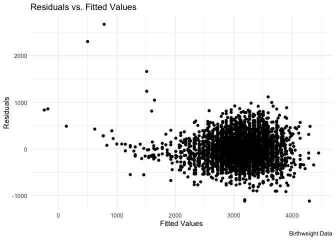
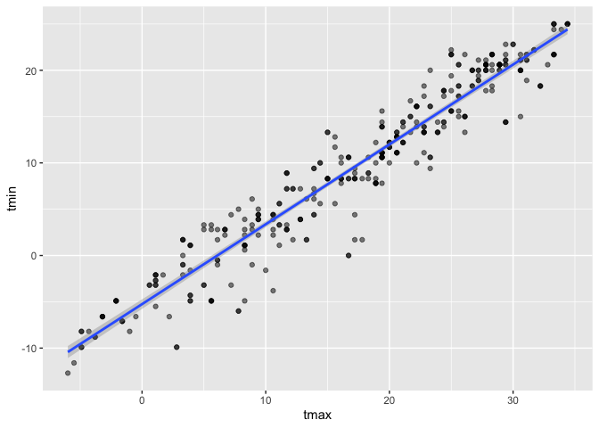

hw6
================
Matthew Spotnitz
11/23/2021

``` r
library(tidyverse)
```

    ## ── Attaching packages ─────────────────────────────────────── tidyverse 1.3.1 ──

    ## ✓ ggplot2 3.3.5     ✓ purrr   0.3.4
    ## ✓ tibble  3.1.5     ✓ dplyr   1.0.7
    ## ✓ tidyr   1.1.3     ✓ stringr 1.4.0
    ## ✓ readr   2.0.1     ✓ forcats 0.5.1

    ## ── Conflicts ────────────────────────────────────────── tidyverse_conflicts() ──
    ## x dplyr::filter() masks stats::filter()
    ## x dplyr::lag()    masks stats::lag()

``` r
library(ggplot2)
library(modelr)
library(mgcv)
```

    ## Loading required package: nlme

    ## 
    ## Attaching package: 'nlme'

    ## The following object is masked from 'package:dplyr':
    ## 
    ##     collapse

    ## This is mgcv 1.8-36. For overview type 'help("mgcv-package")'.

\#\#Problem 1 I will import and view the birthweight dataset.

``` r
birthweight_df = read.csv("birthweight.csv")
birthweight_df = janitor::clean_names(birthweight_df)
head(birthweight_df)
```

    ##   babysex bhead blength  bwt delwt fincome frace gaweeks malform menarche
    ## 1       2    34      51 3629   177      35     1    39.9       0       13
    ## 2       1    34      48 3062   156      65     2    25.9       0       14
    ## 3       2    36      50 3345   148      85     1    39.9       0       12
    ## 4       1    34      52 3062   157      55     1    40.0       0       14
    ## 5       2    34      52 3374   156       5     1    41.6       0       13
    ## 6       1    33      52 3374   129      55     1    40.7       0       12
    ##   mheight momage mrace parity pnumlbw pnumsga    ppbmi ppwt smoken wtgain
    ## 1      63     36     1      3       0       0 26.27184  148      0     29
    ## 2      65     25     2      0       0       0 21.34485  128      0     28
    ## 3      64     29     1      0       0       0 23.56517  137      1     11
    ## 4      64     18     1      0       0       0 21.84508  127     10     30
    ## 5      66     20     1      0       0       0 21.02642  130      1     26
    ## 6      66     23     1      0       0       0 18.60030  115      0     14

``` r
tail(birthweight_df)
```

    ##      babysex bhead blength  bwt delwt fincome frace gaweeks malform menarche
    ## 4337       2    35      52 3657   142      55     2    40.0       0       13
    ## 4338       1    34      50 3147   129      25     2    39.0       0       12
    ## 4339       1    34      51 3430   158      25     2    39.4       0       12
    ## 4340       1    35      52 3090   128      15     2    38.1       0       14
    ## 4341       2    32      46 2268   120       5     2    39.0       0       13
    ## 4342       2    34      52 3232   149      25     2    40.6       0       11
    ##      mheight momage mrace parity pnumlbw pnumsga    ppbmi ppwt smoken wtgain
    ## 4337      63     16     2      0       0       0 21.30149  120      0     22
    ## 4338      64     20     2      0       0       0 18.06089  105      0     24
    ## 4339      66     18     2      0       0       0 19.73249  122      0     36
    ## 4340      56     18     2      0       0       0 21.56776   96      3     32
    ## 4341      62     17     2      0       0       0 19.24491  105      0     15
    ## 4342      63     16     2      0       0       0 23.43164  132      0     17

``` r
str(birthweight_df)
```

    ## 'data.frame':    4342 obs. of  20 variables:
    ##  $ babysex : int  2 1 2 1 2 1 2 2 1 1 ...
    ##  $ bhead   : int  34 34 36 34 34 33 33 33 36 33 ...
    ##  $ blength : int  51 48 50 52 52 52 46 49 52 50 ...
    ##  $ bwt     : int  3629 3062 3345 3062 3374 3374 2523 2778 3515 3459 ...
    ##  $ delwt   : int  177 156 148 157 156 129 126 140 146 169 ...
    ##  $ fincome : int  35 65 85 55 5 55 96 5 85 75 ...
    ##  $ frace   : int  1 2 1 1 1 1 2 1 1 2 ...
    ##  $ gaweeks : num  39.9 25.9 39.9 40 41.6 ...
    ##  $ malform : int  0 0 0 0 0 0 0 0 0 0 ...
    ##  $ menarche: int  13 14 12 14 13 12 14 12 11 12 ...
    ##  $ mheight : int  63 65 64 64 66 66 72 62 61 64 ...
    ##  $ momage  : int  36 25 29 18 20 23 29 19 13 19 ...
    ##  $ mrace   : int  1 2 1 1 1 1 2 1 1 2 ...
    ##  $ parity  : int  3 0 0 0 0 0 0 0 0 0 ...
    ##  $ pnumlbw : int  0 0 0 0 0 0 0 0 0 0 ...
    ##  $ pnumsga : int  0 0 0 0 0 0 0 0 0 0 ...
    ##  $ ppbmi   : num  26.3 21.3 23.6 21.8 21 ...
    ##  $ ppwt    : int  148 128 137 127 130 115 105 119 105 145 ...
    ##  $ smoken  : num  0 0 1 10 1 0 0 0 0 4 ...
    ##  $ wtgain  : int  29 28 11 30 26 14 21 21 41 24 ...

``` r
view(birthweight_df)
```

There are 4342 observations and 20 variables. Those variables are
combinations of integer and numerical formats. I will dnow drop missing
values.

``` r
birthweight_na_df = drop_na(birthweight_df)
str(birthweight_na_df)
```

    ## 'data.frame':    4342 obs. of  20 variables:
    ##  $ babysex : int  2 1 2 1 2 1 2 2 1 1 ...
    ##  $ bhead   : int  34 34 36 34 34 33 33 33 36 33 ...
    ##  $ blength : int  51 48 50 52 52 52 46 49 52 50 ...
    ##  $ bwt     : int  3629 3062 3345 3062 3374 3374 2523 2778 3515 3459 ...
    ##  $ delwt   : int  177 156 148 157 156 129 126 140 146 169 ...
    ##  $ fincome : int  35 65 85 55 5 55 96 5 85 75 ...
    ##  $ frace   : int  1 2 1 1 1 1 2 1 1 2 ...
    ##  $ gaweeks : num  39.9 25.9 39.9 40 41.6 ...
    ##  $ malform : int  0 0 0 0 0 0 0 0 0 0 ...
    ##  $ menarche: int  13 14 12 14 13 12 14 12 11 12 ...
    ##  $ mheight : int  63 65 64 64 66 66 72 62 61 64 ...
    ##  $ momage  : int  36 25 29 18 20 23 29 19 13 19 ...
    ##  $ mrace   : int  1 2 1 1 1 1 2 1 1 2 ...
    ##  $ parity  : int  3 0 0 0 0 0 0 0 0 0 ...
    ##  $ pnumlbw : int  0 0 0 0 0 0 0 0 0 0 ...
    ##  $ pnumsga : int  0 0 0 0 0 0 0 0 0 0 ...
    ##  $ ppbmi   : num  26.3 21.3 23.6 21.8 21 ...
    ##  $ ppwt    : int  148 128 137 127 130 115 105 119 105 145 ...
    ##  $ smoken  : num  0 0 1 10 1 0 0 0 0 4 ...
    ##  $ wtgain  : int  29 28 11 30 26 14 21 21 41 24 ...

There were no missing values. Therefore, it is appropriate to use the
original dataframe. I will make a facetwrap that shows a histogram of
each variable

``` r
ggplot(gather(birthweight_df), aes(value)) + geom_histogram(bins = 10) + facet_wrap(~key, scales = 'free_x')
```

<!-- --> After looking at
these plots, I intend to convert babysex, frace, mrace, malform, and
mrace into factor variables.

``` r
birthweight_factor_df = birthweight_df %>% mutate (babysex = as.factor(babysex), frace = as.factor(frace), mrace = as.factor(mrace), malform = as.factor(malform), mrace = as.factor(mrace))
str(birthweight_factor_df)
```

    ## 'data.frame':    4342 obs. of  20 variables:
    ##  $ babysex : Factor w/ 2 levels "1","2": 2 1 2 1 2 1 2 2 1 1 ...
    ##  $ bhead   : int  34 34 36 34 34 33 33 33 36 33 ...
    ##  $ blength : int  51 48 50 52 52 52 46 49 52 50 ...
    ##  $ bwt     : int  3629 3062 3345 3062 3374 3374 2523 2778 3515 3459 ...
    ##  $ delwt   : int  177 156 148 157 156 129 126 140 146 169 ...
    ##  $ fincome : int  35 65 85 55 5 55 96 5 85 75 ...
    ##  $ frace   : Factor w/ 5 levels "1","2","3","4",..: 1 2 1 1 1 1 2 1 1 2 ...
    ##  $ gaweeks : num  39.9 25.9 39.9 40 41.6 ...
    ##  $ malform : Factor w/ 2 levels "0","1": 1 1 1 1 1 1 1 1 1 1 ...
    ##  $ menarche: int  13 14 12 14 13 12 14 12 11 12 ...
    ##  $ mheight : int  63 65 64 64 66 66 72 62 61 64 ...
    ##  $ momage  : int  36 25 29 18 20 23 29 19 13 19 ...
    ##  $ mrace   : Factor w/ 4 levels "1","2","3","4": 1 2 1 1 1 1 2 1 1 2 ...
    ##  $ parity  : int  3 0 0 0 0 0 0 0 0 0 ...
    ##  $ pnumlbw : int  0 0 0 0 0 0 0 0 0 0 ...
    ##  $ pnumsga : int  0 0 0 0 0 0 0 0 0 0 ...
    ##  $ ppbmi   : num  26.3 21.3 23.6 21.8 21 ...
    ##  $ ppwt    : int  148 128 137 127 130 115 105 119 105 145 ...
    ##  $ smoken  : num  0 0 1 10 1 0 0 0 0 4 ...
    ##  $ wtgain  : int  29 28 11 30 26 14 21 21 41 24 ...

I will make scatter plots for numerical variables that may be associated
with birthweight.

``` r
birthweight_factor_df %>% ggplot(aes(x = bhead, y= bwt)) + geom_point()  ##On inspection, there is a corrleation
```

<!-- -->

``` r
birthweight_factor_df %>% ggplot(aes(x = blength, y= bwt)) + geom_point() ##On inspection, there is a corrrelation
```

<!-- -->

``` r
birthweight_factor_df %>% ggplot(aes(x = delwt, y= bwt)) + geom_point() #There is not a strong correlation
```

<!-- -->

``` r
birthweight_factor_df %>% ggplot(aes(x = gaweeks, y= bwt)) + geom_point() ##There is not a strong correlation
```

<!-- -->

``` r
birthweight_factor_df %>% ggplot(aes(x = menarche, y= bwt)) + geom_point()#There is not a strong correlation
```

<!-- -->

``` r
birthweight_factor_df %>% ggplot(aes(x = fincome, y= bwt)) + geom_point() #There is not a strong correlation
```

<!-- -->

``` r
birthweight_factor_df %>% ggplot(aes(x = mheight, y= bwt)) + geom_point() #There is not a strong correlation
```

<!-- -->

``` r
birthweight_factor_df %>% ggplot(aes(x = momage, y= bwt)) + geom_point() #There is not a strong correlation
```

<!-- -->

``` r
birthweight_factor_df %>% ggplot(aes(x = ppbmi, y= bwt)) + geom_point() #There is not a strong correlation
```

<!-- -->

``` r
birthweight_factor_df %>% ggplot(aes(x = ppwt, y= bwt)) + geom_point()#There is not a strong correlation
```

<!-- -->

``` r
birthweight_factor_df %>% ggplot(aes(x = smoken, y= bwt)) + geom_point() #There is not a strong correlation
```

<!-- -->

``` r
birthweight_factor_df %>% ggplot(aes(x = wtgain, y= bwt)) + geom_point() #There is not a strong correlation
```

<!-- -->

``` r
birthweight_factor_df %>% ggplot(aes(x = parity, y= bwt)) + geom_point() #There is not a strong correlation
```

<!-- --> Now I will plot
brithweight by non-continuous variables

``` r
birthweight_factor_df %>% ggplot(aes(x = babysex, y= bwt)) + geom_boxplot()   #There is not a strong correlation
```

<!-- -->

``` r
birthweight_factor_df %>% ggplot(aes(x = frace, y= bwt)) + geom_boxplot()   #There is not a strong correlation
```

<!-- -->

``` r
birthweight_factor_df %>% ggplot(aes(x = mrace, y= bwt)) + geom_boxplot() #There is not a strong correlation 
```

<!-- -->

``` r
birthweight_factor_df %>% ggplot(aes(x = malform, y= bwt)) + geom_boxplot() # There is not a strong correlation
```

<!-- -->

``` r
#pnumlbw and pnumsga are exlusively zero values.
```

On the basis of this exploratory data analysis, a baby’s head
circumference and length at birth have the strongest correlation with
birthweight. I will map the residuals and fitted values of these models.

``` r
fit = lm(bwt ~ bhead + blength, data = birthweight_factor_df)
birthweight_factor_df %>% modelr::add_residuals(fit) %>% ggplot(aes(x=bhead, y = resid)) + geom_point() ##Overall, there is a uniform distribution of residuals
```

<!-- -->

``` r
birthweight_factor_df %>% modelr::add_residuals(fit) %>% ggplot(aes(x=blength, y = resid)) + geom_point() ##Overall, there is a uniform distribution of residuals
```

<!-- --> Now I will plot
the fitted values

``` r
fit = lm(bwt ~ bhead + blength, data = birthweight_factor_df)
birthweight_factor_df %>% modelr::add_predictions(fit) %>% ggplot(aes(x=bhead, y = pred)) + geom_point() ##Overall, there is a direct correlation between baby's head circumference at birth and fitted values
```

<!-- -->

``` r
birthweight_factor_df %>% modelr::add_predictions(fit) %>% ggplot(aes(x=blength, y = pred)) + geom_point() ##Overall, there is a direct correlation betwen baby's length at birth and fitted values.
```

<!-- --> Now I will
correlate the fitted values with residuals

``` r
fit = lm(bwt ~ bhead + blength, data = birthweight_factor_df)
birthweight_factor_df  %>% modelr::add_residuals(fit)%>% modelr::add_predictions(fit) %>% ggplot(aes(x=pred, y = resid)) + geom_point() +    labs(
    title = "Residuals vs. Fitted Values",
    x = "Fitted Values",
    y = "Residuals",
    caption = "Birthweight Data"
  )  + theme_minimal() #Overall, there is not a strong correlation between fitted values and residuals
```

<!-- --> Now I will fit
more models. In order to make the model with baby sex run, the input
needs to be numeric and not a factor. Also, I will need to split the
data frame into training and testing data.

``` r
birthweight_df = mutate(birthweight_df, id = row_number())
view(birthweight_df)
train_df = sample_n(birthweight_df, 80)
test_df = anti_join(birthweight_df, train_df, by = 'id')
```

Fit the linear models with the training data

``` r
fit = lm(bwt ~ bhead + blength, data = birthweight_df)
fit_length_age = lm(bwt ~ blength + gaweeks, data = birthweight_df)
fit_three = lm (bwt ~ bhead + blength + babysex + bhead*blength*babysex, data = birthweight_df)
```

Now I will add model performance

``` r
train_df %>% 
  gather_predictions(fit, fit_length_age, fit_three) %>% 
  mutate(model = fct_inorder(model))
```

    ##              model babysex bhead blength  bwt delwt fincome frace gaweeks
    ## 1              fit       2    33      50 2892   127      85     1    37.4
    ## 2              fit       2    33      50 3629   144      15     2    39.7
    ## 3              fit       1    34      54 3544   198      15     2    34.6
    ## 4              fit       2    34      50 3969   135      95     1    42.1
    ## 5              fit       2    35      48 3232   147      15     2    30.4
    ## 6              fit       2    31      45 2353   148      15     1    43.9
    ## 7              fit       2    32      49 2410   151      15     2    40.6
    ## 8              fit       2    32      45 2863   157      75     1    38.0
    ## 9              fit       1    33      44 2296   125      55     2    36.6
    ## 10             fit       1    32      49 2778   170      55     2    37.3
    ## 11             fit       1    32      45 2410   119      55     1    37.7
    ## 12             fit       1    36      53 3997   195      15     2    46.4
    ## 13             fit       2    35      52 3997   188      35     2    45.0
    ## 14             fit       1    36      53 3402   130      25     1    41.0
    ## 15             fit       1    36      49 3827   181      25     2    46.1
    ## 16             fit       1    35      54 3770   129      65     1    42.1
    ## 17             fit       2    34      50 3289   164      25     2    41.9
    ## 18             fit       1    31      48 3118   130      15     2    33.7
    ## 19             fit       2    33      50 2977   119      65     1    39.0
    ## 20             fit       2    36      51 3544   144      35     1    40.9
    ## 21             fit       2    32      45 2438   132      25     2    38.0
    ## 22             fit       1    35      52 3572   141      45     1    42.9
    ## 23             fit       2    33      52 3629   156      35     1    41.7
    ## 24             fit       2    34      49 3090   134      35     1    40.3
    ## 25             fit       1    33      49 2778   138      25     2    38.3
    ## 26             fit       2    32      50 2892   145      35     4    41.6
    ## 27             fit       1    34      52 3033   172      85     1    41.1
    ## 28             fit       1    34      49 3572   137      65     2    44.4
    ## 29             fit       1    33      48 2722   123      15     2    38.9
    ## 30             fit       2    33      48 2608   128      35     4    38.0
    ## 31             fit       2    34      50 2807   136      35     2    38.9
    ## 32             fit       2    33      48 3118   164      75     2    41.4
    ## 33             fit       1    35      51 2807   129      25     2    34.4
    ## 34             fit       2    35      50 3374   150       5     1    37.4
    ## 35             fit       2    34      48 2665   112      35     4    40.0
    ## 36             fit       1    36      52 3600   154       5     2    38.9
    ## 37             fit       2    35      49 3118   138      45     2    41.3
    ## 38             fit       1    34      51 3515   149      75     1    40.6
    ## 39             fit       1    36      51 3175   135      25     1    38.1
    ## 40             fit       2    33      51 2835   140      75     1    40.4
    ## 41             fit       1    33      48 3062   131      15     2    31.1
    ## 42             fit       1    32      48 2863   126      35     1    28.9
    ## 43             fit       2    34      47 3062   126       5     2    40.1
    ## 44             fit       2    32      50 2807   143      15     2    39.3
    ## 45             fit       1    32      50 2693   145      25     2    37.3
    ## 46             fit       1    34      49 2863   139      75     1    35.0
    ## 47             fit       2    31      46 2495   143      35     2    30.1
    ## 48             fit       2    34      49 2920   135      15     2    38.6
    ## 49             fit       1    34      51 3062   173      45     2    39.7
    ## 50             fit       2    30      44 2268   114      25     2    32.0
    ## 51             fit       2    31      46 2381   136      45     1    39.4
    ## 52             fit       1    31      49 2693   176      25     2    39.4
    ## 53             fit       1    34      52 3317   145      15     2    43.0
    ## 54             fit       2    33      51 3289   177      15     2    33.4
    ## 55             fit       2    35      51 3203   183      15     2    39.4
    ## 56             fit       2    35      52 3629   150      85     1    40.7
    ## 57             fit       1    34      51 3175   143      35     2    39.9
    ## 58             fit       1    33      52 3147   131      25     2    29.0
    ## 59             fit       1    37      53 3685   156      75     1    41.4
    ## 60             fit       1    34      49 3203   128      45     1    40.0
    ## 61             fit       1    33      52 2551   165      65     2    49.9
    ## 62             fit       1    36      52 3402   126      15     2    39.1
    ## 63             fit       1    36      51 3487   135      25     2    41.1
    ## 64             fit       2    38      53 3742   240      35     2    38.3
    ## 65             fit       2    33      50 3260   154       5     2    40.1
    ## 66             fit       1    36      50 4082   186      45     2    37.0
    ## 67             fit       1    34      51 3459   110      35     1    40.3
    ## 68             fit       1    34      49 2807   126      85     2    34.9
    ## 69             fit       1    34      50 2977   149      45     2    39.4
    ## 70             fit       1    32      51 3402   143      25     3    40.6
    ## 71             fit       2    35      51 3827   130      45     1    41.3
    ## 72             fit       1    37      51 3374   133      25     2    39.0
    ## 73             fit       1    37      56 3742   166      45     4    40.3
    ## 74             fit       2    32      49 2948   134      25     1    39.3
    ## 75             fit       1    35      49 3118   140      25     2    38.7
    ## 76             fit       2    37      53 3572   163      75     1    42.1
    ## 77             fit       2    32      46 2353   134      45     2    38.3
    ## 78             fit       2    35      51 2948   138      25     1    42.1
    ## 79             fit       2    35      51 3260   169      35     1    40.3
    ## 80             fit       2    33      50 3515   170      35     1    40.9
    ## 81  fit_length_age       2    33      50 2892   127      85     1    37.4
    ## 82  fit_length_age       2    33      50 3629   144      15     2    39.7
    ## 83  fit_length_age       1    34      54 3544   198      15     2    34.6
    ## 84  fit_length_age       2    34      50 3969   135      95     1    42.1
    ## 85  fit_length_age       2    35      48 3232   147      15     2    30.4
    ## 86  fit_length_age       2    31      45 2353   148      15     1    43.9
    ## 87  fit_length_age       2    32      49 2410   151      15     2    40.6
    ## 88  fit_length_age       2    32      45 2863   157      75     1    38.0
    ## 89  fit_length_age       1    33      44 2296   125      55     2    36.6
    ## 90  fit_length_age       1    32      49 2778   170      55     2    37.3
    ## 91  fit_length_age       1    32      45 2410   119      55     1    37.7
    ## 92  fit_length_age       1    36      53 3997   195      15     2    46.4
    ## 93  fit_length_age       2    35      52 3997   188      35     2    45.0
    ## 94  fit_length_age       1    36      53 3402   130      25     1    41.0
    ## 95  fit_length_age       1    36      49 3827   181      25     2    46.1
    ## 96  fit_length_age       1    35      54 3770   129      65     1    42.1
    ## 97  fit_length_age       2    34      50 3289   164      25     2    41.9
    ## 98  fit_length_age       1    31      48 3118   130      15     2    33.7
    ## 99  fit_length_age       2    33      50 2977   119      65     1    39.0
    ## 100 fit_length_age       2    36      51 3544   144      35     1    40.9
    ## 101 fit_length_age       2    32      45 2438   132      25     2    38.0
    ## 102 fit_length_age       1    35      52 3572   141      45     1    42.9
    ## 103 fit_length_age       2    33      52 3629   156      35     1    41.7
    ## 104 fit_length_age       2    34      49 3090   134      35     1    40.3
    ## 105 fit_length_age       1    33      49 2778   138      25     2    38.3
    ## 106 fit_length_age       2    32      50 2892   145      35     4    41.6
    ## 107 fit_length_age       1    34      52 3033   172      85     1    41.1
    ## 108 fit_length_age       1    34      49 3572   137      65     2    44.4
    ## 109 fit_length_age       1    33      48 2722   123      15     2    38.9
    ## 110 fit_length_age       2    33      48 2608   128      35     4    38.0
    ## 111 fit_length_age       2    34      50 2807   136      35     2    38.9
    ## 112 fit_length_age       2    33      48 3118   164      75     2    41.4
    ## 113 fit_length_age       1    35      51 2807   129      25     2    34.4
    ## 114 fit_length_age       2    35      50 3374   150       5     1    37.4
    ## 115 fit_length_age       2    34      48 2665   112      35     4    40.0
    ## 116 fit_length_age       1    36      52 3600   154       5     2    38.9
    ## 117 fit_length_age       2    35      49 3118   138      45     2    41.3
    ## 118 fit_length_age       1    34      51 3515   149      75     1    40.6
    ## 119 fit_length_age       1    36      51 3175   135      25     1    38.1
    ## 120 fit_length_age       2    33      51 2835   140      75     1    40.4
    ## 121 fit_length_age       1    33      48 3062   131      15     2    31.1
    ## 122 fit_length_age       1    32      48 2863   126      35     1    28.9
    ## 123 fit_length_age       2    34      47 3062   126       5     2    40.1
    ## 124 fit_length_age       2    32      50 2807   143      15     2    39.3
    ## 125 fit_length_age       1    32      50 2693   145      25     2    37.3
    ## 126 fit_length_age       1    34      49 2863   139      75     1    35.0
    ## 127 fit_length_age       2    31      46 2495   143      35     2    30.1
    ## 128 fit_length_age       2    34      49 2920   135      15     2    38.6
    ## 129 fit_length_age       1    34      51 3062   173      45     2    39.7
    ## 130 fit_length_age       2    30      44 2268   114      25     2    32.0
    ## 131 fit_length_age       2    31      46 2381   136      45     1    39.4
    ## 132 fit_length_age       1    31      49 2693   176      25     2    39.4
    ## 133 fit_length_age       1    34      52 3317   145      15     2    43.0
    ## 134 fit_length_age       2    33      51 3289   177      15     2    33.4
    ## 135 fit_length_age       2    35      51 3203   183      15     2    39.4
    ## 136 fit_length_age       2    35      52 3629   150      85     1    40.7
    ## 137 fit_length_age       1    34      51 3175   143      35     2    39.9
    ## 138 fit_length_age       1    33      52 3147   131      25     2    29.0
    ## 139 fit_length_age       1    37      53 3685   156      75     1    41.4
    ## 140 fit_length_age       1    34      49 3203   128      45     1    40.0
    ## 141 fit_length_age       1    33      52 2551   165      65     2    49.9
    ## 142 fit_length_age       1    36      52 3402   126      15     2    39.1
    ## 143 fit_length_age       1    36      51 3487   135      25     2    41.1
    ## 144 fit_length_age       2    38      53 3742   240      35     2    38.3
    ## 145 fit_length_age       2    33      50 3260   154       5     2    40.1
    ## 146 fit_length_age       1    36      50 4082   186      45     2    37.0
    ## 147 fit_length_age       1    34      51 3459   110      35     1    40.3
    ## 148 fit_length_age       1    34      49 2807   126      85     2    34.9
    ## 149 fit_length_age       1    34      50 2977   149      45     2    39.4
    ## 150 fit_length_age       1    32      51 3402   143      25     3    40.6
    ## 151 fit_length_age       2    35      51 3827   130      45     1    41.3
    ## 152 fit_length_age       1    37      51 3374   133      25     2    39.0
    ## 153 fit_length_age       1    37      56 3742   166      45     4    40.3
    ## 154 fit_length_age       2    32      49 2948   134      25     1    39.3
    ## 155 fit_length_age       1    35      49 3118   140      25     2    38.7
    ## 156 fit_length_age       2    37      53 3572   163      75     1    42.1
    ## 157 fit_length_age       2    32      46 2353   134      45     2    38.3
    ## 158 fit_length_age       2    35      51 2948   138      25     1    42.1
    ## 159 fit_length_age       2    35      51 3260   169      35     1    40.3
    ## 160 fit_length_age       2    33      50 3515   170      35     1    40.9
    ## 161      fit_three       2    33      50 2892   127      85     1    37.4
    ## 162      fit_three       2    33      50 3629   144      15     2    39.7
    ## 163      fit_three       1    34      54 3544   198      15     2    34.6
    ## 164      fit_three       2    34      50 3969   135      95     1    42.1
    ## 165      fit_three       2    35      48 3232   147      15     2    30.4
    ## 166      fit_three       2    31      45 2353   148      15     1    43.9
    ## 167      fit_three       2    32      49 2410   151      15     2    40.6
    ## 168      fit_three       2    32      45 2863   157      75     1    38.0
    ## 169      fit_three       1    33      44 2296   125      55     2    36.6
    ## 170      fit_three       1    32      49 2778   170      55     2    37.3
    ## 171      fit_three       1    32      45 2410   119      55     1    37.7
    ## 172      fit_three       1    36      53 3997   195      15     2    46.4
    ## 173      fit_three       2    35      52 3997   188      35     2    45.0
    ## 174      fit_three       1    36      53 3402   130      25     1    41.0
    ## 175      fit_three       1    36      49 3827   181      25     2    46.1
    ## 176      fit_three       1    35      54 3770   129      65     1    42.1
    ## 177      fit_three       2    34      50 3289   164      25     2    41.9
    ## 178      fit_three       1    31      48 3118   130      15     2    33.7
    ## 179      fit_three       2    33      50 2977   119      65     1    39.0
    ## 180      fit_three       2    36      51 3544   144      35     1    40.9
    ## 181      fit_three       2    32      45 2438   132      25     2    38.0
    ## 182      fit_three       1    35      52 3572   141      45     1    42.9
    ## 183      fit_three       2    33      52 3629   156      35     1    41.7
    ## 184      fit_three       2    34      49 3090   134      35     1    40.3
    ## 185      fit_three       1    33      49 2778   138      25     2    38.3
    ## 186      fit_three       2    32      50 2892   145      35     4    41.6
    ## 187      fit_three       1    34      52 3033   172      85     1    41.1
    ## 188      fit_three       1    34      49 3572   137      65     2    44.4
    ## 189      fit_three       1    33      48 2722   123      15     2    38.9
    ## 190      fit_three       2    33      48 2608   128      35     4    38.0
    ## 191      fit_three       2    34      50 2807   136      35     2    38.9
    ## 192      fit_three       2    33      48 3118   164      75     2    41.4
    ## 193      fit_three       1    35      51 2807   129      25     2    34.4
    ## 194      fit_three       2    35      50 3374   150       5     1    37.4
    ## 195      fit_three       2    34      48 2665   112      35     4    40.0
    ## 196      fit_three       1    36      52 3600   154       5     2    38.9
    ## 197      fit_three       2    35      49 3118   138      45     2    41.3
    ## 198      fit_three       1    34      51 3515   149      75     1    40.6
    ## 199      fit_three       1    36      51 3175   135      25     1    38.1
    ## 200      fit_three       2    33      51 2835   140      75     1    40.4
    ## 201      fit_three       1    33      48 3062   131      15     2    31.1
    ## 202      fit_three       1    32      48 2863   126      35     1    28.9
    ## 203      fit_three       2    34      47 3062   126       5     2    40.1
    ## 204      fit_three       2    32      50 2807   143      15     2    39.3
    ## 205      fit_three       1    32      50 2693   145      25     2    37.3
    ## 206      fit_three       1    34      49 2863   139      75     1    35.0
    ## 207      fit_three       2    31      46 2495   143      35     2    30.1
    ## 208      fit_three       2    34      49 2920   135      15     2    38.6
    ## 209      fit_three       1    34      51 3062   173      45     2    39.7
    ## 210      fit_three       2    30      44 2268   114      25     2    32.0
    ## 211      fit_three       2    31      46 2381   136      45     1    39.4
    ## 212      fit_three       1    31      49 2693   176      25     2    39.4
    ## 213      fit_three       1    34      52 3317   145      15     2    43.0
    ## 214      fit_three       2    33      51 3289   177      15     2    33.4
    ## 215      fit_three       2    35      51 3203   183      15     2    39.4
    ## 216      fit_three       2    35      52 3629   150      85     1    40.7
    ## 217      fit_three       1    34      51 3175   143      35     2    39.9
    ## 218      fit_three       1    33      52 3147   131      25     2    29.0
    ## 219      fit_three       1    37      53 3685   156      75     1    41.4
    ## 220      fit_three       1    34      49 3203   128      45     1    40.0
    ## 221      fit_three       1    33      52 2551   165      65     2    49.9
    ## 222      fit_three       1    36      52 3402   126      15     2    39.1
    ## 223      fit_three       1    36      51 3487   135      25     2    41.1
    ## 224      fit_three       2    38      53 3742   240      35     2    38.3
    ## 225      fit_three       2    33      50 3260   154       5     2    40.1
    ## 226      fit_three       1    36      50 4082   186      45     2    37.0
    ## 227      fit_three       1    34      51 3459   110      35     1    40.3
    ## 228      fit_three       1    34      49 2807   126      85     2    34.9
    ## 229      fit_three       1    34      50 2977   149      45     2    39.4
    ## 230      fit_three       1    32      51 3402   143      25     3    40.6
    ## 231      fit_three       2    35      51 3827   130      45     1    41.3
    ## 232      fit_three       1    37      51 3374   133      25     2    39.0
    ## 233      fit_three       1    37      56 3742   166      45     4    40.3
    ## 234      fit_three       2    32      49 2948   134      25     1    39.3
    ## 235      fit_three       1    35      49 3118   140      25     2    38.7
    ## 236      fit_three       2    37      53 3572   163      75     1    42.1
    ## 237      fit_three       2    32      46 2353   134      45     2    38.3
    ## 238      fit_three       2    35      51 2948   138      25     1    42.1
    ## 239      fit_three       2    35      51 3260   169      35     1    40.3
    ## 240      fit_three       2    33      50 3515   170      35     1    40.9
    ##     malform menarche mheight momage mrace parity pnumlbw pnumsga    ppbmi ppwt
    ## 1         0       12      67     17     1      0       0       0 15.69496  100
    ## 2         0       13      65     19     2      0       0       0 20.84458  125
    ## 3         0       12      68     15     2      0       0       0 26.35956  173
    ## 4         0       11      61     22     1      0       0       0 20.25975  107
    ## 5         0       13      66     18     2      0       0       0 19.40900  120
    ## 6         0       11      68     21     1      0       0       0 17.82699  117
    ## 7         0       13      67     17     2      0       0       0 19.61870  125
    ## 8         0       11      61     21     1      0       0       0 24.61464  130
    ## 9         0       13      61     20     2      0       0       0 20.82778  110
    ## 10        0       15      65     21     2      0       0       0 22.01188  132
    ## 11        0       11      63     22     1      0       0       0 20.23642  114
    ## 12        0        9      61     15     2      0       0       0 31.62035  167
    ## 13        0       12      64     19     2      0       0       0 24.94123  145
    ## 14        0       12      61     19     1      0       0       0 24.61464  130
    ## 15        1       12      62     23     2      0       0       0 24.74345  135
    ## 16        0       12      62     22     1      0       0       0 18.87834  103
    ## 17        0       14      66     16     2      0       0       0 22.64384  140
    ## 18        0       13      60     16     2      0       0       0 17.61367   90
    ## 19        0       14      60     22     1      0       0       0 19.17933   98
    ## 20        0       13      65     19     1      0       0       0 20.01080  120
    ## 21        0       14      61     17     2      0       0       0 19.31303  102
    ## 22        0       13      66     19     1      0       0       0 19.08552  118
    ## 23        0       12      68     23     1      0       0       0 21.02670  138
    ## 24        0       13      65     29     1      0       0       0 20.01080  120
    ## 25        0       12      61     18     2      0       0       0 20.82778  110
    ## 26        0       14      60     18     4      0       0       0 21.91924  112
    ## 27        0       16      67     26     1      0       0       0 22.75770  145
    ## 28        0       11      61     16     2      0       0       0 17.98763   95
    ## 29        0       12      61     16     2      0       0       0 21.01712  111
    ## 30        0       11      64     18     4      0       0       0 18.57692  108
    ## 31        0       12      64     16     2      0       0       0 19.43696  113
    ## 32        0       12      70     16     2      0       0       0 19.41099  135
    ## 33        0       12      66     17     2      0       0       0 18.76204  116
    ## 34        0       13      66     19     1      0       0       0 21.83513  135
    ## 35        0       14      63     17     4      0       0       0 17.57373   99
    ## 36        0       12      70     15     2      0       0       0 18.11692  126
    ## 37        0       14      61     25     2      0       0       0 20.82778  110
    ## 38        0       12      67     19     1      0       0       0 20.08955  128
    ## 39        0       14      61     18     1      0       0       0 20.25975  107
    ## 40        0       14      68     25     1      0       0       0 19.04593  125
    ## 41        0       13      62     20     2      0       0       0 21.99418  120
    ## 42        0       12      63     27     1      0       0       0 19.88139  112
    ## 43        0       13      63     18     2      0       0       0 18.46129  104
    ## 44        0       15      64     18     2      0       0       0 20.29700  118
    ## 45        0       11      63     15     2      0       0       0 19.34886  109
    ## 46        0       14      63     21     1      0       0       0 21.30149  120
    ## 47        0       14      66     19     2      0       0       0 20.70294  128
    ## 48        1       13      64     14     2      0       0       0 18.92094  110
    ## 49        0       12      66     21     2      0       0       0 24.26126  150
    ## 50        0       16      65     20     2      0       0       0 17.17594  103
    ## 51        0       12      63     20     1      0       0       0 22.72159  128
    ## 52        0       11      64     17     2      0       0       0 26.14529  152
    ## 53        0       12      62     16     2      0       0       0 21.99418  120
    ## 54        0       10      65     18     2      0       0       0 22.17863  133
    ## 55        0       15      69     16     2      0       0       0 21.16156  143
    ## 56        0       13      66     21     1      0       0       0 20.21771  125
    ## 57        0       14      64     22     2      0       0       0 22.18910  129
    ## 58        0       11      63     18     2      0       0       0 21.30149  120
    ## 59        0       13      58     23     1      0       0       0 28.27403  135
    ## 60        0       12      65     25     1      0       0       0 18.34323  110
    ## 61        0       11      64     20     2      0       0       0 25.80128  150
    ## 62        0       16      63     19     2      0       0       0 19.52637  110
    ## 63        0       14      63     17     2      0       0       0 21.30149  120
    ## 64        0       15      66     24     2      0       0       0 33.96576  210
    ## 65        0       12      65     14     2      0       0       0 19.17702  115
    ## 66        0       13      64     17     2      0       0       0 23.22115  135
    ## 67        0       11      61     22     1      0       0       0 20.25975  107
    ## 68        0       12      63     19     2      0       0       0 19.88139  112
    ## 69        0       16      63     21     2      0       0       0 23.96418  135
    ## 70        0       13      60     25     3      0       0       0 24.46343  125
    ## 71        0       12      61     22     1      0       0       0 19.88106  105
    ## 72        0       14      59     20     4      0       0       0 22.26376  110
    ## 73        0       12      68     20     1      0       0       0 21.33144  140
    ## 74        0       10      61     17     1      0       0       0 22.34252  118
    ## 75        0       13      66     15     2      0       0       0 17.46810  108
    ## 76        0       13      67     23     1      0       0       0 22.28685  142
    ## 77        0       11      60     21     2      0       0       0 22.50636  115
    ## 78        0       13      62     19     1      0       0       0 22.91060  125
    ## 79        0       11      63     19     1      0       0       0 28.40199  160
    ## 80        0       14      61     23     1      0       0       0 28.02283  148
    ## 81        0       12      67     17     1      0       0       0 15.69496  100
    ## 82        0       13      65     19     2      0       0       0 20.84458  125
    ## 83        0       12      68     15     2      0       0       0 26.35956  173
    ## 84        0       11      61     22     1      0       0       0 20.25975  107
    ## 85        0       13      66     18     2      0       0       0 19.40900  120
    ## 86        0       11      68     21     1      0       0       0 17.82699  117
    ## 87        0       13      67     17     2      0       0       0 19.61870  125
    ## 88        0       11      61     21     1      0       0       0 24.61464  130
    ## 89        0       13      61     20     2      0       0       0 20.82778  110
    ## 90        0       15      65     21     2      0       0       0 22.01188  132
    ## 91        0       11      63     22     1      0       0       0 20.23642  114
    ## 92        0        9      61     15     2      0       0       0 31.62035  167
    ## 93        0       12      64     19     2      0       0       0 24.94123  145
    ## 94        0       12      61     19     1      0       0       0 24.61464  130
    ## 95        1       12      62     23     2      0       0       0 24.74345  135
    ## 96        0       12      62     22     1      0       0       0 18.87834  103
    ## 97        0       14      66     16     2      0       0       0 22.64384  140
    ## 98        0       13      60     16     2      0       0       0 17.61367   90
    ## 99        0       14      60     22     1      0       0       0 19.17933   98
    ## 100       0       13      65     19     1      0       0       0 20.01080  120
    ## 101       0       14      61     17     2      0       0       0 19.31303  102
    ## 102       0       13      66     19     1      0       0       0 19.08552  118
    ## 103       0       12      68     23     1      0       0       0 21.02670  138
    ## 104       0       13      65     29     1      0       0       0 20.01080  120
    ## 105       0       12      61     18     2      0       0       0 20.82778  110
    ## 106       0       14      60     18     4      0       0       0 21.91924  112
    ## 107       0       16      67     26     1      0       0       0 22.75770  145
    ## 108       0       11      61     16     2      0       0       0 17.98763   95
    ## 109       0       12      61     16     2      0       0       0 21.01712  111
    ## 110       0       11      64     18     4      0       0       0 18.57692  108
    ## 111       0       12      64     16     2      0       0       0 19.43696  113
    ## 112       0       12      70     16     2      0       0       0 19.41099  135
    ## 113       0       12      66     17     2      0       0       0 18.76204  116
    ## 114       0       13      66     19     1      0       0       0 21.83513  135
    ## 115       0       14      63     17     4      0       0       0 17.57373   99
    ## 116       0       12      70     15     2      0       0       0 18.11692  126
    ## 117       0       14      61     25     2      0       0       0 20.82778  110
    ## 118       0       12      67     19     1      0       0       0 20.08955  128
    ## 119       0       14      61     18     1      0       0       0 20.25975  107
    ## 120       0       14      68     25     1      0       0       0 19.04593  125
    ## 121       0       13      62     20     2      0       0       0 21.99418  120
    ## 122       0       12      63     27     1      0       0       0 19.88139  112
    ## 123       0       13      63     18     2      0       0       0 18.46129  104
    ## 124       0       15      64     18     2      0       0       0 20.29700  118
    ## 125       0       11      63     15     2      0       0       0 19.34886  109
    ## 126       0       14      63     21     1      0       0       0 21.30149  120
    ## 127       0       14      66     19     2      0       0       0 20.70294  128
    ## 128       1       13      64     14     2      0       0       0 18.92094  110
    ## 129       0       12      66     21     2      0       0       0 24.26126  150
    ## 130       0       16      65     20     2      0       0       0 17.17594  103
    ## 131       0       12      63     20     1      0       0       0 22.72159  128
    ## 132       0       11      64     17     2      0       0       0 26.14529  152
    ## 133       0       12      62     16     2      0       0       0 21.99418  120
    ## 134       0       10      65     18     2      0       0       0 22.17863  133
    ## 135       0       15      69     16     2      0       0       0 21.16156  143
    ## 136       0       13      66     21     1      0       0       0 20.21771  125
    ## 137       0       14      64     22     2      0       0       0 22.18910  129
    ## 138       0       11      63     18     2      0       0       0 21.30149  120
    ## 139       0       13      58     23     1      0       0       0 28.27403  135
    ## 140       0       12      65     25     1      0       0       0 18.34323  110
    ## 141       0       11      64     20     2      0       0       0 25.80128  150
    ## 142       0       16      63     19     2      0       0       0 19.52637  110
    ## 143       0       14      63     17     2      0       0       0 21.30149  120
    ## 144       0       15      66     24     2      0       0       0 33.96576  210
    ## 145       0       12      65     14     2      0       0       0 19.17702  115
    ## 146       0       13      64     17     2      0       0       0 23.22115  135
    ## 147       0       11      61     22     1      0       0       0 20.25975  107
    ## 148       0       12      63     19     2      0       0       0 19.88139  112
    ## 149       0       16      63     21     2      0       0       0 23.96418  135
    ## 150       0       13      60     25     3      0       0       0 24.46343  125
    ## 151       0       12      61     22     1      0       0       0 19.88106  105
    ## 152       0       14      59     20     4      0       0       0 22.26376  110
    ## 153       0       12      68     20     1      0       0       0 21.33144  140
    ## 154       0       10      61     17     1      0       0       0 22.34252  118
    ## 155       0       13      66     15     2      0       0       0 17.46810  108
    ## 156       0       13      67     23     1      0       0       0 22.28685  142
    ## 157       0       11      60     21     2      0       0       0 22.50636  115
    ## 158       0       13      62     19     1      0       0       0 22.91060  125
    ## 159       0       11      63     19     1      0       0       0 28.40199  160
    ## 160       0       14      61     23     1      0       0       0 28.02283  148
    ## 161       0       12      67     17     1      0       0       0 15.69496  100
    ## 162       0       13      65     19     2      0       0       0 20.84458  125
    ## 163       0       12      68     15     2      0       0       0 26.35956  173
    ## 164       0       11      61     22     1      0       0       0 20.25975  107
    ## 165       0       13      66     18     2      0       0       0 19.40900  120
    ## 166       0       11      68     21     1      0       0       0 17.82699  117
    ## 167       0       13      67     17     2      0       0       0 19.61870  125
    ## 168       0       11      61     21     1      0       0       0 24.61464  130
    ## 169       0       13      61     20     2      0       0       0 20.82778  110
    ## 170       0       15      65     21     2      0       0       0 22.01188  132
    ## 171       0       11      63     22     1      0       0       0 20.23642  114
    ## 172       0        9      61     15     2      0       0       0 31.62035  167
    ## 173       0       12      64     19     2      0       0       0 24.94123  145
    ## 174       0       12      61     19     1      0       0       0 24.61464  130
    ## 175       1       12      62     23     2      0       0       0 24.74345  135
    ## 176       0       12      62     22     1      0       0       0 18.87834  103
    ## 177       0       14      66     16     2      0       0       0 22.64384  140
    ## 178       0       13      60     16     2      0       0       0 17.61367   90
    ## 179       0       14      60     22     1      0       0       0 19.17933   98
    ## 180       0       13      65     19     1      0       0       0 20.01080  120
    ## 181       0       14      61     17     2      0       0       0 19.31303  102
    ## 182       0       13      66     19     1      0       0       0 19.08552  118
    ## 183       0       12      68     23     1      0       0       0 21.02670  138
    ## 184       0       13      65     29     1      0       0       0 20.01080  120
    ## 185       0       12      61     18     2      0       0       0 20.82778  110
    ## 186       0       14      60     18     4      0       0       0 21.91924  112
    ## 187       0       16      67     26     1      0       0       0 22.75770  145
    ## 188       0       11      61     16     2      0       0       0 17.98763   95
    ## 189       0       12      61     16     2      0       0       0 21.01712  111
    ## 190       0       11      64     18     4      0       0       0 18.57692  108
    ## 191       0       12      64     16     2      0       0       0 19.43696  113
    ## 192       0       12      70     16     2      0       0       0 19.41099  135
    ## 193       0       12      66     17     2      0       0       0 18.76204  116
    ## 194       0       13      66     19     1      0       0       0 21.83513  135
    ## 195       0       14      63     17     4      0       0       0 17.57373   99
    ## 196       0       12      70     15     2      0       0       0 18.11692  126
    ## 197       0       14      61     25     2      0       0       0 20.82778  110
    ## 198       0       12      67     19     1      0       0       0 20.08955  128
    ## 199       0       14      61     18     1      0       0       0 20.25975  107
    ## 200       0       14      68     25     1      0       0       0 19.04593  125
    ## 201       0       13      62     20     2      0       0       0 21.99418  120
    ## 202       0       12      63     27     1      0       0       0 19.88139  112
    ## 203       0       13      63     18     2      0       0       0 18.46129  104
    ## 204       0       15      64     18     2      0       0       0 20.29700  118
    ## 205       0       11      63     15     2      0       0       0 19.34886  109
    ## 206       0       14      63     21     1      0       0       0 21.30149  120
    ## 207       0       14      66     19     2      0       0       0 20.70294  128
    ## 208       1       13      64     14     2      0       0       0 18.92094  110
    ## 209       0       12      66     21     2      0       0       0 24.26126  150
    ## 210       0       16      65     20     2      0       0       0 17.17594  103
    ## 211       0       12      63     20     1      0       0       0 22.72159  128
    ## 212       0       11      64     17     2      0       0       0 26.14529  152
    ## 213       0       12      62     16     2      0       0       0 21.99418  120
    ## 214       0       10      65     18     2      0       0       0 22.17863  133
    ## 215       0       15      69     16     2      0       0       0 21.16156  143
    ## 216       0       13      66     21     1      0       0       0 20.21771  125
    ## 217       0       14      64     22     2      0       0       0 22.18910  129
    ## 218       0       11      63     18     2      0       0       0 21.30149  120
    ## 219       0       13      58     23     1      0       0       0 28.27403  135
    ## 220       0       12      65     25     1      0       0       0 18.34323  110
    ## 221       0       11      64     20     2      0       0       0 25.80128  150
    ## 222       0       16      63     19     2      0       0       0 19.52637  110
    ## 223       0       14      63     17     2      0       0       0 21.30149  120
    ## 224       0       15      66     24     2      0       0       0 33.96576  210
    ## 225       0       12      65     14     2      0       0       0 19.17702  115
    ## 226       0       13      64     17     2      0       0       0 23.22115  135
    ## 227       0       11      61     22     1      0       0       0 20.25975  107
    ## 228       0       12      63     19     2      0       0       0 19.88139  112
    ## 229       0       16      63     21     2      0       0       0 23.96418  135
    ## 230       0       13      60     25     3      0       0       0 24.46343  125
    ## 231       0       12      61     22     1      0       0       0 19.88106  105
    ## 232       0       14      59     20     4      0       0       0 22.26376  110
    ## 233       0       12      68     20     1      0       0       0 21.33144  140
    ## 234       0       10      61     17     1      0       0       0 22.34252  118
    ## 235       0       13      66     15     2      0       0       0 17.46810  108
    ## 236       0       13      67     23     1      0       0       0 22.28685  142
    ## 237       0       11      60     21     2      0       0       0 22.50636  115
    ## 238       0       13      62     19     1      0       0       0 22.91060  125
    ## 239       0       11      63     19     1      0       0       0 28.40199  160
    ## 240       0       14      61     23     1      0       0       0 28.02283  148
    ##     smoken wtgain   id     pred
    ## 1    5.000     27 3747 3040.575
    ## 2    0.000     19 1516 3040.575
    ## 3   10.000     25 3264 3526.716
    ## 4    5.000     28 1101 3186.595
    ## 5    0.000     27 1990 3162.556
    ## 6   15.000     31 2966 2323.382
    ## 7    2.000     26 4111 2809.524
    ## 8   10.000     27  783 2469.403
    ## 9    0.000     15 2227 2530.393
    ## 10  20.000     38 2504 2809.524
    ## 11   7.000      5  535 2469.403
    ## 12   6.000     28 3376 3733.727
    ## 13   0.000     43 3504 3502.677
    ## 14   0.000      0 3029 3733.727
    ## 15  10.000     46 3338 3393.607
    ## 16   0.000     26  243 3672.737
    ## 17   5.000     24 3669 3186.595
    ## 18   0.000     40 4314 2578.473
    ## 19   0.000     21 3945 3040.575
    ## 20   0.000     24 3978 3563.667
    ## 21   0.000     30 1312 2469.403
    ## 22   5.000     23 1664 3502.677
    ## 23  15.000     18  527 3210.635
    ## 24  20.000     14  396 3101.565
    ## 25   0.000     28 3448 2955.544
    ## 26   0.000     33 2608 2894.554
    ## 27  20.000     27   63 3356.656
    ## 28   0.000     42 1772 3101.565
    ## 29   0.000     12 1862 2870.514
    ## 30   0.000     20 2559 2870.514
    ## 31   0.000     23 4317 3186.595
    ## 32   8.000     29 1603 2870.514
    ## 33   0.000     13 3598 3417.646
    ## 34  10.000     15 2927 3332.616
    ## 35   3.000     13 2587 3016.535
    ## 36   0.000     28 4059 3648.697
    ## 37   0.000     28 2820 3247.586
    ## 38   0.750     21  147 3271.626
    ## 39  30.000     28 3839 3563.667
    ## 40   0.000     15 2051 3125.605
    ## 41   0.000     11 2492 2870.514
    ## 42   0.000     14 3860 2724.494
    ## 43   0.000     22 4336 2931.505
    ## 44   1.000     25 3317 2894.554
    ## 45   0.000     36 4203 2894.554
    ## 46   2.000     19 2398 3101.565
    ## 47   0.000     15 2042 2408.412
    ## 48   0.000     25 4270 3101.565
    ## 49   0.000     23 1533 3271.626
    ## 50   2.000     11 4308 2092.331
    ## 51   0.000      8 1032 2408.412
    ## 52   0.000     24 4316 2663.503
    ## 53  10.000     25  329 3356.656
    ## 54   3.000     44 3374 3125.605
    ## 55   0.000     40 4310 3417.646
    ## 56   0.000     25 2146 3502.677
    ## 57   0.000     14 3235 3271.626
    ## 58   0.000     11 3342 3210.635
    ## 59   0.000     21  161 3879.748
    ## 60   3.000     18  335 3101.565
    ## 61   6.000     15 3506 3210.635
    ## 62   0.000     16 3614 3648.697
    ## 63   5.000     15 1298 3563.667
    ## 64   0.000     30 1300 4025.769
    ## 65   0.000     39 1276 3040.575
    ## 66   0.000     51 1886 3478.637
    ## 67   0.000      3 3726 3271.626
    ## 68   0.000     14 4014 3101.565
    ## 69   2.000     14 3515 3186.595
    ## 70   0.000     18 2349 2979.584
    ## 71   0.000     25   34 3417.646
    ## 72  17.000     23 2803 3709.688
    ## 73   0.000     26  871 4134.839
    ## 74  18.000     16  253 2809.524
    ## 75   0.125     32 1626 3247.586
    ## 76   0.000     21  390 3879.748
    ## 77   0.000     19 1458 2554.433
    ## 78   0.000     13 3033 3417.646
    ## 79   0.000      9 3423 3417.646
    ## 80  20.000     22  875 3040.575
    ## 81   5.000     27 3747 3091.665
    ## 82   0.000     19 1516 3153.873
    ## 83  10.000     25 3264 3530.157
    ## 84   5.000     28 1101 3218.785
    ## 85   0.000     27 1990 2645.227
    ## 86  15.000     31 2966 2624.691
    ## 87   2.000     26 4111 3049.659
    ## 88  10.000     27  783 2465.115
    ## 89   0.000     15 2227 2298.694
    ## 90  20.000     38 2504 2960.405
    ## 91   7.000      5  535 2457.001
    ## 92   6.000     28 3376 3720.753
    ## 93   0.000     43 3504 3554.332
    ## 94   0.000      0 3029 3574.701
    ## 95  10.000     46 3338 3198.416
    ## 96   0.000     26  243 3733.008
    ## 97   5.000     24 3669 3213.376
    ## 98   0.000     40 4314 2734.481
    ## 99   0.000     21 3945 3134.940
    ## 100  0.000     24 3978 3314.885
    ## 101  0.000     30 1312 2465.115
    ## 102  5.000     23 1664 3497.534
    ## 103 15.000     18  527 3465.078
    ## 104 20.000     14  396 3041.545
    ## 105  0.000     28 3448 2987.452
    ## 106  0.000     33 2608 3205.262
    ## 107 20.000     27   63 3448.850
    ## 108  0.000     42 1772 3152.437
    ## 109  0.000     12 1862 2875.124
    ## 110  0.000     20 2559 2850.782
    ## 111  0.000     23 4317 3132.235
    ## 112  8.000     29 1603 2942.741
    ## 113  0.000     13 3598 3139.081
    ## 114 10.000     15 2927 3091.665
    ## 115  3.000     13 2587 2904.875
    ## 116  0.000     28 4059 3389.347
    ## 117  0.000     28 2820 3068.592
    ## 118  0.750     21  147 3306.770
    ## 119 30.000     28 3839 3239.154
    ## 120  0.000     15 2051 3301.361
    ## 121  0.000     11 2492 2664.159
    ## 122  0.000     14 3860 2604.657
    ## 123  0.000     22 4336 2779.024
    ## 124  1.000     25 3317 3143.054
    ## 125  0.000     36 4203 3088.961
    ## 126  2.000     19 2398 2898.197
    ## 127  0.000     15 2042 2380.001
    ## 128  0.000     25 4270 2995.566
    ## 129  0.000     23 1533 3282.428
    ## 130  2.000     11 4308 2174.279
    ## 131  0.000      8 1032 2631.536
    ## 132  0.000     24 4316 3017.203
    ## 133 10.000     25  329 3500.238
    ## 134  3.000     44 3374 3112.034
    ## 135  0.000     40 4310 3274.314
    ## 136  0.000     25 2146 3438.031
    ## 137  0.000     14 3235 3287.838
    ## 138  0.000     11 3342 3121.584
    ## 139  0.000     21  161 3585.519
    ## 140  3.000     18  335 3033.431
    ## 141  6.000     15 3506 3686.861
    ## 142  0.000     16 3614 3394.756
    ## 143  5.000     15 1298 3320.294
    ## 144  0.000     30 1300 3501.674
    ## 145  0.000     39 1276 3164.691
    ## 146  0.000     51 1886 3080.847
    ## 147  0.000      3 3726 3298.656
    ## 148  0.000     14 4014 2895.493
    ## 149  2.000     14 3515 3145.759
    ## 150  0.000     18 2349 3306.770
    ## 151  0.000     25   34 3325.703
    ## 152 17.000     23 2803 3263.496
    ## 153  0.000     26  871 3941.435
    ## 154 18.000     16  253 3014.498
    ## 155  0.125     32 1626 2998.270
    ## 156  0.000     21  390 3604.452
    ## 157  0.000     19 1458 2601.785
    ## 158  0.000     13 3033 3347.341
    ## 159  0.000      9 3423 3298.656
    ## 160 20.000     22  875 3186.329
    ## 161  5.000     27 3747 3053.366
    ## 162  0.000     19 1516 3053.366
    ## 163 10.000     25 3264 3502.661
    ## 164  5.000     28 1101 3202.991
    ## 165  0.000     27 1990 3163.196
    ## 166 15.000     31 2966 2347.058
    ## 167  2.000     26 4111 2819.005
    ## 168 10.000     27  783 2480.060
    ## 169  0.000     15 2227 2512.182
    ## 170 20.000     38 2504 2776.803
    ## 171  7.000      5  535 2439.157
    ## 172  6.000     28 3376 3724.266
    ## 173  0.000     43 3504 3542.034
    ## 174  0.000      0 3029 3724.266
    ## 175 10.000     46 3338 3395.478
    ## 176  0.000     26  243 3654.562
    ## 177  5.000     24 3669 3202.991
    ## 178  0.000     40 4314 2537.169
    ## 179  0.000     21 3945 3053.366
    ## 180  0.000     24 3978 3600.274
    ## 181  0.000     30 1312 2480.060
    ## 182  5.000     23 1664 3489.061
    ## 183 15.000     18  527 3229.487
    ## 184 20.000     14  396 3111.605
    ## 185  0.000     28 3448 2931.471
    ## 186  0.000     33 2608 2903.741
    ## 187 20.000     27   63 3336.053
    ## 188  0.000     42 1772 3086.140
    ## 189  0.000     12 1862 2847.614
    ## 190  0.000     20 2559 2877.245
    ## 191  0.000     23 4317 3202.991
    ## 192  8.000     29 1603 2877.245
    ## 193  0.000     13 3598 3406.310
    ## 194 10.000     15 2927 3352.615
    ## 195  3.000     13 2587 3020.220
    ## 196  0.000     28 4059 3642.069
    ## 197  0.000     28 2820 3257.906
    ## 198  0.750     21  147 3252.749
    ## 199 30.000     28 3839 3559.872
    ## 200  0.000     15 2051 3141.427
    ## 201  0.000     11 2492 2847.614
    ## 202  0.000     14 3860 2692.391
    ## 203  0.000     22 4336 2928.835
    ## 204  1.000     25 3317 2903.741
    ## 205  0.000     36 4203 2861.214
    ## 206  2.000     19 2398 3086.140
    ## 207  0.000     15 2042 2428.470
    ## 208  0.000     25 4270 3111.605
    ## 209  0.000     23 1533 3252.749
    ## 210  2.000     11 4308 2135.968
    ## 211  0.000      8 1032 2428.470
    ## 212  0.000     24 4316 2622.134
    ## 213 10.000     25  329 3336.053
    ## 214  3.000     44 3374 3141.427
    ## 215  0.000     40 4310 3447.325
    ## 216  0.000     25 2146 3542.034
    ## 217  0.000     14 3235 3252.749
    ## 218  0.000     11 3342 3183.045
    ## 219  0.000     21  161 3876.720
    ## 220  3.000     18  335 3086.140
    ## 221  6.000     15 3506 3183.045
    ## 222  0.000     16 3614 3642.069
    ## 223  5.000     15 1298 3559.872
    ## 224  0.000     30 1300 4115.538
    ## 225  0.000     39 1276 3053.366
    ## 226  0.000     51 1886 3477.675
    ## 227  0.000      3 3726 3252.749
    ## 228  0.000     14 4014 3086.140
    ## 229  2.000     14 3515 3169.444
    ## 230  0.000     18 2349 2945.626
    ## 231  0.000     25   34 3447.325
    ## 232 17.000     23 2803 3713.433
    ## 233  0.000     26  871 4121.650
    ## 234 18.000     16  253 2819.005
    ## 235  0.125     32 1626 3240.809
    ## 236  0.000     21  390 3955.940
    ## 237  0.000     19 1458 2564.796
    ## 238  0.000     13 3033 3447.325
    ## 239  0.000      9 3423 3447.325
    ## 240 20.000     22  875 3053.366

Cross validation

``` r
cv_df = crossv_mc(birthweight_df, 100)
```

Creating testing and training datasets

``` r
cv_df =
  cv_df %>% 
  mutate(
    train = map(train, as_tibble),
    test = map(test, as_tibble))
```

Now we will do cross validation on different models

``` r
cv_df = 
  cv_df %>% 
  mutate(
    model_one  = map(train, ~lm(bwt ~ bhead + blength, data = .x)),
    model_two  = map(train, ~lm(bwt ~ blength + gaweeks, data =.x)),
    model_three  = map(train, ~lm (bwt ~ bhead + blength + babysex + bhead*blength*babysex, data = .x))) %>% 
   mutate(
    rmse_model_one = map2_dbl(model_one, test, ~rmse(model = .x, data = .y)),
    rmse_model_two = map2_dbl(model_two, test, ~rmse(model = .x, data = .y)),
    rmse_model_three = map2_dbl(model_three, test, ~rmse(model = .x, data = .y)))
```

Now I will make violin plots of each model

``` r
cv_df %>% 
  select(starts_with("rmse")) %>% 
  pivot_longer(
    everything(),
    names_to = "model", 
    values_to = "rmse",
    names_prefix = "rmse_") %>% 
  mutate(model = fct_inorder(model)) %>% 
  ggplot(aes(x = model, y = rmse)) + geom_violin()+    labs(
    title = "Violin Plot of Residuals vs. Candidate Models",
    x = "Candidate Models",
    y = "Residuals",
    caption = "Birthweight Data"
  )  + theme_minimal()
```

<!-- --> Overall, the
model that used child length at birth and gestational age, without
interaction terms, had the highest residual error (“model\_two). My
model, which used head circumference and child length at birth without
interactions(”model\_one“), had similar performance to a model that used
head cirumferece and length at birth, sex, and interactions terms of all
three variables (”model\_three").

\#Problem Two

``` r
weather_df = 
  rnoaa::meteo_pull_monitors(
    c("USW00094728"),
    var = c("PRCP", "TMIN", "TMAX"), 
    date_min = "2017-01-01",
    date_max = "2017-12-31") %>%
  mutate(
    name = recode(id, USW00094728 = "CentralPark_NY"),
    tmin = tmin / 10,
    tmax = tmax / 10) %>%
  select(name, id, everything())
```

    ## Registered S3 method overwritten by 'hoardr':
    ##   method           from
    ##   print.cache_info httr

    ## using cached file: ~/Library/Caches/R/noaa_ghcnd/USW00094728.dly

    ## date created (size, mb): 2021-10-05 20:10:57 (7.602)

    ## file min/max dates: 1869-01-01 / 2021-10-31

``` r
head_df = janitor::clean_names(weather_df)
head(weather_df)
```

    ## # A tibble: 6 × 6
    ##   name           id          date        prcp  tmax  tmin
    ##   <chr>          <chr>       <date>     <dbl> <dbl> <dbl>
    ## 1 CentralPark_NY USW00094728 2017-01-01     0   8.9   4.4
    ## 2 CentralPark_NY USW00094728 2017-01-02    53   5     2.8
    ## 3 CentralPark_NY USW00094728 2017-01-03   147   6.1   3.9
    ## 4 CentralPark_NY USW00094728 2017-01-04     0  11.1   1.1
    ## 5 CentralPark_NY USW00094728 2017-01-05     0   1.1  -2.7
    ## 6 CentralPark_NY USW00094728 2017-01-06    13   0.6  -3.8

``` r
tail(weather_df)
```

    ## # A tibble: 6 × 6
    ##   name           id          date        prcp  tmax  tmin
    ##   <chr>          <chr>       <date>     <dbl> <dbl> <dbl>
    ## 1 CentralPark_NY USW00094728 2017-12-26     0  -2.1  -4.9
    ## 2 CentralPark_NY USW00094728 2017-12-27     0  -4.3  -8.2
    ## 3 CentralPark_NY USW00094728 2017-12-28     0  -7.7 -11.6
    ## 4 CentralPark_NY USW00094728 2017-12-29     0  -5.5 -11.6
    ## 5 CentralPark_NY USW00094728 2017-12-30    13  -4.9  -8.2
    ## 6 CentralPark_NY USW00094728 2017-12-31     0  -6   -12.7

``` r
str(weather_df)
```

    ## tibble [365 × 6] (S3: tbl_df/tbl/data.frame)
    ##  $ name: chr [1:365] "CentralPark_NY" "CentralPark_NY" "CentralPark_NY" "CentralPark_NY" ...
    ##  $ id  : chr [1:365] "USW00094728" "USW00094728" "USW00094728" "USW00094728" ...
    ##  $ date: Date[1:365], format: "2017-01-01" "2017-01-02" ...
    ##  $ prcp: num [1:365] 0 53 147 0 0 13 81 0 0 0 ...
    ##  $ tmax: num [1:365] 8.9 5 6.1 11.1 1.1 0.6 -3.2 -3.8 -4.9 7.8 ...
    ##  $ tmin: num [1:365] 4.4 2.8 3.9 1.1 -2.7 -3.8 -6.6 -8.8 -9.9 -6 ...

``` r
view(weather_df)
```

We are going to fit a linear model with tmax as the response and tmin as
the predictor

``` r
lm (tmax~tmin, data=weather_df) %>% broom::glance()
```

    ## # A tibble: 1 × 12
    ##   r.squared adj.r.squared sigma statistic   p.value    df logLik   AIC   BIC
    ##       <dbl>         <dbl> <dbl>     <dbl>     <dbl> <dbl>  <dbl> <dbl> <dbl>
    ## 1     0.912         0.911  2.94     3741. 2.98e-193     1  -910. 1827. 1838.
    ## # … with 3 more variables: deviance <dbl>, df.residual <int>, nobs <int>

Now I am going to make a boot smaple funcion.

``` r
boot_sample = function(df) {
  sample_frac(df, replace = TRUE)
}
```

I will run the boot sample function to check that it works

``` r
boot_sample(weather_df) %>% 
  ggplot(aes(x = tmax, y = tmin)) + 
  geom_point(alpha = .5) +
  stat_smooth(method = "lm")
```

    ## `geom_smooth()` using formula 'y ~ x'

<!-- --> I wll now run
5000 boot straps

``` r
boot_straps = 
  tibble(
    strap_number = 1:5000,
    strap_sample = rerun(5000, boot_sample(weather_df))
  )

boot_straps
```

    ## # A tibble: 5,000 × 2
    ##    strap_number strap_sample      
    ##           <int> <list>            
    ##  1            1 <tibble [365 × 6]>
    ##  2            2 <tibble [365 × 6]>
    ##  3            3 <tibble [365 × 6]>
    ##  4            4 <tibble [365 × 6]>
    ##  5            5 <tibble [365 × 6]>
    ##  6            6 <tibble [365 × 6]>
    ##  7            7 <tibble [365 × 6]>
    ##  8            8 <tibble [365 × 6]>
    ##  9            9 <tibble [365 × 6]>
    ## 10           10 <tibble [365 × 6]>
    ## # … with 4,990 more rows

``` r
bootstrap_results = 
  boot_straps %>% 
  mutate(
    models = map(strap_sample, ~lm(tmax ~ tmin, data = .x) ),
    results = map(models, broom::glance)) %>% 
  select(-strap_sample, -models) %>% 
  unnest(results) 

bootstrap_results %>% 
  summarize(
    ci_lower = quantile(r.squared, 0.025), 
    ci_upper = quantile(r.squared, 0.975))  
```

    ## # A tibble: 1 × 2
    ##   ci_lower ci_upper
    ##      <dbl>    <dbl>
    ## 1    0.894    0.927

On the basis of this output the 95% confidence interval for r squared
ranges from 0.894 to 0.927.

``` r
bootstrap_results = 
  boot_straps %>% 
  mutate(
    models = map(strap_sample, ~lm(tmax ~ tmin, data = .x) ),
    results = map(models, broom::tidy)) %>% 
  select(-strap_sample, -models) %>% 
  unnest(results) 

bootstrap_results %>% 
  summarize(
    ci_lower = quantile(estimate, 0.025), 
    ci_upper = quantile(estimate, 0.975))  
```

    ## # A tibble: 1 × 2
    ##   ci_lower ci_upper
    ##      <dbl>    <dbl>
    ## 1     1.01     7.65
